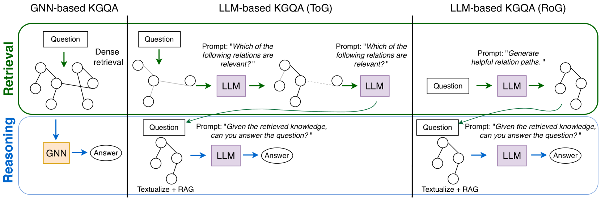
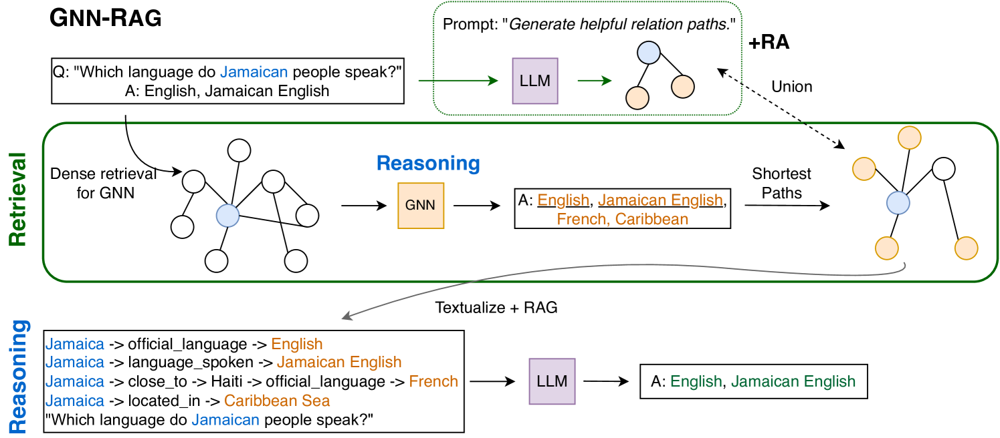
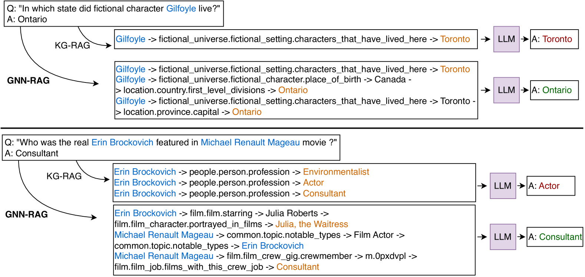
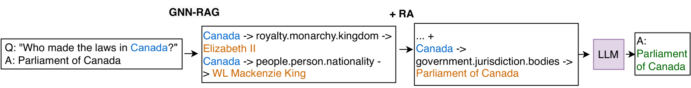

# 图神经检索 GNN-RAG：助力大型语言模型推理

发布时间：2024年05月30日

`RAG

理由：这篇论文介绍了一种名为GNN-RAG的新方法，它结合了大型语言模型（LLMs）的自然语言理解能力和图神经网络（GNNs）的推理能力，采用检索增强生成（RAG）模式来处理知识图谱问答（KGQA）任务。这种方法特别强调了检索增强（RA）技术，以提升在KGQA任务上的表现。因此，它更符合RAG分类，而不是Agent、LLM应用或LLM理论。` `问答系统` `知识图谱`

> GNN-RAG: Graph Neural Retrieval for Large Language Model Reasoning

# 摘要

> 知识图谱（KGs）以三元组形式呈现人工构建的事实知识，形成图结构。知识图谱问答（KGQA）旨在基于知识图谱信息推理，回答自然语言问题。大型语言模型（LLMs）因其卓越的自然语言理解能力，成为问答任务的尖端技术。同时，图神经网络（GNNs）因能处理知识图谱中的复杂图形信息，广泛应用于KGQA。本研究引入GNN-RAG，一种结合LLMs语言理解与GNNs推理能力的新方法，采用检索增强生成（RAG）模式。首先，GNN在密集知识图谱子图上推理，为问题检索答案候选。其次，提取连接问题实体与答案候选的最短路径，作为知识图谱推理路径。这些路径被表述后，作为LLM在RAG中推理的输入。在GNN-RAG框架中，GNN负责提取有用图形信息，LLM则利用其自然语言处理能力完成KGQA。我们还开发了检索增强（RA）技术，进一步提升GNN-RAG在KGQA上的表现。实验显示，GNN-RAG在WebQSP和CWQ两个KGQA基准上达到顶尖水平，性能超越或媲美7B调优的LLM的GPT-4。特别是在处理多跳和多实体问题时，GNN-RAG的答案F1分数比其他方法高出8.9至15.5个百分点。

> Knowledge Graphs (KGs) represent human-crafted factual knowledge in the form of triplets (head, relation, tail), which collectively form a graph. Question Answering over KGs (KGQA) is the task of answering natural questions grounding the reasoning to the information provided by the KG. Large Language Models (LLMs) are the state-of-the-art models for QA tasks due to their remarkable ability to understand natural language. On the other hand, Graph Neural Networks (GNNs) have been widely used for KGQA as they can handle the complex graph information stored in the KG. In this work, we introduce GNN-RAG, a novel method for combining language understanding abilities of LLMs with the reasoning abilities of GNNs in a retrieval-augmented generation (RAG) style. First, a GNN reasons over a dense KG subgraph to retrieve answer candidates for a given question. Second, the shortest paths in the KG that connect question entities and answer candidates are extracted to represent KG reasoning paths. The extracted paths are verbalized and given as input for LLM reasoning with RAG. In our GNN-RAG framework, the GNN acts as a dense subgraph reasoner to extract useful graph information, while the LLM leverages its natural language processing ability for ultimate KGQA. Furthermore, we develop a retrieval augmentation (RA) technique to further boost KGQA performance with GNN-RAG. Experimental results show that GNN-RAG achieves state-of-the-art performance in two widely used KGQA benchmarks (WebQSP and CWQ), outperforming or matching GPT-4 performance with a 7B tuned LLM. In addition, GNN-RAG excels on multi-hop and multi-entity questions outperforming competing approaches by 8.9--15.5% points at answer F1.

[Arxiv](https://arxiv.org/abs/2405.20139)