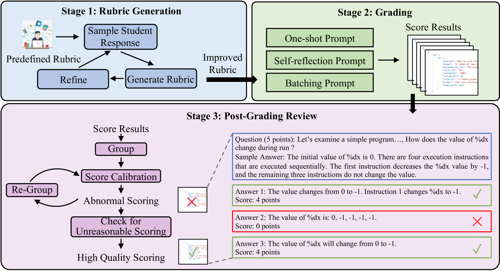
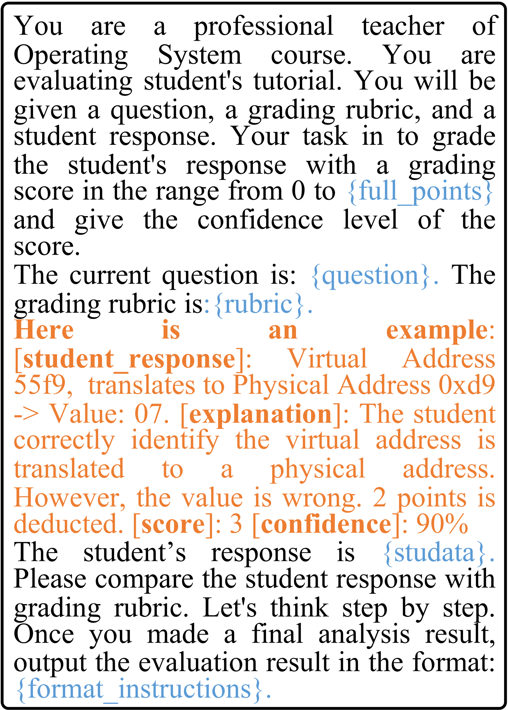
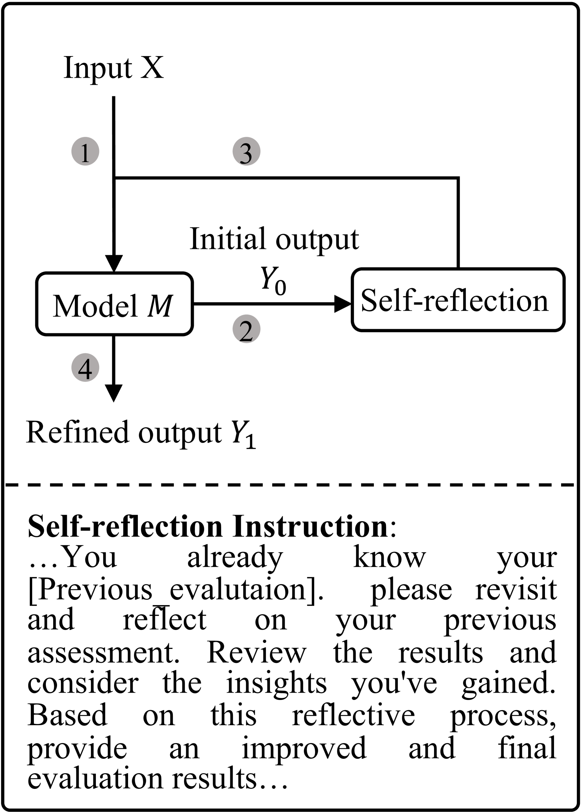
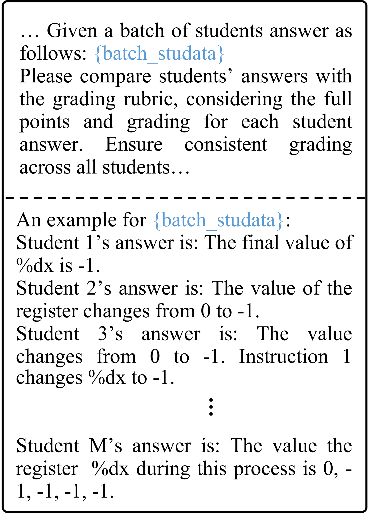
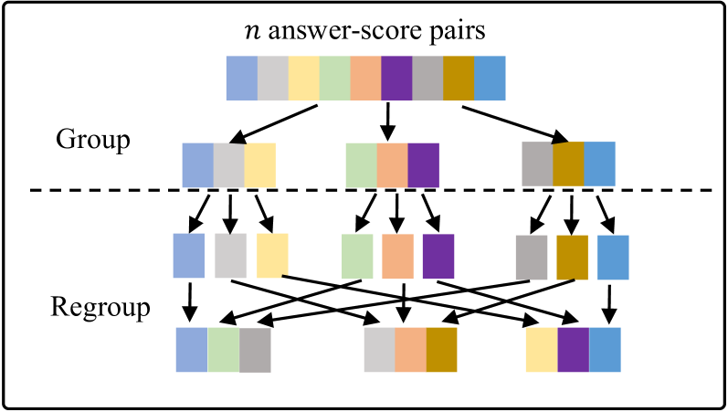
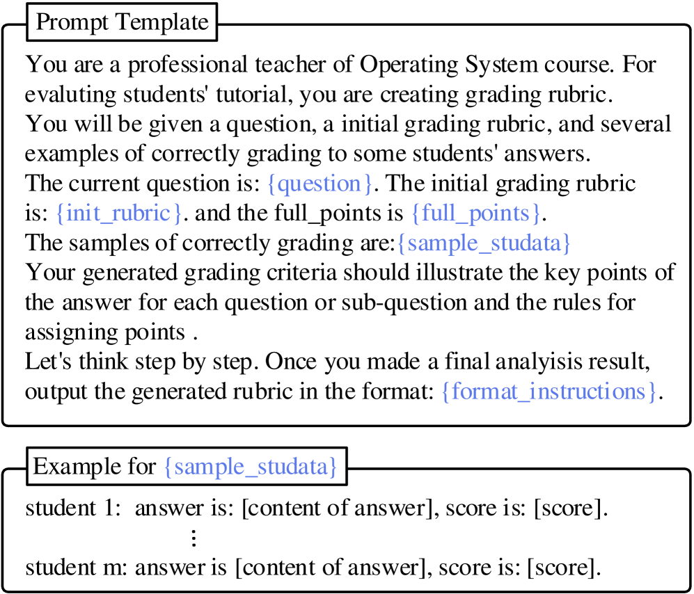

# 人性化评分：探索大型语言模型在自动化评估中的新思路

发布时间：2024年05月30日

`LLM应用

这篇论文探讨了大型语言模型（LLMs）在自动评分系统中的应用，特别是在评分流程的各个关键环节中的应用。这包括评分标准的设计、依据这些标准进行评分，以及评分后的复审。论文提出了一种全面的基于LLM的评分系统，并通过实验验证了其有效性。因此，这篇论文属于LLM应用类别，因为它专注于LLMs在实际应用场景中的使用，即自动评分系统。` `自动评分系统`

> Grade Like a Human: Rethinking Automated Assessment with Large Language Models

# 摘要

> 大型语言模型（LLMs）虽已应用于自动评分，但在处理复杂问题时，其性能仍不及人类。当前研究多集中于评分流程中的某一环节——依据预设评分标准进行评分，而忽略了评分流程的其他重要环节，如评分标准的设计和评分后的复审。本研究旨在全面探索LLMs在评分流程中的应用潜力。本文提出了一种基于LLM的全面评分系统，涵盖评分流程的各个关键环节：1) 制定评分标准，不仅针对问题，还结合学生答案，以更精准地评估学生表现。2) 依据评分标准，为每位学生提供准确且一致的评分，并附以个性化反馈。3) 实施评分后的复审，确保评分的准确性与公正性。我们收集了来自大学操作系统课程的新数据集OS，并在新数据集及广泛使用的Mohler数据集上进行了深入实验。实验结果验证了我们方法的有效性，为基于LLMs的自动评分系统的发展提供了新的视角。

> While large language models (LLMs) have been used for automated grading, they have not yet achieved the same level of performance as humans, especially when it comes to grading complex questions. Existing research on this topic focuses on a particular step in the grading procedure: grading using predefined rubrics. However, grading is a multifaceted procedure that encompasses other crucial steps, such as grading rubrics design and post-grading review. There has been a lack of systematic research exploring the potential of LLMs to enhance the entire grading~process.
  In this paper, we propose an LLM-based grading system that addresses the entire grading procedure, including the following key components: 1) Developing grading rubrics that not only consider the questions but also the student answers, which can more accurately reflect students' performance. 2) Under the guidance of grading rubrics, providing accurate and consistent scores for each student, along with customized feedback. 3) Conducting post-grading review to better ensure accuracy and fairness. Additionally, we collected a new dataset named OS from a university operating system course and conducted extensive experiments on both our new dataset and the widely used Mohler dataset. Experiments demonstrate the effectiveness of our proposed approach, providing some new insights for developing automated grading systems based on LLMs.

[Arxiv](https://arxiv.org/abs/2405.19694)