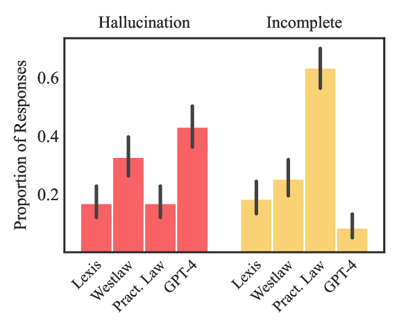
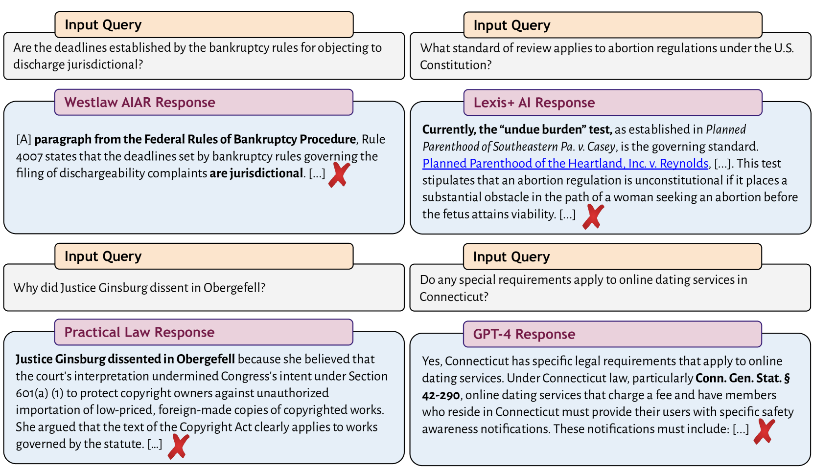
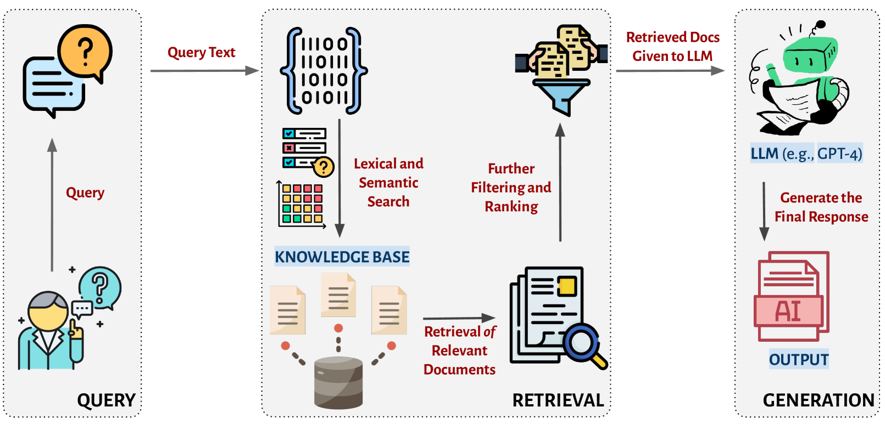
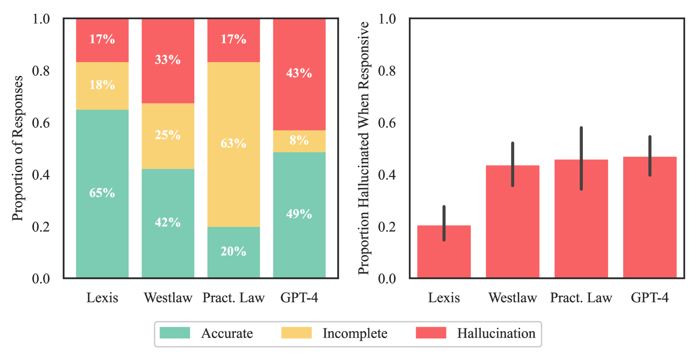
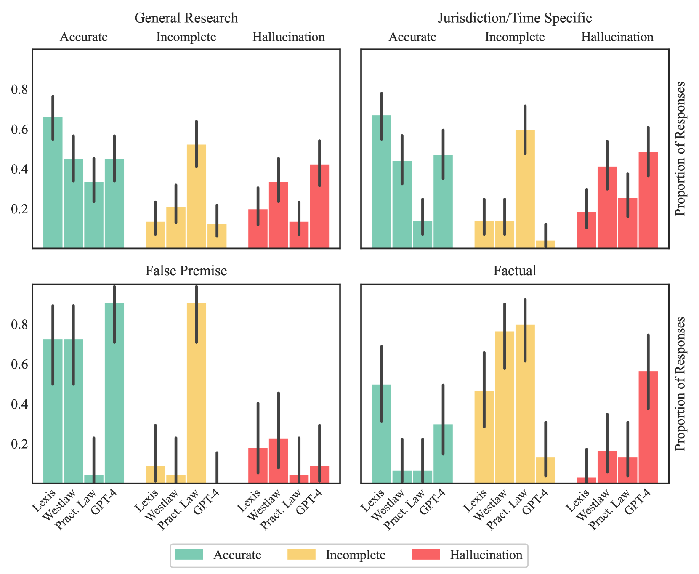

# 幻觉不再？探究顶尖AI法律研究工具的可靠性

发布时间：2024年05月30日

`RAG

这篇论文主要关注的是基于RAG（Retrieval-Augmented Generation）方法的法律AI工具在法律实践中的应用及其性能评估。论文通过实证研究评估了这些工具在减少“幻觉”（即错误信息）方面的效果，并揭示了提供商声明的夸大。此外，论文还提出了一个类型学来区分幻觉与准确法律回应，并提供了指导法律专业人员在AI输出监督和验证中的责任的证据。这些内容主要涉及RAG方法在特定领域的应用和评估，因此归类为RAG。` `人工智能`

> Hallucination-Free? Assessing the Reliability of Leading AI Legal Research Tools

# 摘要

> 在法律实践中，AI产品的应用激增，旨在辅助各种核心法律任务。然而，这些工具中的大型语言模型易产生“幻觉”，即错误信息，这在高风险领域使用时风险显著。近期，一些法律研究提供商声称其方法如RAG能“消除”或“避免”幻觉，甚至保证“无幻觉”的法律引用。但因这些系统的封闭性，评估这些声明颇具挑战。本文首次进行了预注册的实证评估，揭示了提供商声明的夸大：尽管幻觉现象较通用聊天机器人有所减少，但LexisNexis和Thomson Reuters的AI工具仍有17%至33%的时间产生幻觉。此外，各系统在响应性和准确性上存在显著差异。本文的四大贡献包括：首次评估基于RAG的专有法律AI工具；引入全面预注册数据集以识别系统漏洞；提出区分幻觉与准确法律回应的类型学；提供证据指导法律专业人员在AI输出监督和验证中的责任，这是AI与法律整合中的关键问题。

> Legal practice has witnessed a sharp rise in products incorporating artificial intelligence (AI). Such tools are designed to assist with a wide range of core legal tasks, from search and summarization of caselaw to document drafting. But the large language models used in these tools are prone to "hallucinate," or make up false information, making their use risky in high-stakes domains. Recently, certain legal research providers have touted methods such as retrieval-augmented generation (RAG) as "eliminating" (Casetext, 2023) or "avoid[ing]" hallucinations (Thomson Reuters, 2023), or guaranteeing "hallucination-free" legal citations (LexisNexis, 2023). Because of the closed nature of these systems, systematically assessing these claims is challenging. In this article, we design and report on the first preregistered empirical evaluation of AI-driven legal research tools. We demonstrate that the providers' claims are overstated. While hallucinations are reduced relative to general-purpose chatbots (GPT-4), we find that the AI research tools made by LexisNexis (Lexis+ AI) and Thomson Reuters (Westlaw AI-Assisted Research and Ask Practical Law AI) each hallucinate between 17% and 33% of the time. We also document substantial differences between systems in responsiveness and accuracy. Our article makes four key contributions. It is the first to assess and report the performance of RAG-based proprietary legal AI tools. Second, it introduces a comprehensive, preregistered dataset for identifying and understanding vulnerabilities in these systems. Third, it proposes a clear typology for differentiating between hallucinations and accurate legal responses. Last, it provides evidence to inform the responsibilities of legal professionals in supervising and verifying AI outputs, which remains a central open question for the responsible integration of AI into law.

[Arxiv](https://arxiv.org/abs/2405.20362)