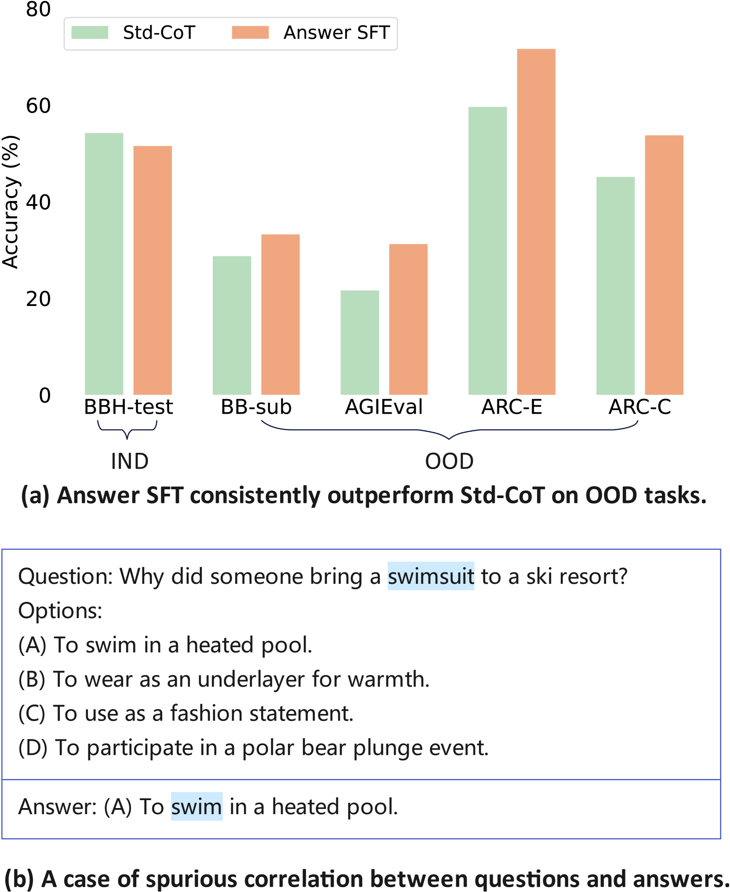
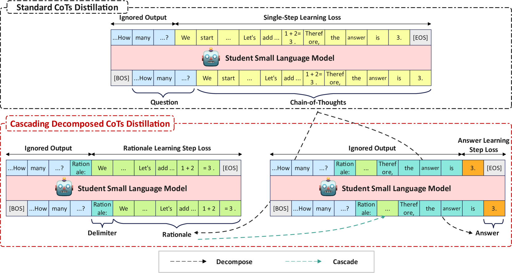
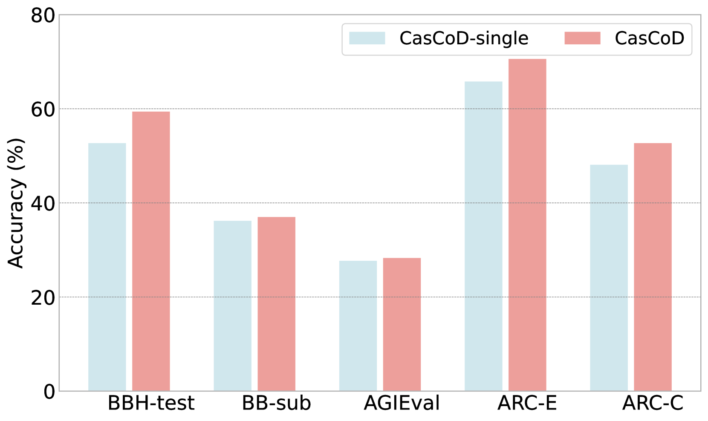
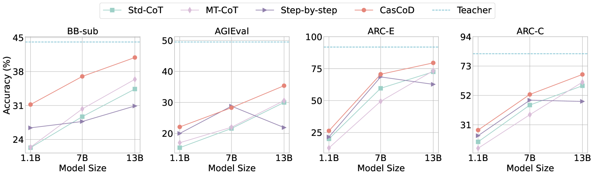
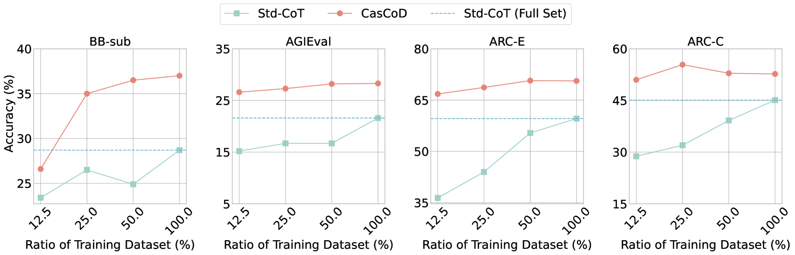
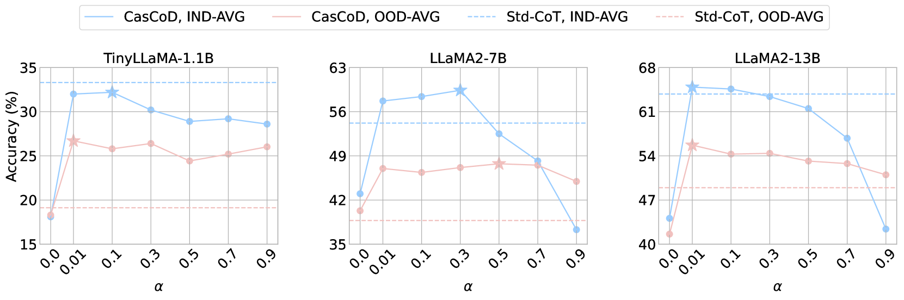
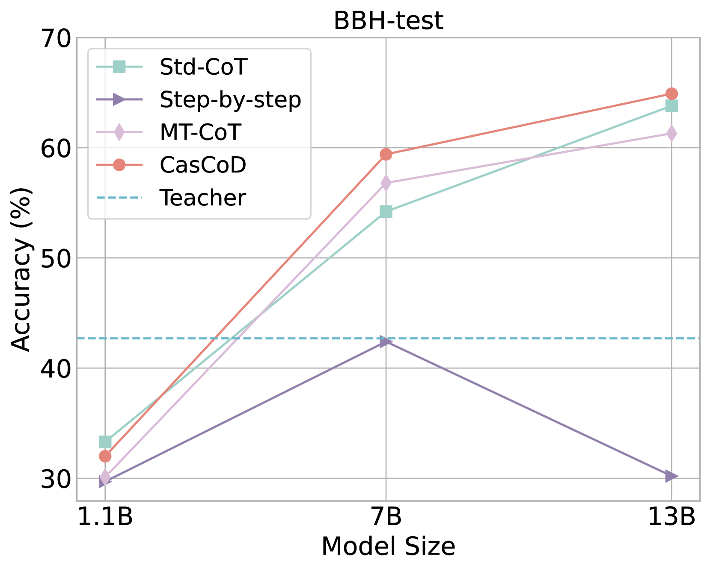
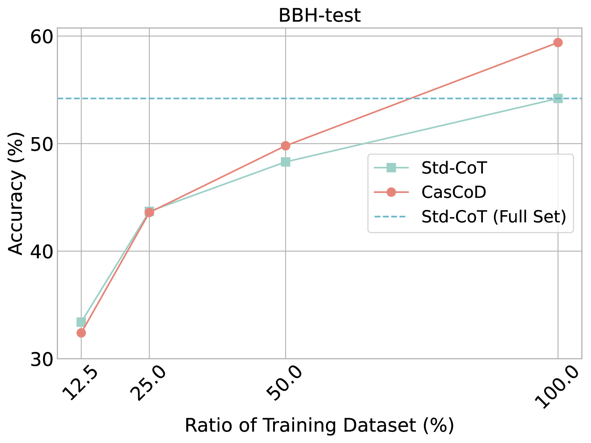

# 利用级联分解思维链蒸馏法，提升学生推理能力的泛化性

发布时间：2024年05月30日

`LLM理论

这篇论文主要探讨了大型语言模型（LLMs）的推理能力，并提出了一种新的教师-学生学习机制，即级联分解思维链蒸馏（CasCoD），以提高小型模型的推理能力和泛化性。这种方法通过重组训练目标，去除答案的干扰，使得学生模型能够更专注于学习推理过程。因此，这篇论文属于LLM理论分类，因为它深入研究了LLMs的内部机制和改进方法，而不是直接应用于特定的Agent或RAG系统，也不是关于LLM的具体应用案例。` `人工智能`

> Improve Student's Reasoning Generalizability through Cascading Decomposed CoTs Distillation

# 摘要

> 大型语言模型（LLMs）在规模扩大时推理能力显著提升，促使研究者通过教师-学生学习机制将这些能力传递给小型模型。以往的方法是在教师生成的思维链（CoTs）数据上微调学生模型，虽提升了领域内（IND）推理，但难以泛化至领域外（OOD）任务。我们认为，问题与答案间的虚假关联可能导致模型预设答案，限制推理的多样性与泛化性。为此，我们提出级联分解思维链蒸馏（CasCoD），将传统单步学习分解为两步级联过程，重组训练目标，去除答案干扰，确保学生专注于学习理由，增强推理的泛化能力。实验证明，CasCoD在IND和OOD推理数据集上均表现出色。相关代码已公开于https://github.com/C-W-D/CasCoD。

> Large language models (LLMs) exhibit enhanced reasoning at larger scales, driving efforts to distill these capabilities into smaller models via teacher-student learning. Previous works simply fine-tune student models on teachers' generated Chain-of-Thoughts (CoTs) data. Although these methods enhance in-domain (IND) reasoning performance, they struggle to generalize to out-of-domain (OOD) tasks. We believe that the widespread spurious correlations between questions and answers may lead the model to preset a specific answer which restricts the diversity and generalizability of its reasoning process. In this paper, we propose Cascading Decomposed CoTs Distillation (CasCoD) to address these issues by decomposing the traditional single-step learning process into two cascaded learning steps. Specifically, by restructuring the training objectives -- removing the answer from outputs and concatenating the question with the rationale as input -- CasCoD's two-step learning process ensures that students focus on learning rationales without interference from the preset answers, thus improving reasoning generalizability. Extensive experiments demonstrate the effectiveness of CasCoD on both IND and OOD benchmark reasoning datasets. Code can be found at https://github.com/C-W-D/CasCoD.

[Arxiv](https://arxiv.org/abs/2405.19842)