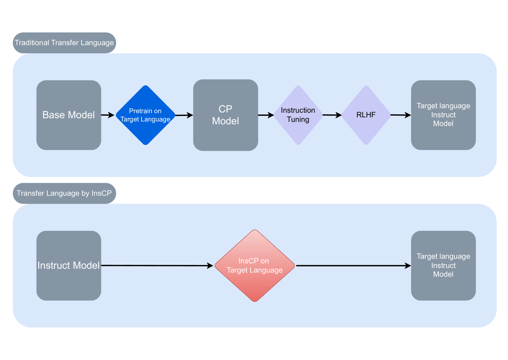

# InstructionCP：快速迁移大型语言模型至目标语言的捷径

发布时间：2024年05月30日

`LLM应用

这篇论文探讨了如何通过创新的指令持续预训练（InsCP）方法，使大型语言模型（LLMs）适应多语言环境，同时保持其对话能力和识别有害内容的能力。这种方法特别关注于如何在掌握新语言的同时，不损害模型的对话技巧和基于人类反馈的强化学习功能。因此，这篇论文属于LLM应用类别，因为它提供了一种实际应用的方法来改进和扩展LLMs的功能，以适应多语言环境。` `多语言技术`

> InstructionCP: A fast approach to transfer Large Language Models into target language

# 摘要

> 近年来，大型语言模型（LLMs）的迅猛发展主要聚焦于英语，导致模型仅能以英语回应。为了使这些模型适应多语言环境，我们通常采用持续预训练（CP），并辅以监督微调（SFT）以保持对话流畅。然而，CP和SFT可能会削弱模型识别有害内容的能力。为此，我们提出了创新的指令持续预训练（InsCP），它巧妙地将指令标签融入CP过程，确保在掌握新语言的同时，对话技巧不受损。实验结果显示，InsCP不仅保留了对话能力，还维持了基于人类反馈的强化学习（RLHF）功能。通过在语言对齐、可靠性和知识测试上的实证评估，InsCP的有效性得到了验证。更令人瞩目的是，这种方法仅需0.1亿个高质量的指令遵循数据标记，大大节约了资源。

> The rapid development of large language models (LLMs) in recent years has largely focused on English, resulting in models that respond exclusively in English. To adapt these models to other languages, continual pre-training (CP) is often employed, followed by supervised fine-tuning (SFT) to maintain conversational abilities. However, CP and SFT can reduce a model's ability to filter harmful content. We propose Instruction Continual Pre-training (InsCP), which integrates instruction tags into the CP process to prevent loss of conversational proficiency while acquiring new languages. Our experiments demonstrate that InsCP retains conversational and Reinforcement Learning from Human Feedback (RLHF) abilities. Empirical evaluations on language alignment, reliability, and knowledge benchmarks confirm the efficacy of InsCP. Notably, this approach requires only 0.1 billion tokens of high-quality instruction-following data, thereby reducing resource consumption.

[Arxiv](https://arxiv.org/abs/2405.20175)