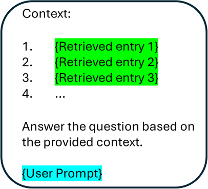
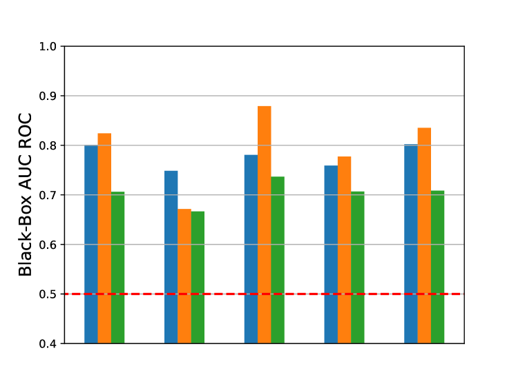
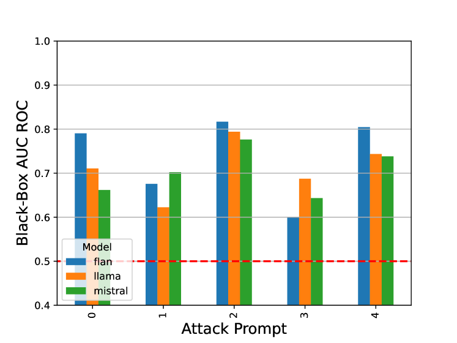
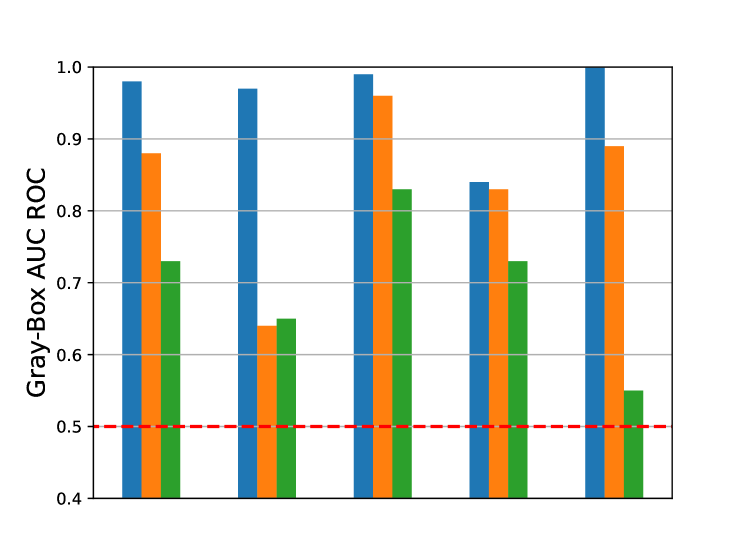
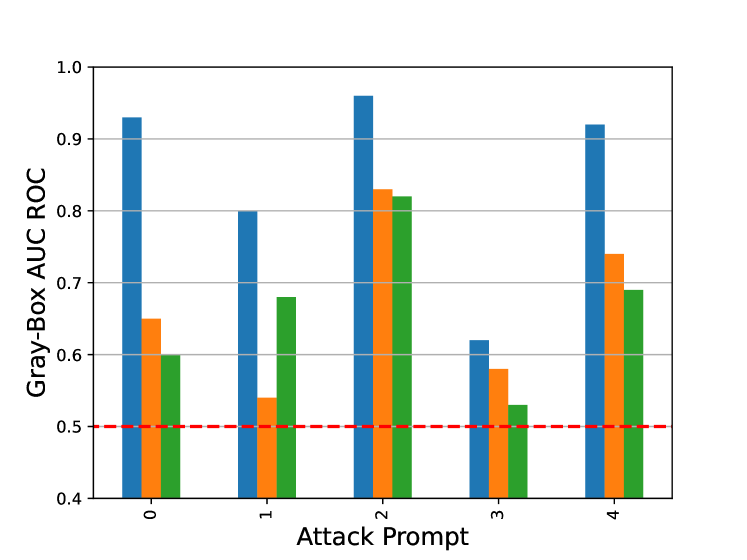

# 你的检索数据库中是否藏有我的数据？探讨针对检索增强生成系统的成员推理攻击

发布时间：2024年05月30日

`RAG

理由：这篇论文主要关注的是检索增强生成（RAG）系统中的隐私问题，特别是成员推断攻击（MIA）。论文提出了一种针对RAG系统的MIA方法，并通过实验验证了其有效性。这与RAG系统的安全性和隐私保护紧密相关，因此归类为RAG。虽然论文涉及到了生成模型和自然语言处理，但其核心关注点是RAG系统的安全问题，而不是LLM的理论或应用，也不是关于Agent的研究。` `隐私保护`

> Is My Data in Your Retrieval Database? Membership Inference Attacks Against Retrieval Augmented Generation

# 摘要

> 检索增强生成（RAG）系统在自然语言处理领域展现出巨大潜力，但其依赖的检索数据库可能包含敏感信息，引发新的隐私担忧。特别是，攻击者可能通过分析RAG系统的输出，推断特定文本是否存在于数据库中，这种攻击称为成员推断攻击（MIA）。尽管MIA的威胁不容忽视，但针对RAG系统的研究仍显不足。本研究提出了一种高效且简便的MIA方法，通过两个基准数据集和多种生成模型验证了其有效性，揭示了在不同安全级别下，通过精心设计的提示，可以有效识别数据库中的文档成员身份。这些发现强调了在实际应用中加强RAG系统安全措施，以保护检索数据库隐私和安全的必要性。

> Retrieval Augmented Generation (RAG) systems have shown great promise in natural language processing. However, their reliance on data stored in a retrieval database, which may contain proprietary or sensitive information, introduces new privacy concerns. Specifically, an attacker may be able to infer whether a certain text passage appears in the retrieval database by observing the outputs of the RAG system, an attack known as a Membership Inference Attack (MIA). Despite the significance of this threat, MIAs against RAG systems have yet remained under-explored. This study addresses this gap by introducing an efficient and easy-to-use method for conducting MIA against RAG systems. We demonstrate the effectiveness of our attack using two benchmark datasets and multiple generative models, showing that the membership of a document in the retrieval database can be efficiently determined through the creation of an appropriate prompt in both black-box and gray-box settings. Our findings highlight the importance of implementing security countermeasures in deployed RAG systems to protect the privacy and security of retrieval databases.

[Arxiv](https://arxiv.org/abs/2405.20446)