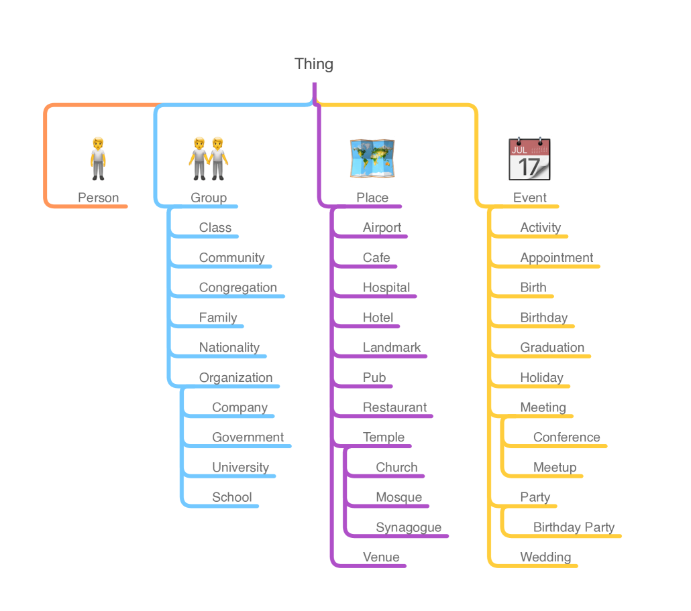

# KNOW：大型语言模型用于知识捕获的真实世界本体论

发布时间：2024年05月30日

`LLM应用

这篇论文介绍了KNOW——世界知识导航器本体，这是一个专门设计来增强大型语言模型（LLMs）在实际生成AI应用中的日常知识使用的本体。它特别关注于提升个人AI助手等应用的性能。论文中提到了该本体的设计理念、与前人研究的对比，以及如何通过提供软件库来支持代码生成，从而便于在软件开发中直接应用本体概念。这些内容表明，该论文主要关注的是LLM在实际应用中的增强和优化，因此属于LLM应用分类。` `人工智能` `软件开发`

> KNOW: A Real-World Ontology for Knowledge Capture with Large Language Models

# 摘要

> 我们推出了KNOW——世界知识导航器本体，这是首个专为增强大型语言模型（LLMs）在实际生成AI应用中的日常知识而设计的本体，如个人AI助手。我们的研究领域深入人类生活，涵盖日常琐事与重大时刻。初期，我们聚焦于已确立的人类共性：时空与社会结构。我们以实用为导向，优先考虑普遍性与实用性。通过对比Schema.org、Cyc等前人研究，我们发现LLMs已内化了许多Cyc项目耗时数十年才捕捉的常识知识。此外，我们为12大主流编程语言提供了代码生成的软件库，便于软件开发中直接应用本体概念。我们推崇简洁与开发者友好，以推动AI的互操作性。

> We present KNOW--the Knowledge Navigator Ontology for the World--the first ontology designed to capture everyday knowledge to augment large language models (LLMs) in real-world generative AI use cases such as personal AI assistants. Our domain is human life, both its everyday concerns and its major milestones. We have limited the initial scope of the modeled concepts to only established human universals: spacetime (places, events) plus social (people, groups, organizations). The inclusion criteria for modeled concepts are pragmatic, beginning with universality and utility. We compare and contrast previous work such as Schema.org and Cyc--as well as attempts at a synthesis of knowledge graphs and language models--noting how LLMs already encode internally much of the commonsense tacit knowledge that took decades to capture in the Cyc project. We also make available code-generated software libraries for the 12 most popular programming languages, enabling the direct use of ontology concepts in software engineering. We emphasize simplicity and developer experience in promoting AI interoperability.

[Arxiv](https://arxiv.org/abs/2405.19877)