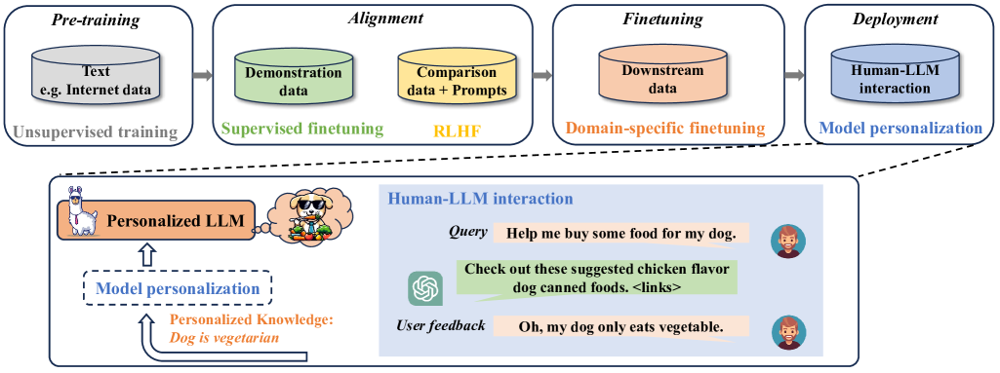
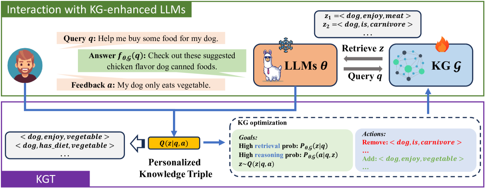
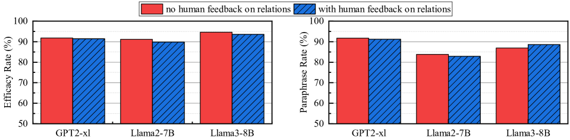
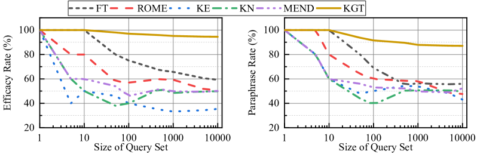

# 实时个性化：基于人类反馈的知识图谱调优大型语言模型

发布时间：2024年05月30日

`LLM应用

这篇论文探讨了大型语言模型（LLMs）的实时个性化问题，提出了一种名为知识图谱调优（KGT）的新方法，该方法利用知识图谱来个性化LLMs，而不需要修改模型参数。这种方法旨在优化用户体验，使模型能够根据用户反馈调整特定知识，同时提高效率和可解释性。因此，这篇论文属于LLM应用类别，因为它关注的是如何应用LLMs以改善用户体验和模型性能。` `个性化推荐`

> Knowledge Graph Tuning: Real-time Large Language Model Personalization based on Human Feedback

# 摘要

> 大型语言模型（LLMs）在众多自然语言处理任务中表现出色。当这些模型投入使用时，它们会接触到拥有个性化知识的用户，并通过交互持续反映这些知识。为了优化用户体验，实时个性化模型变得至关重要，它使LLMs能够根据用户反馈调整特定知识。然而，现有方法通常依赖于高成本的反向传播来微调模型，且缺乏透明度，长期使用可能导致模型性能的不确定性。为此，我们开发了知识图谱调优（KGT），一种创新方法，它利用知识图谱（KGs）来个性化LLMs，无需修改模型参数。KGT通过提取用户查询和反馈中的个性化知识，优化KGs，避免了反向传播，提高了效率，并确保了调整的可解释性。实验证明，KGT不仅提升了包括GPT-2、Llama2和Llama3在内的顶级LLMs的个性化性能，还降低了延迟和GPU内存成本。总之，KGT为实现用户与LLMs交互中的实时、高效且透明的个性化提供了一个有前景的解决方案。

> Large language models (LLMs) have demonstrated remarkable proficiency in a range of natural language processing tasks. Once deployed, LLMs encounter users with personalized factual knowledge, and such personalized knowledge is consistently reflected through users' interactions with the LLMs. To enhance user experience, real-time model personalization is essential, allowing LLMs to adapt user-specific knowledge based on user feedback during human-LLM interactions. Existing methods mostly require back-propagation to finetune the model parameters, which incurs high computational and memory costs. In addition, these methods suffer from low interpretability, which will cause unforeseen impacts on model performance during long-term use, where the user's personalized knowledge is accumulated extensively.To address these challenges, we propose Knowledge Graph Tuning (KGT), a novel approach that leverages knowledge graphs (KGs) to personalize LLMs. KGT extracts personalized factual knowledge triples from users' queries and feedback and optimizes KGs without modifying the LLM parameters. Our method improves computational and memory efficiency by avoiding back-propagation and ensures interpretability by making the KG adjustments comprehensible to humans.Experiments with state-of-the-art LLMs, including GPT-2, Llama2, and Llama3, show that KGT significantly improves personalization performance while reducing latency and GPU memory costs. Ultimately, KGT offers a promising solution of effective, efficient, and interpretable real-time LLM personalization during user interactions with the LLMs.

[Arxiv](https://arxiv.org/abs/2405.19686)