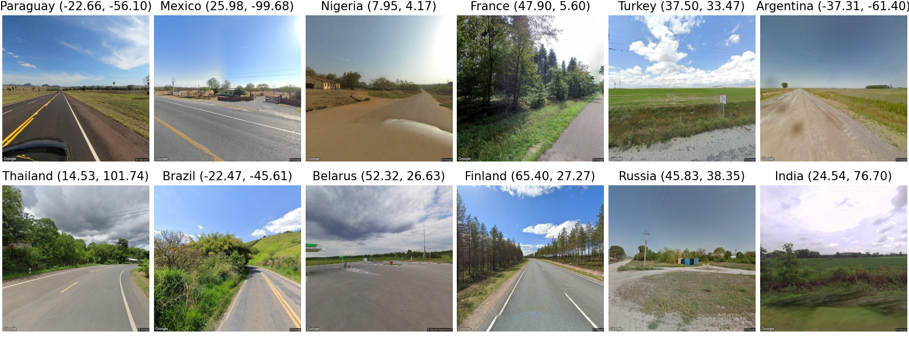
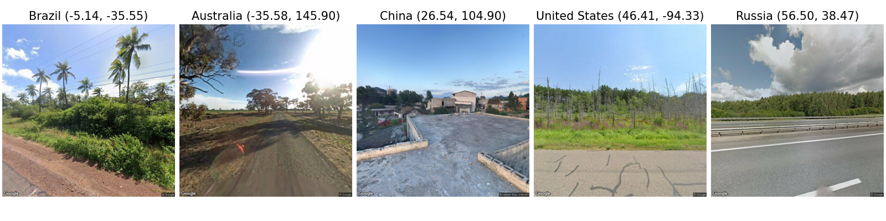
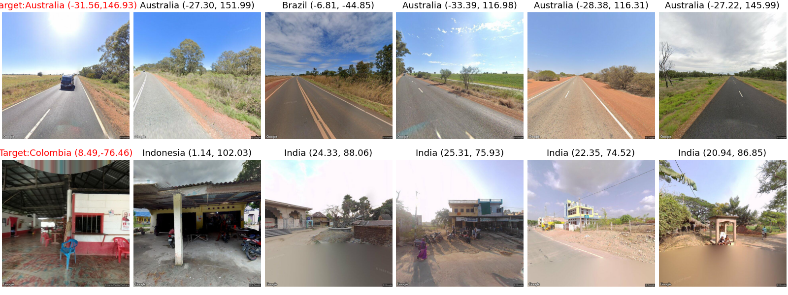

# LLMGeo：大型语言模型在野外图像地理定位的基准测试

发布时间：2024年05月30日

`LLM应用

这篇论文探讨了多模态语言模型在图像地理定位任务中的应用，通过使用特定的数据集和评估体系来评估这些模型的性能。虽然涉及到了多模态语言模型的使用，但重点在于其在实际应用中的表现，即图像地理定位，而不是模型的理论研究或Agent的设计与应用。因此，最合适的分类是LLM应用。` `图像理解` `地理定位`

> LLMGeo: Benchmarking Large Language Models on Image Geolocation In-the-wild

# 摘要

> 图像地理定位在众多图像理解应用中至关重要，但现有技术在处理复杂多变的野外图像时往往力不从心。借鉴多模态语言模型深厚的背景知识，我们采用一套新颖的数据集和评估体系，对其地理定位能力进行了深入探究。我们通过谷歌街景搜集了多国的图像，并对闭源与开源的多模态语言模型进行了无需训练与基于训练的双重评估。研究结果显示，闭源模型在地理定位上表现更佳，而开源模型通过精细调整亦能取得不俗成绩。

> Image geolocation is a critical task in various image-understanding applications. However, existing methods often fail when analyzing challenging, in-the-wild images. Inspired by the exceptional background knowledge of multimodal language models, we systematically evaluate their geolocation capabilities using a novel image dataset and a comprehensive evaluation framework. We first collect images from various countries via Google Street View. Then, we conduct training-free and training-based evaluations on closed-source and open-source multi-modal language models. we conduct both training-free and training-based evaluations on closed-source and open-source multimodal language models. Our findings indicate that closed-source models demonstrate superior geolocation abilities, while open-source models can achieve comparable performance through fine-tuning.

[Arxiv](https://arxiv.org/abs/2405.20363)