# LLaMEA：大型语言模型进化算法，专为自动生成元启发式而设计

发布时间：2024年05月30日

`LLM应用

这篇论文介绍了一个名为LLaMEA的框架，该框架利用大型语言模型（如GPT-4）来自动生成和优化算法。这种方法通过迭代过程，包括生成、变异和选择算法，以及根据性能指标和运行时反馈进行优化，展示了如何自动化地创造新的优化算法。这种应用展示了LLM在算法开发和优化领域的实际应用，因此属于LLM应用分类。` `优化算法` `自动化`

> LLaMEA: A Large Language Model Evolutionary Algorithm for Automatically Generating Metaheuristics

# 摘要

> GPT-4等大型语言模型（LLMs）已证明其理解自然语言和生成复杂代码的能力。本文创新性地提出了大型语言模型进化算法（LLaMEA）框架，利用GPT模型自动生成和优化算法。在设定标准和任务描述（搜索空间）的基础上，LLaMEA通过迭代生成、变异和选择算法，依据性能指标和运行时反馈进行优化。这一框架无需深厚专业知识，即可生成优化算法。我们展示了如何利用LLaMEA自动创造新的黑盒元启发式优化算法，其在五维黑盒优化基准（BBOB）上超越了现有的顶尖算法（如协方差矩阵适应进化策略和差分进化）。这些成果不仅验证了框架的有效性，也为未来通过LLMs自动化算法生成与优化开辟了新路径。

> Large Language Models (LLMs) such as GPT-4 have demonstrated their ability to understand natural language and generate complex code snippets. This paper introduces a novel Large Language Model Evolutionary Algorithm (LLaMEA) framework, leveraging GPT models for the automated generation and refinement of algorithms. Given a set of criteria and a task definition (the search space), LLaMEA iteratively generates, mutates and selects algorithms based on performance metrics and feedback from runtime evaluations. This framework offers a unique approach to generating optimized algorithms without requiring extensive prior expertise. We show how this framework can be used to generate novel black-box metaheuristic optimization algorithms automatically. LLaMEA generates multiple algorithms that outperform state-of-the-art optimization algorithms (Covariance Matrix Adaptation Evolution Strategy and Differential Evolution) on the five dimensional black box optimization benchmark (BBOB). The results demonstrate the feasibility of the framework and identify future directions for automated generation and optimization of algorithms via LLMs.

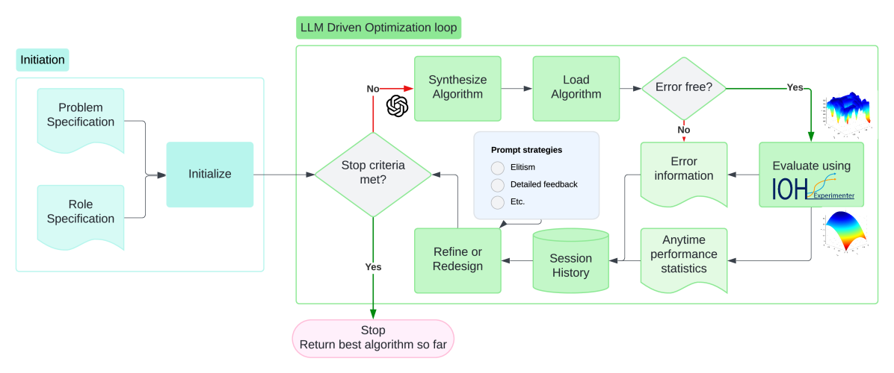

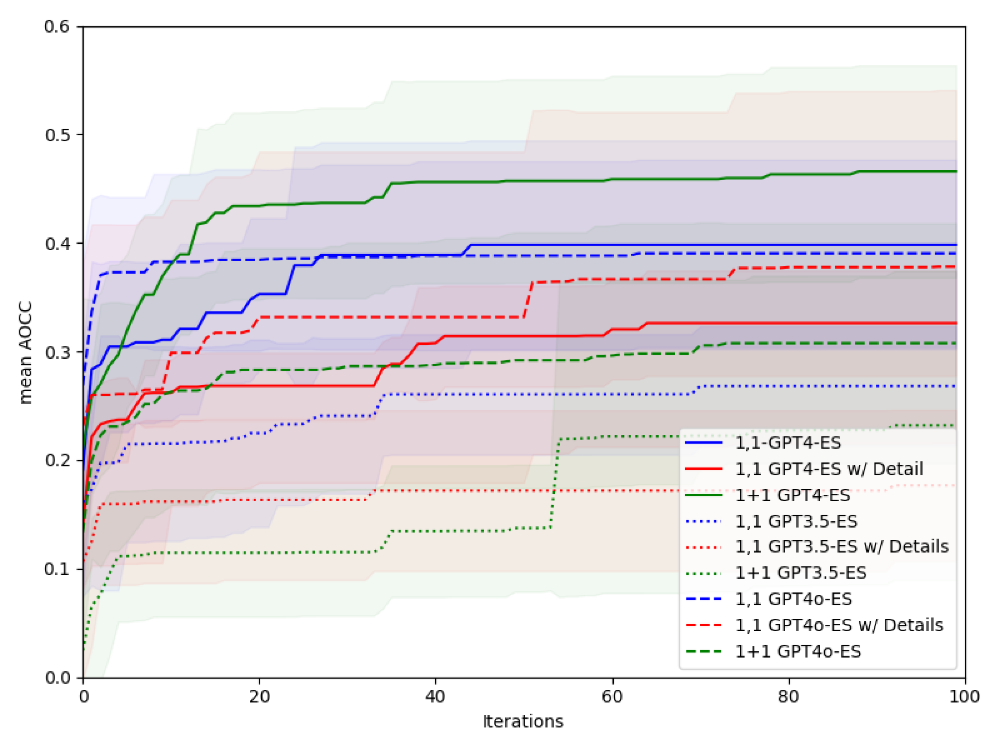

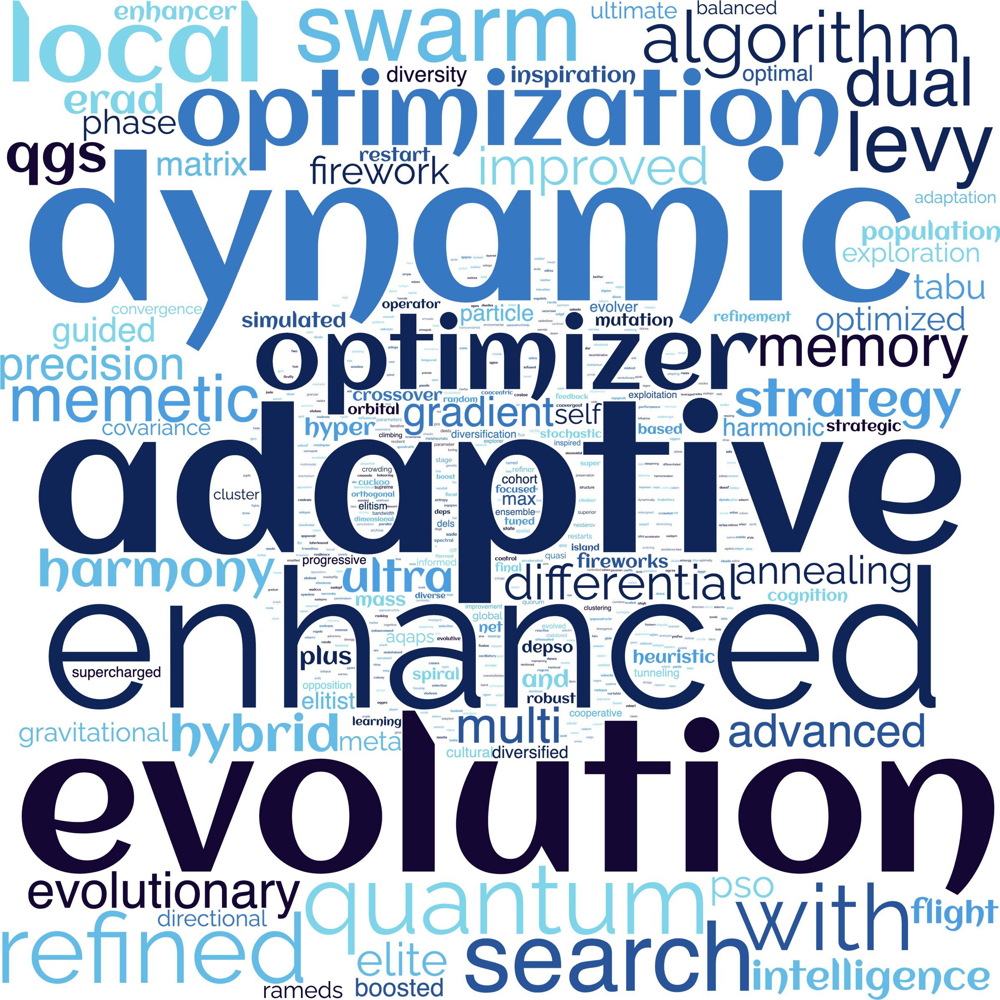

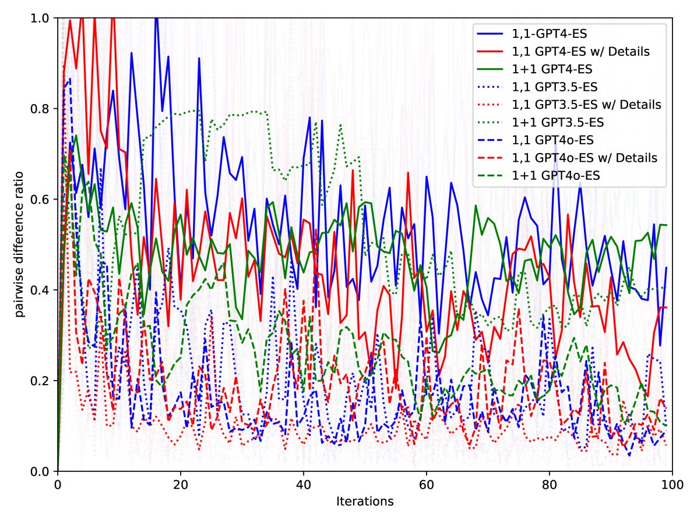

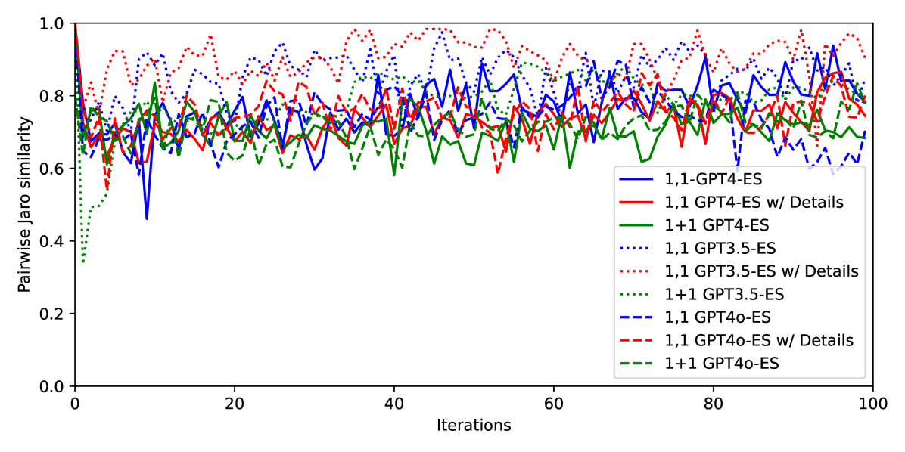

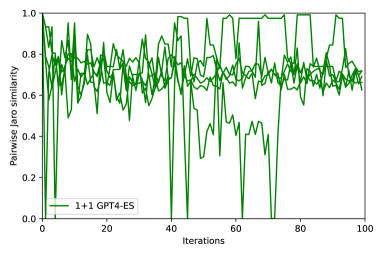

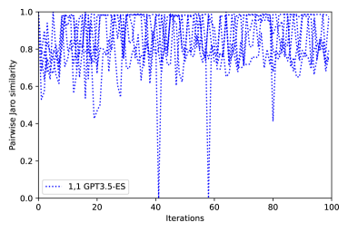

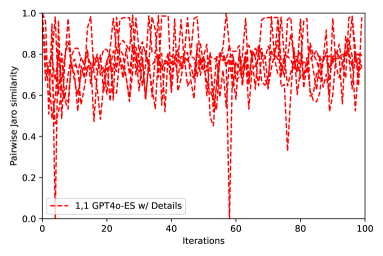

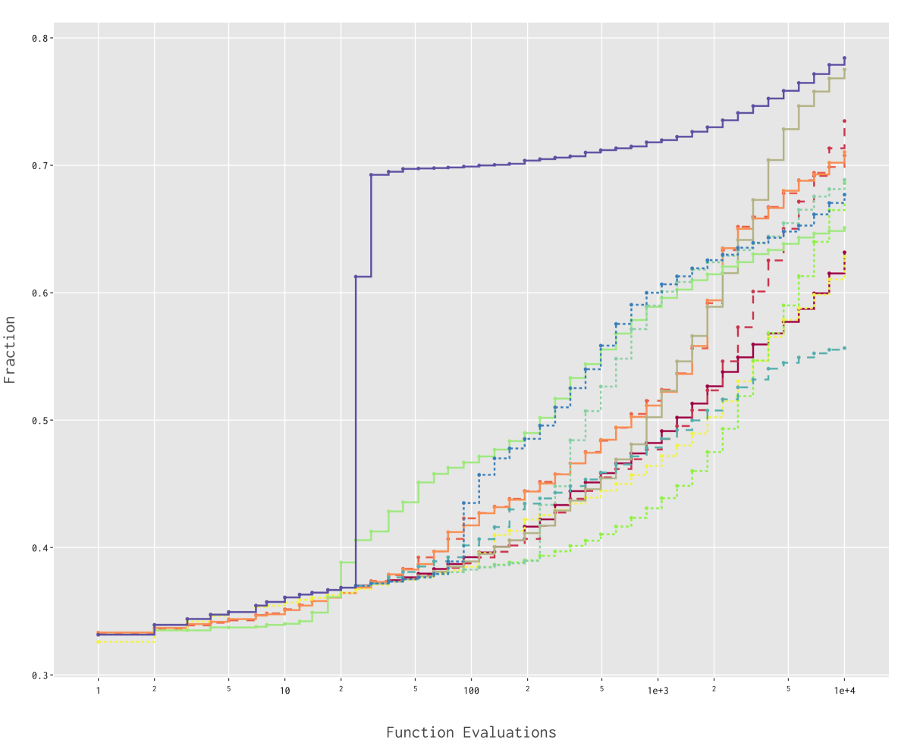

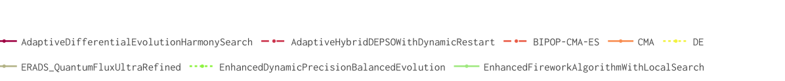

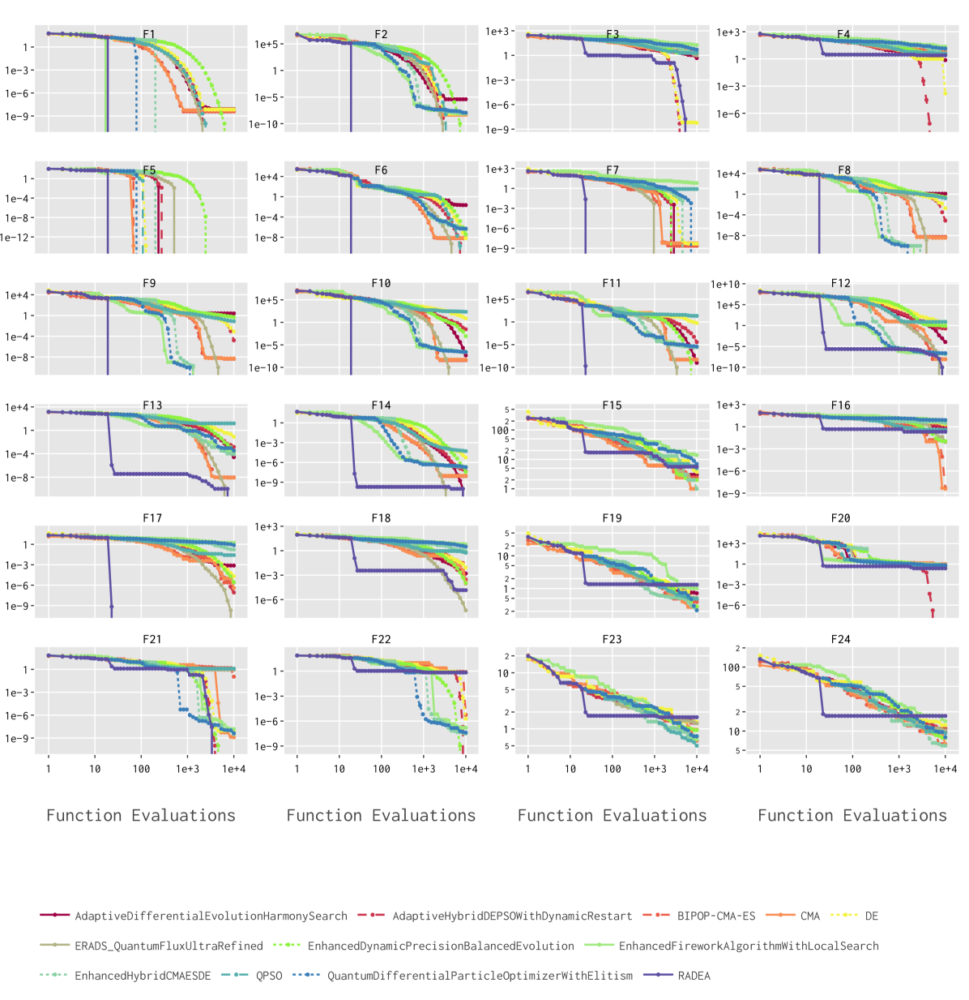

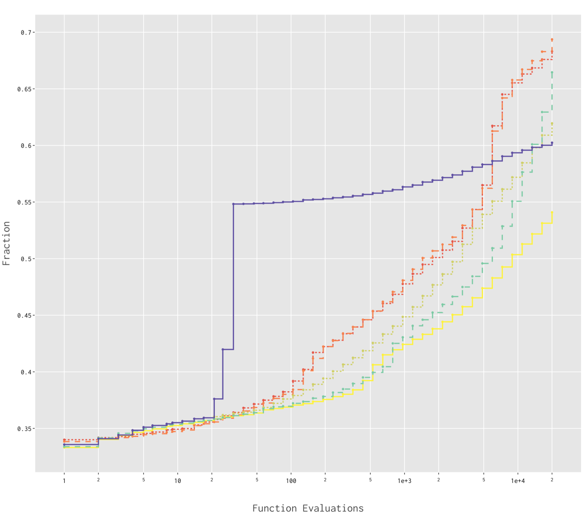

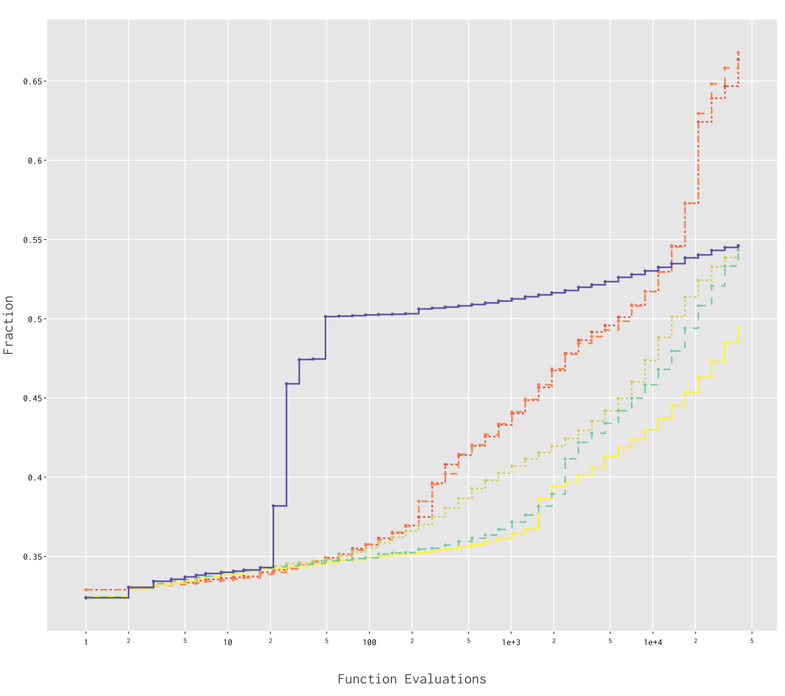

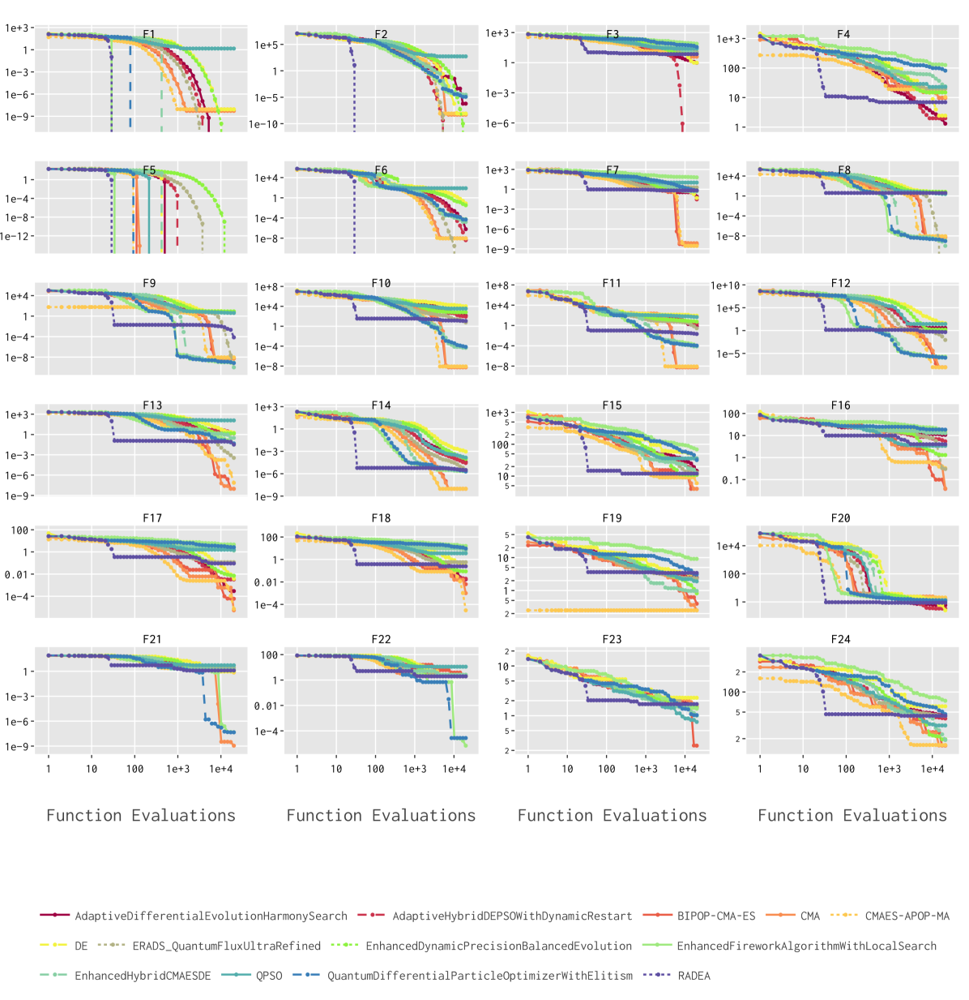

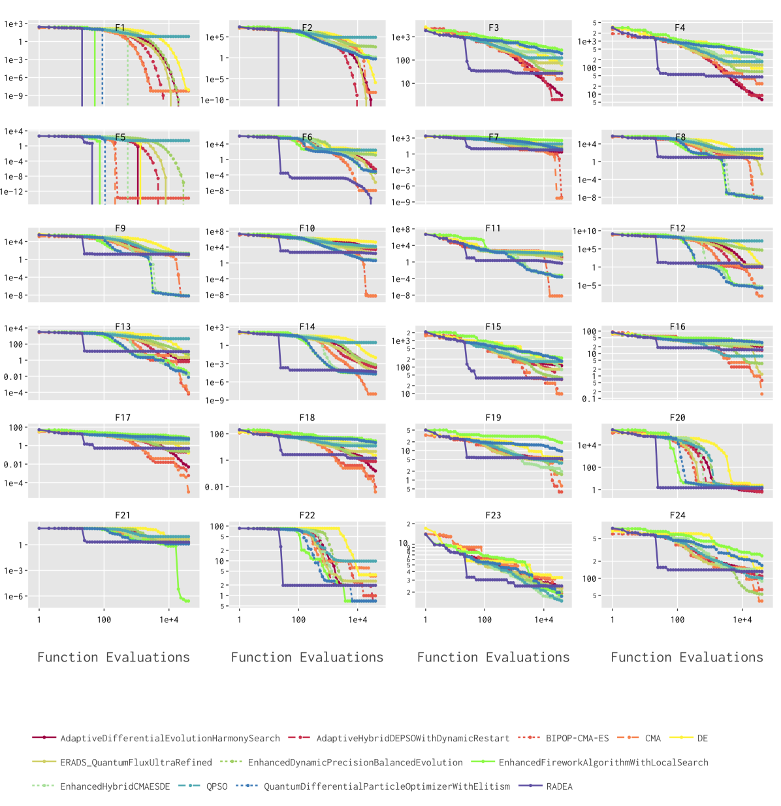

[Arxiv](https://arxiv.org/abs/2405.20132)