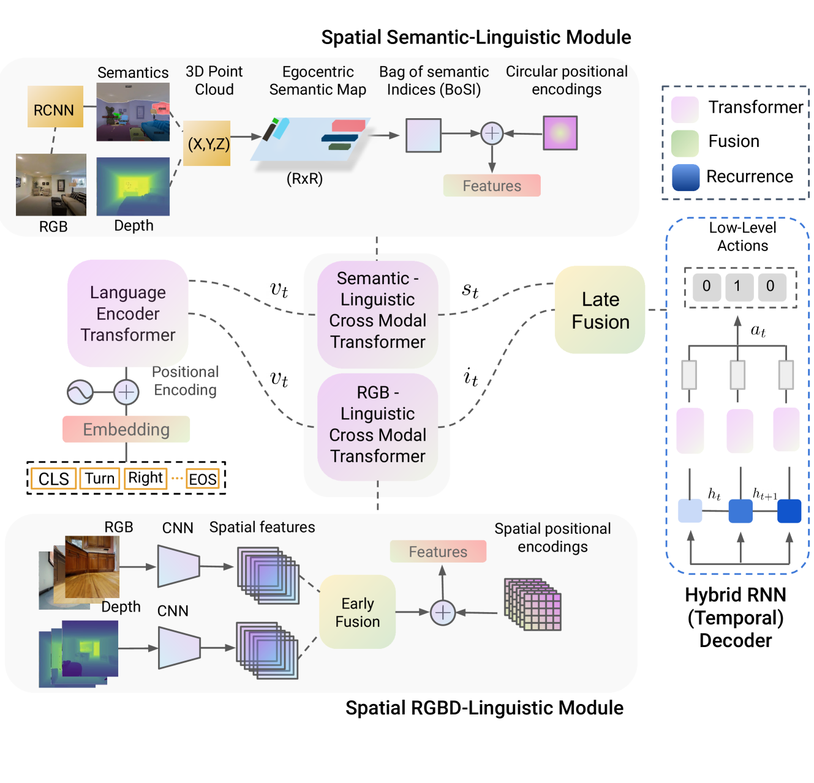
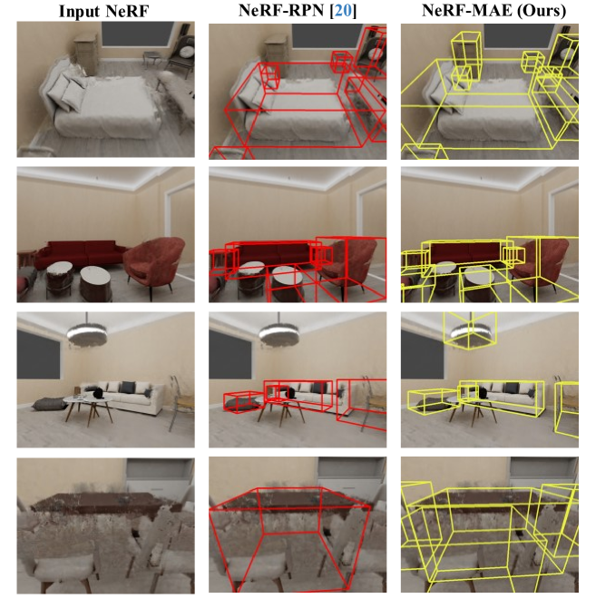
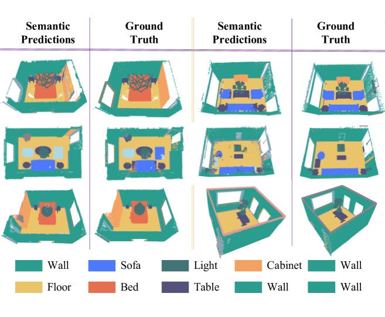

# 借助归纳先验，探索3D机器人感知的学习之道

发布时间：2024年05月30日

`Agent

这篇论文主要探讨了如何利用结构化归纳偏差和先验知识来设计智能代理，这些代理能够高效处理复杂任务并在动态环境中实现对3D世界的全面理解。论文中提到的应用领域（如基于对象的3D重建、视觉与语言结合的决策制定、3D场景理解）以及先验知识的应用，都是围绕着如何构建和优化智能代理的能力。因此，这篇论文更符合Agent分类，因为它关注的是智能代理的设计和应用。` `机器人技术` `人工智能`

> Learning 3D Robotics Perception using Inductive Priors

# 摘要

> 深度学习的进步，催生了数据驱动的智能，使得AI模型能够高效处理海量数据，精通诸如文本生成图像、机器对话、图像识别等数字任务。本论文探讨了如何利用结构化归纳偏差和先验知识，设计出能够释放原则中心智能潜力的方法和算法。先验知识，源自过往经验和对世界运作的假设，助力自主系统更佳泛化，基于经验调整行为。论文中，我展示了先验知识在三个机器人感知领域的应用：1. 基于对象的3D重建，2. 视觉与语言结合的决策制定，3. 3D场景理解。针对这些难题，我提出了多种先验知识来源，如合成数据的几何与外观先验、模块化与语义地图先验、语义结构与上下文先验。我研究了这些先验在机器人3D感知任务中的应用，并探讨了如何在深度学习模型中高效编码它们。部分先验用于迁移学习中的网络预热，其他则作为硬约束，限定机器人行动空间。传统技术在未知场景中易崩溃，数据驱动方法则需大量标注数据，而本论文旨在打造智能代理，它们仅需少量真实数据或模拟数据，便能在动态复杂的新模拟或真实环境中，实现对3D世界的全面理解。

> Recent advances in deep learning have led to a data-centric intelligence i.e. artificially intelligent models unlocking the potential to ingest a large amount of data and be really good at performing digital tasks such as text-to-image generation, machine-human conversation, and image recognition. This thesis covers the topic of learning with structured inductive bias and priors to design approaches and algorithms unlocking the potential of principle-centric intelligence. Prior knowledge (priors for short), often available in terms of past experience as well as assumptions of how the world works, helps the autonomous agent generalize better and adapt their behavior based on past experience. In this thesis, I demonstrate the use of prior knowledge in three different robotics perception problems. 1. object-centric 3D reconstruction, 2. vision and language for decision-making, and 3. 3D scene understanding. To solve these challenging problems, I propose various sources of prior knowledge including 1. geometry and appearance priors from synthetic data, 2. modularity and semantic map priors and 3. semantic, structural, and contextual priors. I study these priors for solving robotics 3D perception tasks and propose ways to efficiently encode them in deep learning models. Some priors are used to warm-start the network for transfer learning, others are used as hard constraints to restrict the action space of robotics agents. While classical techniques are brittle and fail to generalize to unseen scenarios and data-centric approaches require a large amount of labeled data, this thesis aims to build intelligent agents which require very-less real-world data or data acquired only from simulation to generalize to highly dynamic and cluttered environments in novel simulations (i.e. sim2sim) or real-world unseen environments (i.e. sim2real) for a holistic scene understanding of the 3D world.

[Arxiv](https://arxiv.org/abs/2405.20364)