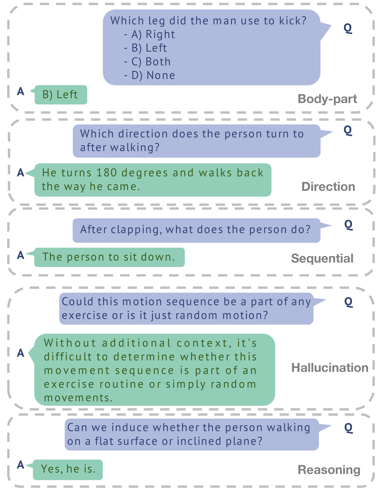
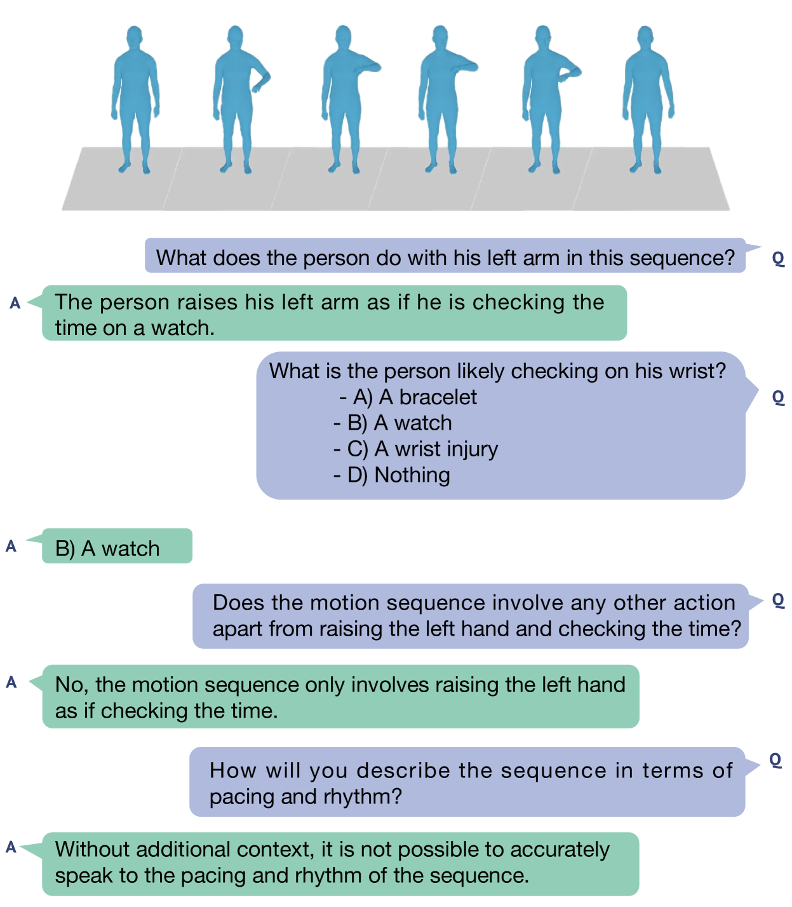

# MotionLLM：解析人体运动与视频，洞察人类行为之谜

发布时间：2024年05月30日

`LLM应用

这篇论文介绍了MotionLLM框架，这是一个专门设计来理解和分析人类行为的系统，它结合了视频和运动数据。这种多模态的方法旨在更深入地理解人类行为的复杂性和语义。论文中提到的MotionLLM框架的开发、训练策略以及创建的MoVid数据集和MoVid-Bench评估基准，都是为了优化和评估人类行为理解的能力。这些内容表明，该研究是关于如何应用大型语言模型（LLMs）来解决实际问题，即人类行为的多模态理解，因此属于LLM应用分类。` `视频分析` `运动科学`

> MotionLLM: Understanding Human Behaviors from Human Motions and Videos

# 摘要

> 本研究通过大型语言模型（LLMs）深入探索了视频与运动结合的多模态人类行为理解领域。与仅专注于视频或运动的LLMs不同，我们认为要真正理解人类行为，必须同时从视频和运动序列（如SMPL序列）两方面进行联合分析，以捕捉身体动态的微妙之处和深层语义。为此，我们推出了MotionLLM框架，它简洁高效，专为人类运动的理解、描述和推理设计。MotionLLM采用了一种结合视频与运动数据的训练策略，巧妙融合了粗细两种文本数据的优势，从而深入挖掘时空信息。我们还创建了MoVid数据集，它包含了丰富的视频、运动、描述和指令。为了更准确地评估人类行为理解，我们精心制作了MoVid-Bench评估基准。实验结果充分展示了MotionLLM在描述、时空理解和推理方面的卓越性能。

> This study delves into the realm of multi-modality (i.e., video and motion modalities) human behavior understanding by leveraging the powerful capabilities of Large Language Models (LLMs). Diverging from recent LLMs designed for video-only or motion-only understanding, we argue that understanding human behavior necessitates joint modeling from both videos and motion sequences (e.g., SMPL sequences) to capture nuanced body part dynamics and semantics effectively. In light of this, we present MotionLLM, a straightforward yet effective framework for human motion understanding, captioning, and reasoning. Specifically, MotionLLM adopts a unified video-motion training strategy that leverages the complementary advantages of existing coarse video-text data and fine-grained motion-text data to glean rich spatial-temporal insights. Furthermore, we collect a substantial dataset, MoVid, comprising diverse videos, motions, captions, and instructions. Additionally, we propose the MoVid-Bench, with carefully manual annotations, for better evaluation of human behavior understanding on video and motion. Extensive experiments show the superiority of MotionLLM in the caption, spatial-temporal comprehension, and reasoning ability.

[Arxiv](https://arxiv.org/abs/2405.20340)