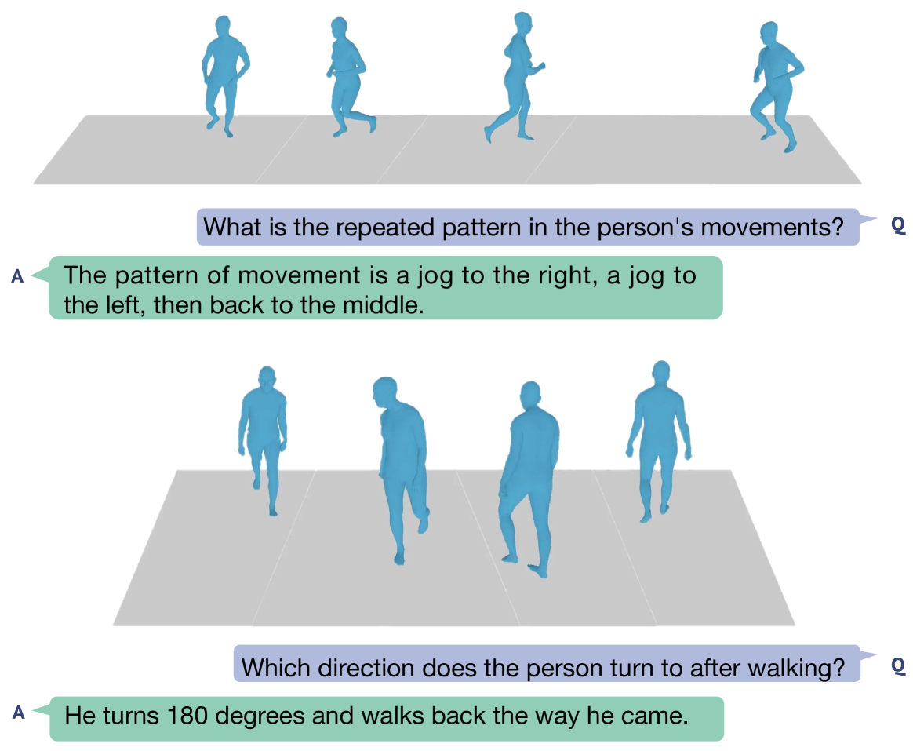

# MotionLLM：解析人体运动与视频，洞察人类行为之谜

发布时间：2024年05月30日

`LLM应用

理由：这篇论文介绍了MotionLLM框架，这是一个专门设计来理解和推理人类运动的系统，它结合了视频和运动数据来深入挖掘时空信息。这种应用性质的研究，特别是它如何利用大型语言模型（LLMs）来增强对多模态人类行为的理解，符合LLM应用的分类。论文中提到的开发新数据集和评估工具，以及实验结果的展示，都是应用研究的典型特征，而不是专注于理论探讨或Agent的设计与实现。` `视频分析` `运动科学`

> MotionLLM: Understanding Human Behaviors from Human Motions and Videos

# 摘要

> 本研究通过大型语言模型（LLMs）深入探索了视频与运动结合的多模态人类行为理解领域。与仅专注于视频或运动的LLMs不同，我们认为要深入理解人类行为，必须同时从视频和运动序列（如SMPL序列）中提取信息，以捕捉身体部位的微妙动态和语义。为此，我们开发了MotionLLM框架，它简单高效，专为人类运动的理解、描述和推理设计。MotionLLM采用了一种结合视频与运动数据的训练策略，充分利用了现有视频-文本与运动-文本数据的互补性，从而深入挖掘时空信息。我们还创建了MoVid数据集，包含丰富的视频、运动、描述和指令，并设计了MoVid-Bench评估工具，通过精细的人工标注，以更准确地衡量人类行为理解能力。实验结果显示，MotionLLM在描述生成、时空理解和推理方面均展现出卓越性能。

> This study delves into the realm of multi-modality (i.e., video and motion modalities) human behavior understanding by leveraging the powerful capabilities of Large Language Models (LLMs). Diverging from recent LLMs designed for video-only or motion-only understanding, we argue that understanding human behavior necessitates joint modeling from both videos and motion sequences (e.g., SMPL sequences) to capture nuanced body part dynamics and semantics effectively. In light of this, we present MotionLLM, a straightforward yet effective framework for human motion understanding, captioning, and reasoning. Specifically, MotionLLM adopts a unified video-motion training strategy that leverages the complementary advantages of existing coarse video-text data and fine-grained motion-text data to glean rich spatial-temporal insights. Furthermore, we collect a substantial dataset, MoVid, comprising diverse videos, motions, captions, and instructions. Additionally, we propose the MoVid-Bench, with carefully manual annotations, for better evaluation of human behavior understanding on video and motion. Extensive experiments show the superiority of MotionLLM in the caption, spatial-temporal comprehension, and reasoning ability.

[Arxiv](https://arxiv.org/abs/2405.20340)