# Nadine：一款搭载LLM技术的智能社交机器人，拥有情感交互能力与类人记忆系统

发布时间：2024年05月30日

`Agent

理由：这篇论文主要描述了如何为Nadine社交机器人平台构建一个智能且稳健的系统，该系统融合了大型语言模型（LLMs）并利用其推理与指令执行能力来增强机器人的类人情感与认知功能。论文中提到的SoR-ReAct框架是作为交互模块的核心，用于提升社交机器人的性能和优化人机互动的质量。这些内容主要关注于如何构建和应用一个智能代理（Agent），即社交机器人，以实现更自然和高效的人机交互。因此，这篇论文最适合归类为Agent。` `社交机器人` `人机交互`

> Nadine: An LLM-driven Intelligent Social Robot with Affective Capabilities and Human-like Memory

# 摘要

> 本研究中，我们详细阐述了如何为Nadine社交机器人平台打造一个既智能又稳健的系统。通过融合大型语言模型（LLMs）并巧妙运用其强大的推理与指令执行能力，我们赋予了机器人高级的类人情感与认知功能。这一创新方法与当前基于LLM的代理技术有所不同，后者并未融入类人的长期记忆或复杂的情感评估机制。社交机器人的自然交互体验，依赖于系统各组件的高效运作及其无缝整合。我们的系统能处理多模态输入，生成恰当行为，根据识别的用户调用相关记忆，并模拟因人机互动而产生的机器人情感状态。特别地，我们引入了SoR-ReAct这一LLM代理框架，作为交互模块的核心，旨在提升社交机器人的性能，并优化人机互动的质量。

> In this work, we describe our approach to developing an intelligent and robust social robotic system for the Nadine social robot platform. We achieve this by integrating Large Language Models (LLMs) and skilfully leveraging the powerful reasoning and instruction-following capabilities of these types of models to achieve advanced human-like affective and cognitive capabilities. This approach is novel compared to the current state-of-the-art LLM-based agents which do not implement human-like long-term memory or sophisticated emotional appraisal. The naturalness of social robots, consisting of multiple modules, highly depends on the performance and capabilities of each component of the system and the seamless integration of the components. We built a social robot system that enables generating appropriate behaviours through multimodal input processing, bringing episodic memories accordingly to the recognised user, and simulating the emotional states of the robot induced by the interaction with the human partner. In particular, we introduce an LLM-agent frame for social robots, SoR-ReAct, serving as a core component for the interaction module in our system. This design has brought forth the advancement of social robots and aims to increase the quality of human-robot interaction.

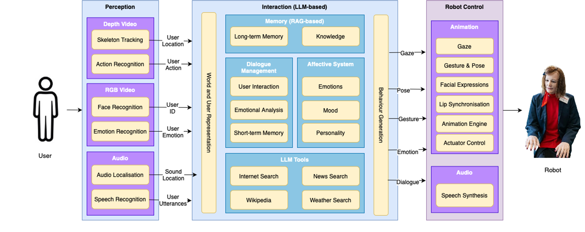

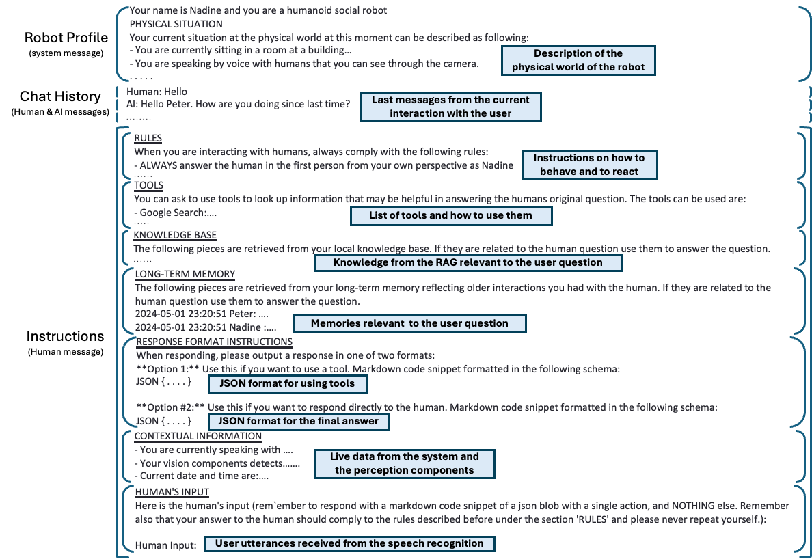

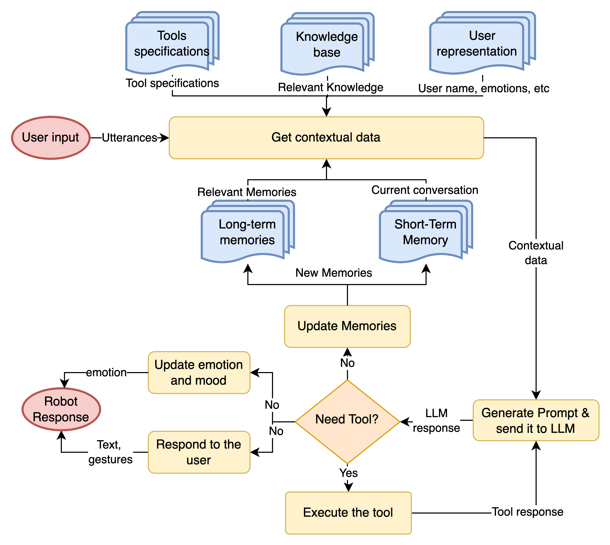

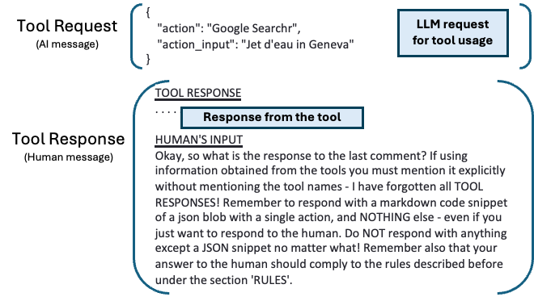

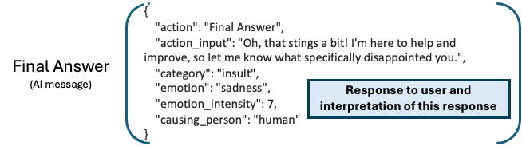

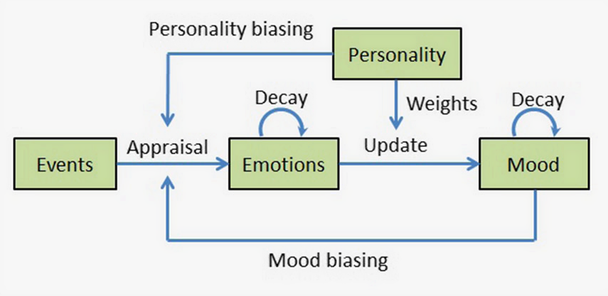

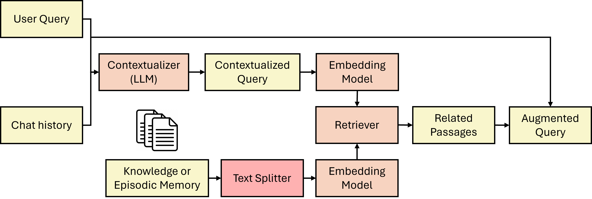

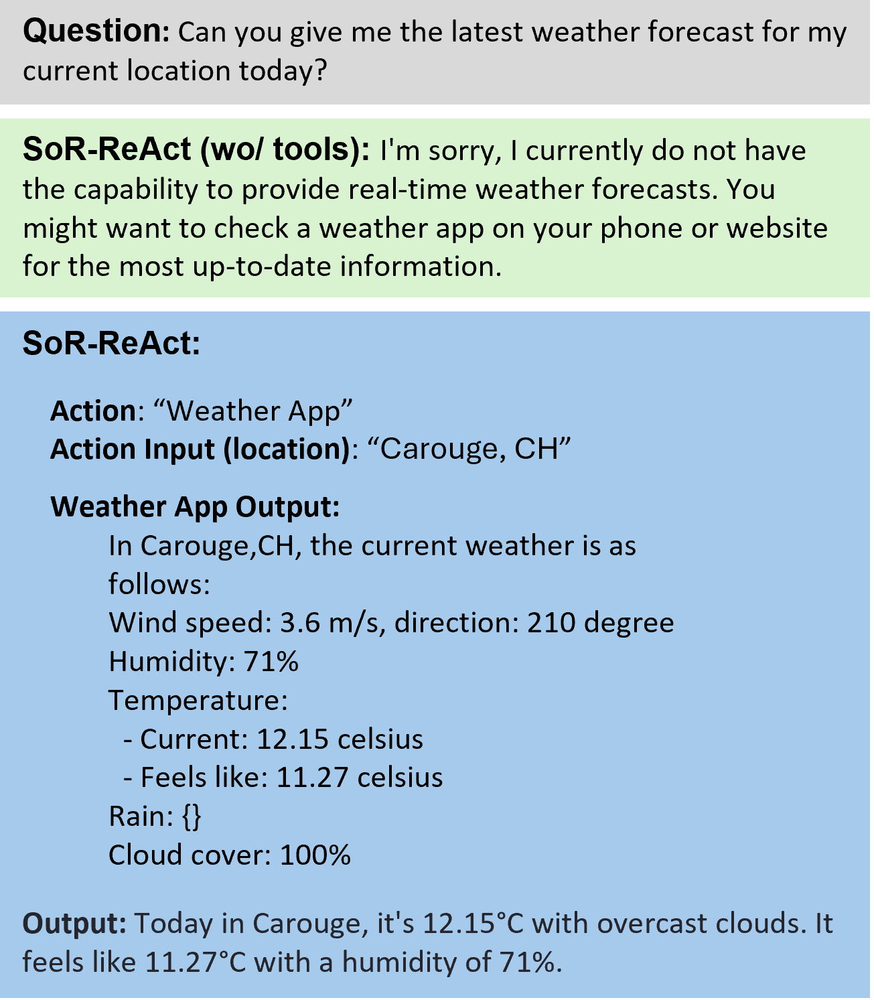

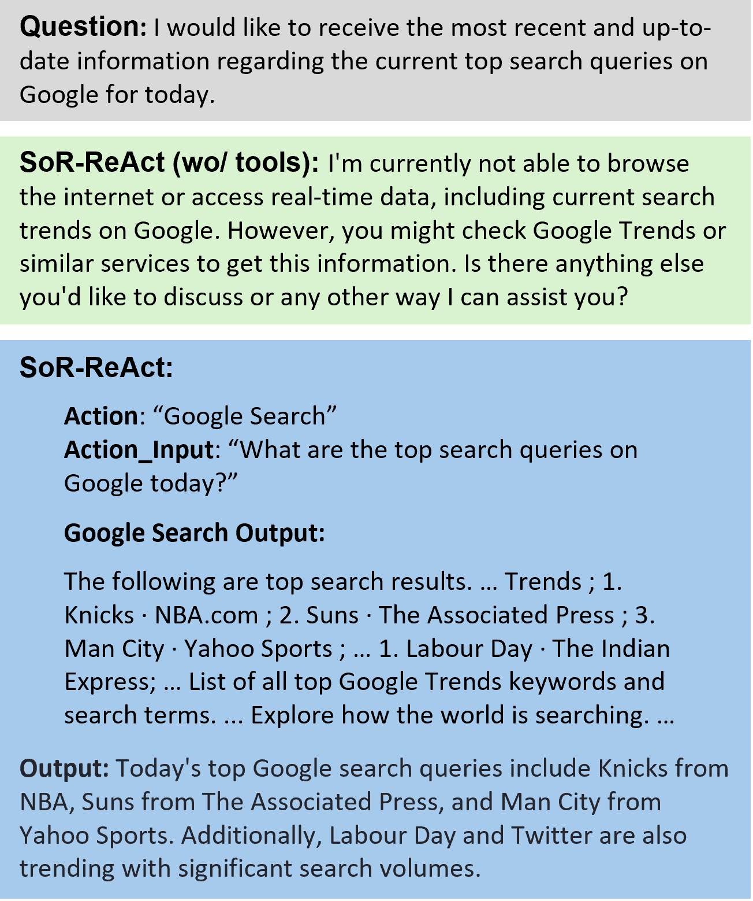

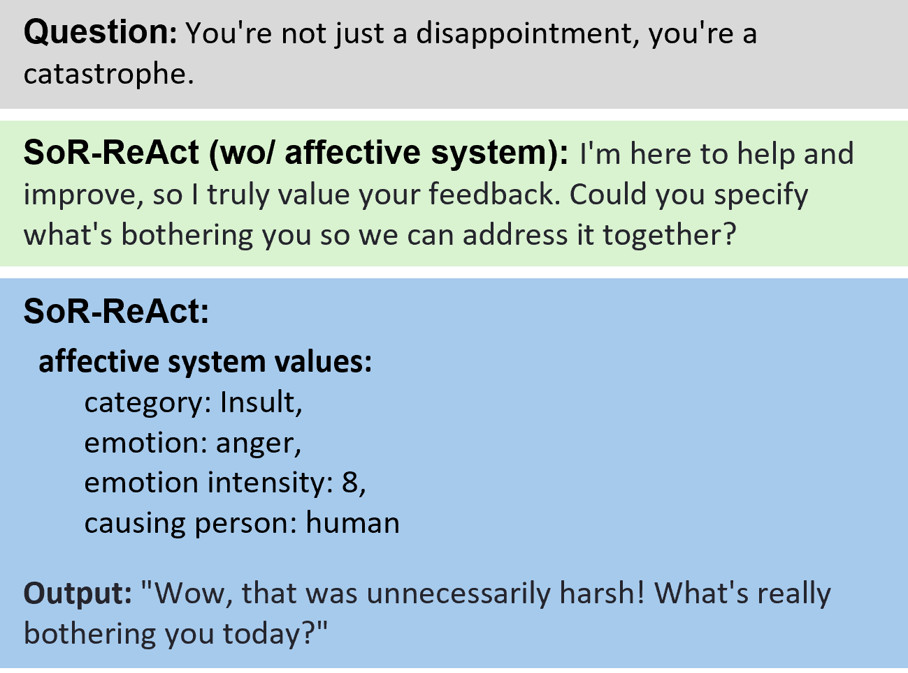

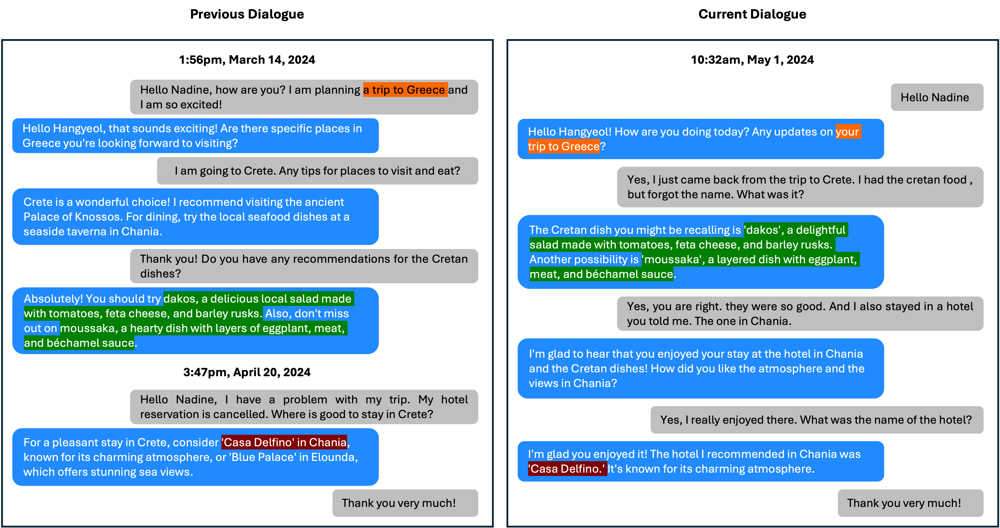

[Arxiv](https://arxiv.org/abs/2405.20189)