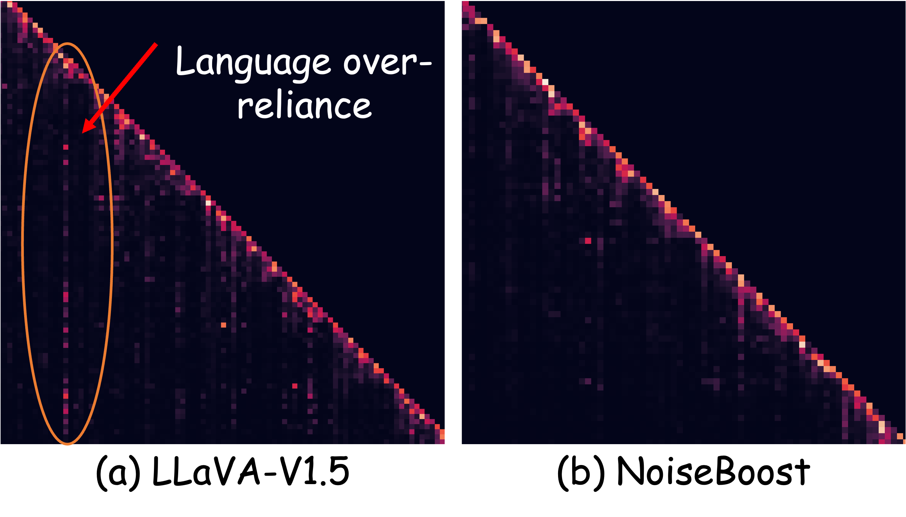

# NoiseBoost：借助噪声扰动，缓解多模态大型语言模型中的幻觉现象

发布时间：2024年05月30日

`LLM应用

这篇论文探讨了多模态大型语言模型（MLLMs）在生成图像描述时产生的幻觉问题，并提出了一种名为NoiseBoost的方法来解决这一问题。该方法通过引入噪声特征扰动来减轻幻觉现象，并在多种训练模式下提升了模型的性能。此外，NoiseBoost还实现了MLLMs的半监督学习，有效利用了未标记数据。这些研究成果直接应用于改进现有的MLLMs技术，因此属于LLM应用类别。` `计算机视觉`

> NoiseBoost: Alleviating Hallucination with Noise Perturbation for Multimodal Large Language Models

# 摘要

> 多模态大型语言模型（MLLMs）在理解视觉信息方面展现出强大能力，但它们在生成图像的详细描述时容易产生幻觉。我们的研究发现，这种幻觉源于模型对语言标记的过度依赖，忽视了视觉信息。为此，我们提出了 NoiseBoost 方法，通过引入噪声特征扰动，有效减轻了幻觉现象。这种方法简单而高效，不仅在多种训练模式下提升了 MLLMs 的性能，还首次实现了 MLLMs 的半监督学习，充分利用了未标记数据。实验结果显示，NoiseBoost 在人类评估中提升了 8.1% 的描述准确性，并能通过未标记数据达到与使用一半标记数据相当的效果。相关代码和模型已公开发布于 https://kaiwu5.github.io/noiseboost。

> Multimodal large language models (MLLMs) contribute a powerful mechanism to understanding visual information building on large language models. However, MLLMs are notorious for suffering from hallucinations, especially when generating lengthy, detailed descriptions for images. Our analysis reveals that hallucinations stem from the inherent summarization mechanism of large language models, leading to excessive dependence on linguistic tokens while neglecting vision information. In this paper, we propose NoiseBoost, a broadly applicable and simple method for alleviating hallucinations for MLLMs through the integration of noise feature perturbations. Noise perturbation acts as a regularizer, facilitating a balanced distribution of attention weights among visual and linguistic tokens. Despite its simplicity, NoiseBoost consistently enhances the performance of MLLMs across common training strategies, including supervised fine-tuning and reinforcement learning. Further, NoiseBoost pioneerly enables semi-supervised learning for MLLMs, unleashing the power of unlabeled data. Comprehensive experiments demonstrate that NoiseBoost improves dense caption accuracy by 8.1% with human evaluation and achieves comparable results with 50% of the data by mining unlabeled data. Code and models are available at https://kaiwu5.github.io/noiseboost.

[Arxiv](https://arxiv.org/abs/2405.20081)