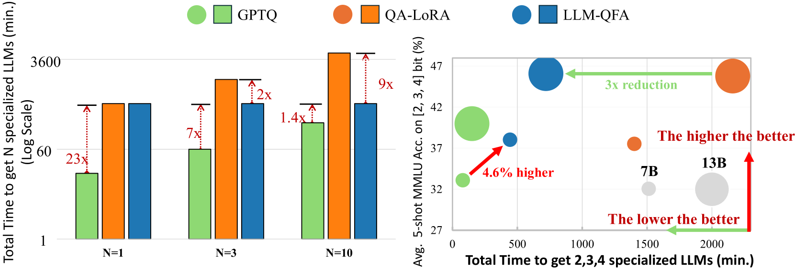

# 一调通用，高效部署：微调量化大型语言模型，一次到位

发布时间：2024年05月30日

`LLM理论

理由：这篇论文主要探讨了大型语言模型（LLMs）的量化技术和训练效率问题，并提出了一种新的训练方法（OFA超网络）来优化这一过程。这涉及到LLMs的理论研究和模型优化，因此属于LLM理论分类。论文中提出的方法和技术旨在改进LLMs的训练和部署过程，而不是直接应用于特定的Agent或RAG系统，也不是关于LLM的具体应用案例，因此不适合归类为Agent、RAG或LLM应用。` `人工智能` `模型部署`

> One QuantLLM for ALL: Fine-tuning Quantized LLMs Once for Efficient Deployments

# 摘要

> 大型语言模型（LLMs）虽进步缓慢，但内存需求巨大。量化技术虽有潜力，但现有方法常需长时间训练以缓解量化损失。在不同资源限制场景中部署LLMs，每个应用都需重复训练，加剧了训练时间问题。因此，我们提出“一次训练，全用”（OFA）超网络，通过一次训练为下游应用生成多样化的最优子网络。我们通过解耦共享权重消除干扰，并引入低秩适配器提升训练效率。针对传统均匀采样导致的资源分配不均，我们引入非参数调度器，调整采样率，实现不同需求子网络间更均衡的资源分配。在LLaMA2系列上的验证表明，我们能在多种场景下保持高性能，同时显著减少部署时间。

> Large Language Models (LLMs) have advanced rapidly but face significant memory demands. While quantization has shown promise for LLMs, current methods typically require lengthy training to alleviate the performance degradation from quantization loss. However, deploying LLMs across diverse scenarios with different resource constraints, e.g., servers and personal computers, requires repeated training per application, which amplifies the lengthy training problem. Given that, it is advantageous to train a once-for-all (OFA) supernet capable of yielding diverse optimal subnets for downstream applications through one-shot training. Nonetheless, the scale of current language models impedes efficiency and amplifies interference from weight sharing between subnets. We make an initial attempt to extend the once-for-all framework to large language models. Specifically, we decouple shared weights to eliminate the interference and incorporate Low-Rank adapters for training efficiency. Furthermore, we observe the imbalance allocation of training resources from the traditional uniform sampling. A non-parametric scheduler is introduced to adjust the sampling rate for each quantization configuration, achieving a more balanced allocation among subnets with varying demands. We validate the approach on LLaMA2 families, and downstream evaluation confirms our ability to maintain high performance while significantly reducing deployment time faced with multiple scenarios.

[Arxiv](https://arxiv.org/abs/2405.20202)