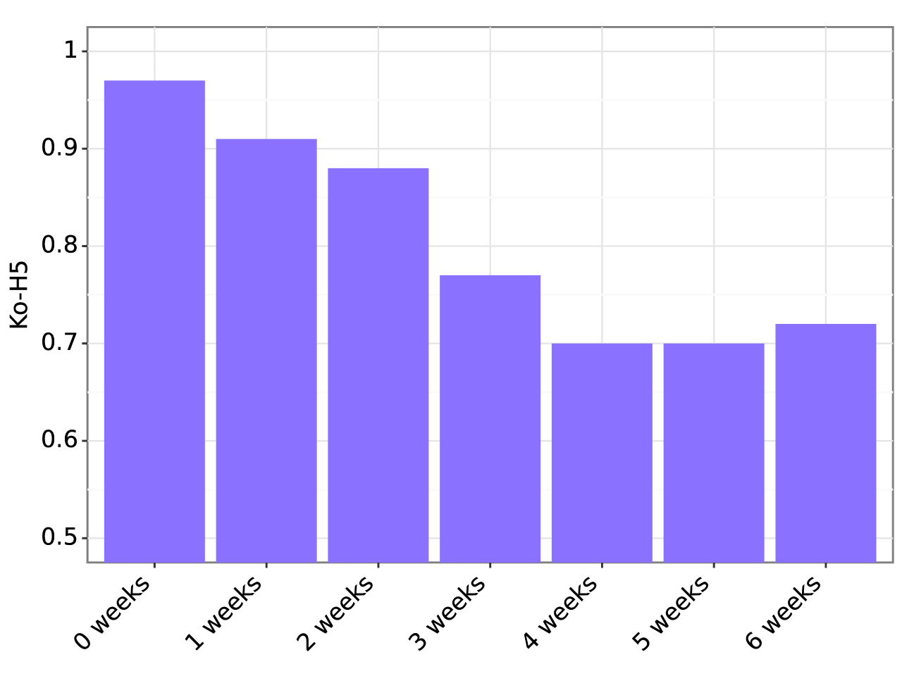

# 韩语大型语言模型评测榜：借助Ko-H5基准，探索韩语LLM的性能表现

发布时间：2024年05月30日

`LLM应用

这篇论文介绍了Open Ko-LLM Leaderboard和Ko-H5 Benchmark，这两个工具专门用于评估韩语中的大型语言模型。这些工具的开发和应用直接关联到LLM的实际应用场景，特别是在非英语语言环境下的评估和改进。因此，这篇论文属于LLM应用分类。` `语言模型评估` `韩语处理`

> Open Ko-LLM Leaderboard: Evaluating Large Language Models in Korean with Ko-H5 Benchmark

# 摘要

> 本文推出了Open Ko-LLM Leaderboard和Ko-H5 Benchmark，这两个关键工具用于评估韩语中的大型语言模型。通过整合私有测试集并参照英语Open LLM Leaderboard，我们构建了一个强健的评估体系，该体系已在韩语LLM社群中得到广泛应用。我们进行了数据泄露分析，证明了私有测试集的价值，并在Ko-H5基准内进行了相关性和时序分析。此外，我们通过实证研究强调了超越现有基准的必要性。我们期望Open Ko-LLM Leaderboard能成为推动LLM评估多样化的先驱，促进语言多样性的发展。

> This paper introduces the Open Ko-LLM Leaderboard and the Ko-H5 Benchmark as vital tools for evaluating Large Language Models (LLMs) in Korean. Incorporating private test sets while mirroring the English Open LLM Leaderboard, we establish a robust evaluation framework that has been well integrated in the Korean LLM community. We perform data leakage analysis that shows the benefit of private test sets along with a correlation study within the Ko-H5 benchmark and temporal analyses of the Ko-H5 score. Moreover, we present empirical support for the need to expand beyond set benchmarks. We hope the Open Ko-LLM Leaderboard sets precedent for expanding LLM evaluation to foster more linguistic diversity.

[Arxiv](https://arxiv.org/abs/2405.20574)