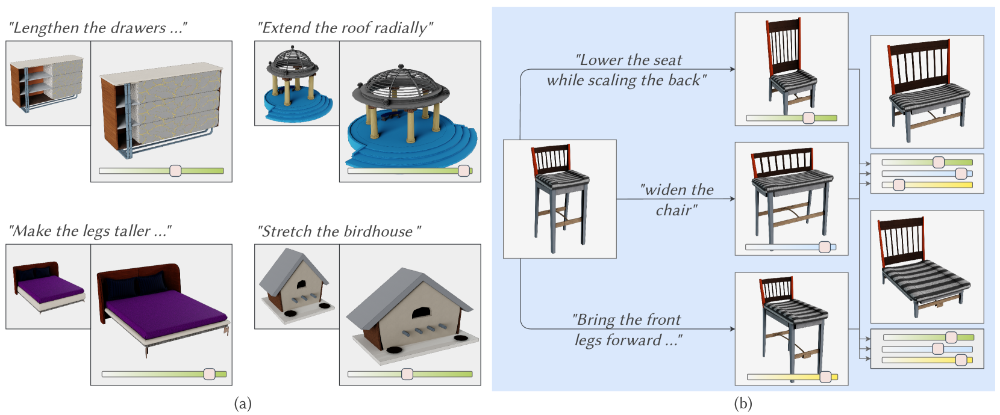
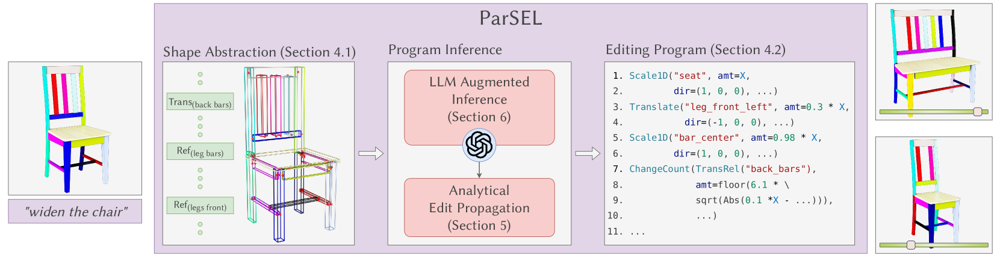
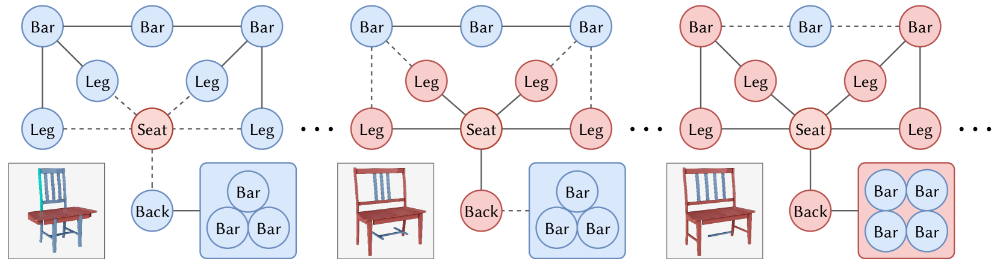
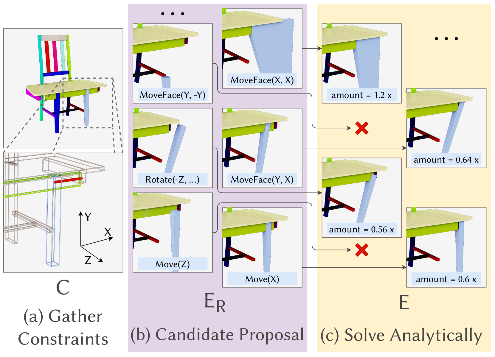
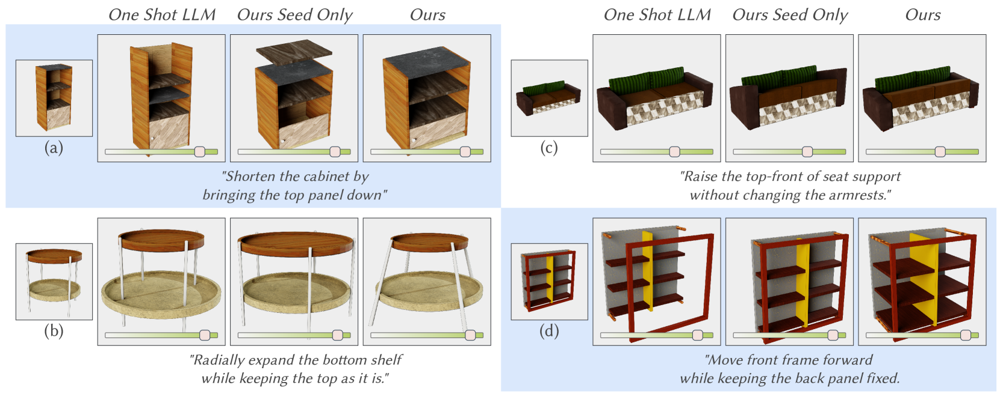
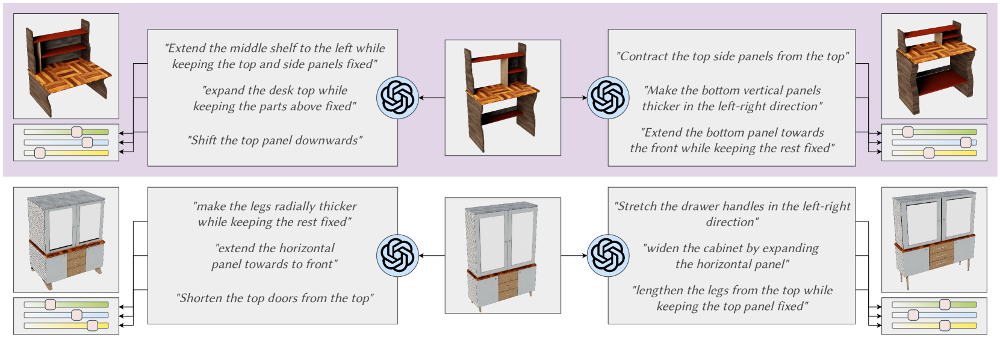
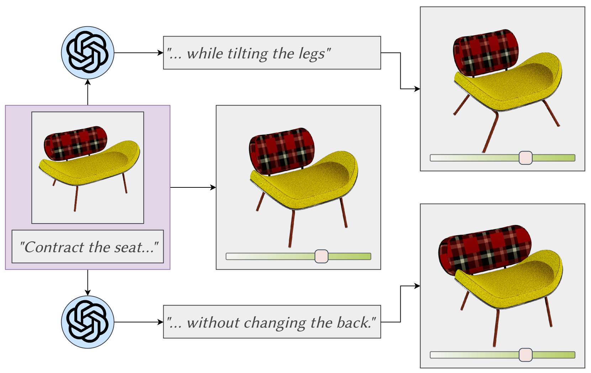
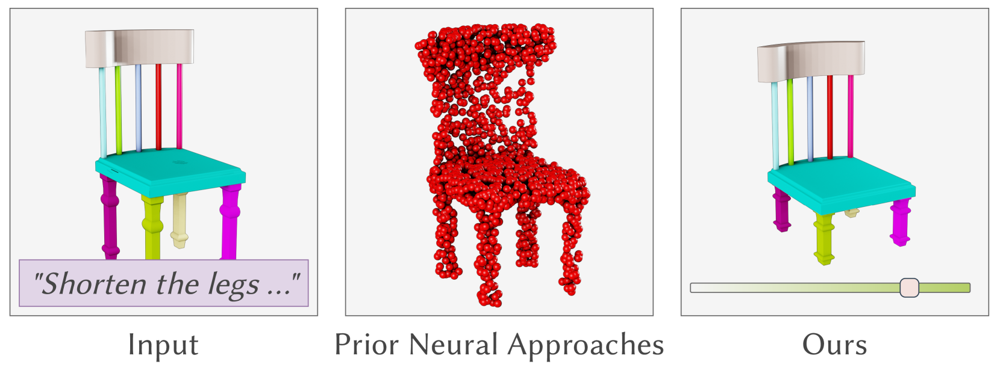

# ParSEL：语言驱动的参数化形状编辑

发布时间：2024年05月30日

`LLM应用

这篇论文摘要描述了一个名为ParSEL的系统，它利用大型语言模型（LLMs）来帮助用户通过自然语言精确控制3D资产的编辑。该系统通过LLMs推断编辑程序，并使用分析编辑传播（AEP）算法来完善这些程序，确保它们符合形状的语义规则。这个应用展示了LLMs在3D内容创作领域的实际应用，特别是在精确控制和编辑3D资产方面。因此，这篇论文属于LLM应用分类。` `3D内容创作` `计算机图形学`

> ParSEL: Parameterized Shape Editing with Language

# 摘要

> 自然语言编辑3D资产的能力为3D内容创作的普及开辟了新天地。尽管自然语言在传达意图上颇为有效，但在精确操作上却显得力不从心。为此，我们推出了ParSEL系统，它能让用户通过自然语言精确控制高质量3D资产的编辑。用户只需提供一个分割的3D网格和编辑请求，ParSEL便能生成一个可调参数的编辑程序，让用户在探索形状变化时，对编辑幅度拥有精准掌控。我们借助大型语言模型（LLMs）的能力来推断符合用户请求的编辑程序，虽然LLMs在初始编辑操作上表现出色，但在完整程序的推断上却常显不足，有时甚至违背了形状的语义规则。为此，我们开发了分析编辑传播（AEP）算法，它通过不断添加操作直至形成完整程序，来扩展初始编辑。与以往方法不同，AEP通过计算机代数系统进行几何分析，寻找与用户可能的编辑相兼容的分析操作。实验证明，ParSEL在通过自然语言请求实现3D对象的可控编辑上，优于其他系统设计。

> The ability to edit 3D assets from natural language presents a compelling paradigm to aid in the democratization of 3D content creation. However, while natural language is often effective at communicating general intent, it is poorly suited for specifying precise manipulation. To address this gap, we introduce ParSEL, a system that enables controllable editing of high-quality 3D assets from natural language. Given a segmented 3D mesh and an editing request, ParSEL produces a parameterized editing program. Adjusting the program parameters allows users to explore shape variations with a precise control over the magnitudes of edits. To infer editing programs which align with an input edit request, we leverage the abilities of large-language models (LLMs). However, while we find that LLMs excel at identifying initial edit operations, they often fail to infer complete editing programs, and produce outputs that violate shape semantics. To overcome this issue, we introduce Analytical Edit Propagation (AEP), an algorithm which extends a seed edit with additional operations until a complete editing program has been formed. Unlike prior methods, AEP searches for analytical editing operations compatible with a range of possible user edits through the integration of computer algebra systems for geometric analysis. Experimentally we demonstrate ParSEL's effectiveness in enabling controllable editing of 3D objects through natural language requests over alternative system designs.

[Arxiv](https://arxiv.org/abs/2405.20319)