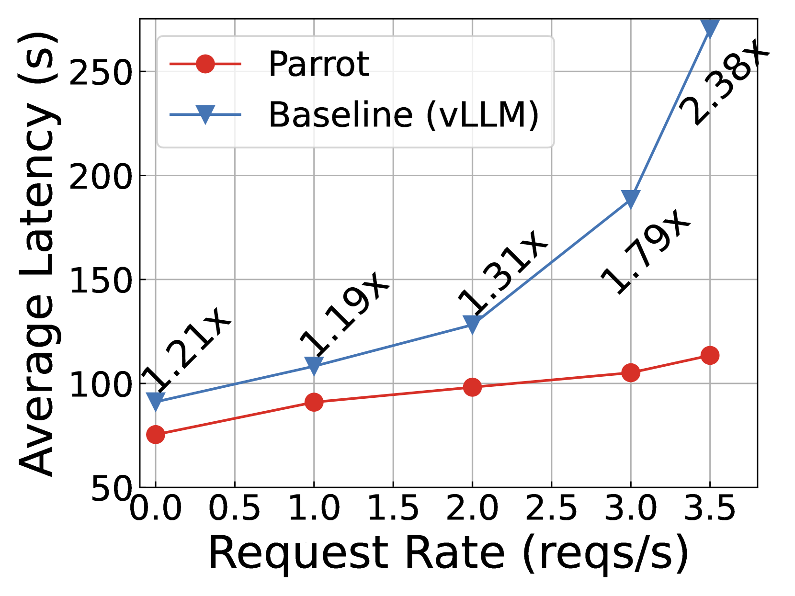
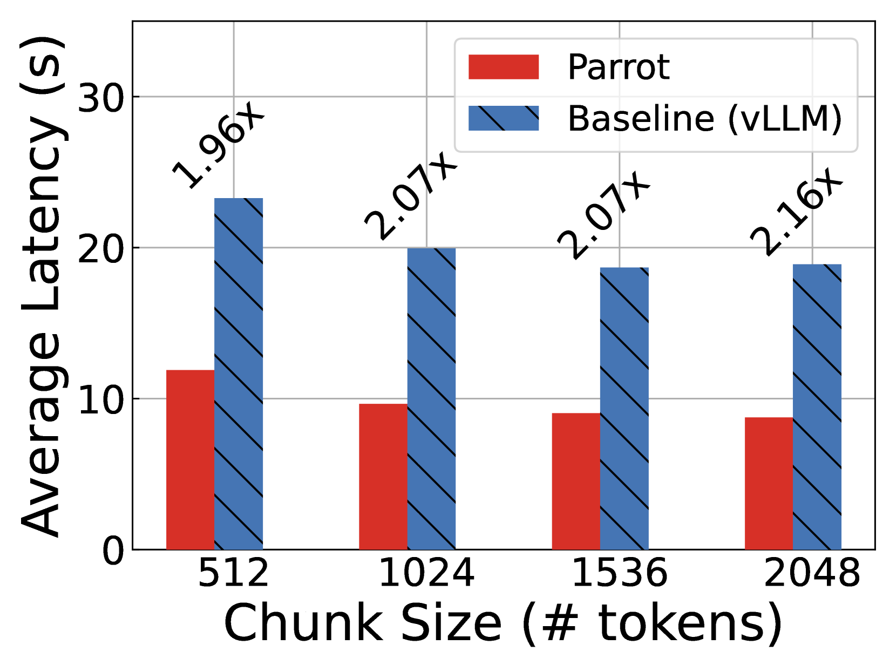

# Parrot：借助语义变量，高效支持基于大型语言模型的应用服务

发布时间：2024年05月30日

`Agent

理由：这篇论文主要讨论了基于大型语言模型（LLMs）的应用程序，特别是AI代理或副驾驶，以及它们如何通过多个LLM请求构建复杂的工作流程来完成任务。论文中提出的Parrot系统专注于提升这些应用程序的端到端体验，通过引入语义变量来优化数据流和应用级知识的利用。这与Agent分类下的研究内容相符，因为Agent通常指的是能够自主执行任务的智能系统，而这里讨论的基于LLM的应用程序正是一种智能代理，能够处理复杂任务并优化工作流程。` `软件开发` `人工智能`

> Parrot: Efficient Serving of LLM-based Applications with Semantic Variable

# 摘要

> 随着大型语言模型（LLMs）的兴起，基于LLM的应用程序（AI代理或副驾驶）应运而生，这是一种融合了LLM与传统软件优势的新型软件范式。这些应用程序能够通过多个LLM请求构建复杂的工作流程，以完成任务。然而，受限于公共LLM服务提供的简化请求级API，它们无法保留关键的应用级信息。这导致公共LLM服务只能孤立地优化单个请求，从而影响了LLM应用的整体性能。本论文推出的Parrot系统，专注于提升基于LLM的应用程序的端到端体验。Parrot引入了语义变量（Semantic Variable），这一创新抽象使得应用级知识能够被公共LLM服务所利用。语义变量在请求提示中标记输入输出变量，并在多个LLM请求间建立数据流，为LLM应用的编程提供了一种直观方法。通过向公共LLM服务开放语义变量，可以进行数据流分析，揭示请求间的内在联系，从而为LLM应用的整体性能优化开辟新途径。实验证明，Parrot能为LLM应用的实际场景带来显著的性能提升。

> The rise of large language models (LLMs) has enabled LLM-based applications (a.k.a. AI agents or co-pilots), a new software paradigm that combines the strength of LLM and conventional software. Diverse LLM applications from different tenants could design complex workflows using multiple LLM requests to accomplish one task. However, they have to use the over-simplified request-level API provided by today's public LLM services, losing essential application-level information. Public LLM services have to blindly optimize individual LLM requests, leading to sub-optimal end-to-end performance of LLM applications.
  This paper introduces Parrot, an LLM service system that focuses on the end-to-end experience of LLM-based applications. Parrot proposes Semantic Variable, a unified abstraction to expose application-level knowledge to public LLM services. A Semantic Variable annotates an input/output variable in the prompt of a request, and creates the data pipeline when connecting multiple LLM requests, providing a natural way to program LLM applications. Exposing Semantic Variables to the public LLM service allows it to perform conventional data flow analysis to uncover the correlation across multiple LLM requests. This correlation opens a brand-new optimization space for the end-to-end performance of LLM-based applications. Extensive evaluations demonstrate that Parrot can achieve up to an order-of-magnitude improvement for popular and practical use cases of LLM applications.

[Arxiv](https://arxiv.org/abs/2405.19888)