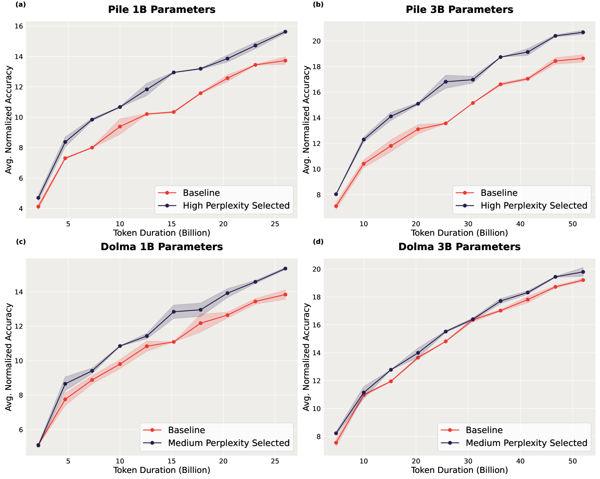
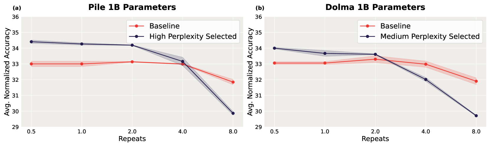
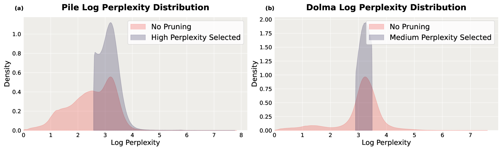
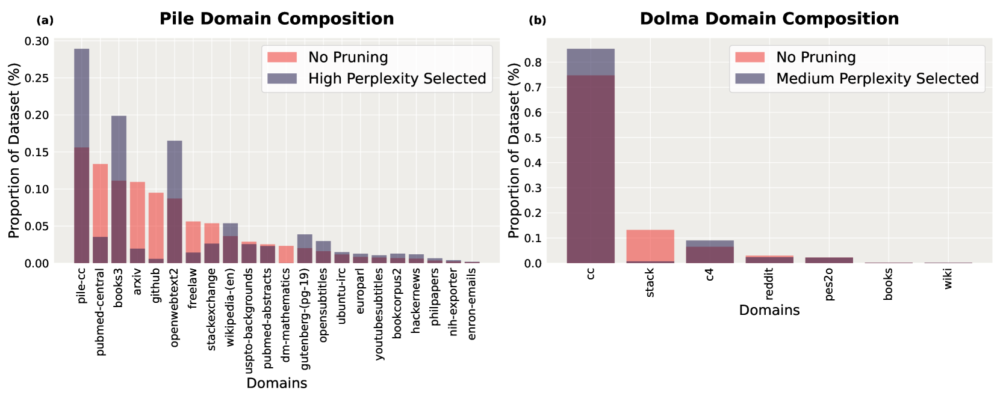

# 困惑度之谜：利用小型参考模型进行基于困惑度的数据精简

发布时间：2024年05月30日

`LLM应用

这篇论文探讨了使用小型语言模型来筛选大规模文本数据集，以优化大型语言模型的性能。研究关注的是如何通过小型模型的帮助来提高大型模型的表现，特别是在数据筛选和预训练过程中的应用。这种方法直接关联到大型语言模型的应用层面，即如何通过改进数据处理和预训练策略来提升大型语言模型的实际应用效果。因此，这篇论文应归类于LLM应用。` `机器学习`

> Perplexed by Perplexity: Perplexity-Based Data Pruning With Small Reference Models

# 摘要

> 本研究探索了小型语言模型是否能筛选出大规模文本数据集的高质量子集，从而优化大型语言模型的表现。虽然已有研究指出，依据大型模型的困惑度进行数据筛选能产出优质数据，但我们进一步探究了小型模型在此过程中的应用潜力，以及数据领域组成对剪枝效果的影响。实验结果显示，无论数据集如何组成，通过预训练数据的困惑度进行剪枝，都能显著增强大型模型在下游任务中的表现，提升幅度高达2.04，并能将预训练步骤减少至原来的1.45倍，以达到同等基准水平。此外，这种基于困惑度的数据筛选策略在过度训练和数据资源有限的情况下，同样能提升下游任务的性能。

> In this work, we investigate whether small language models can determine high-quality subsets of large-scale text datasets that improve the performance of larger language models. While existing work has shown that pruning based on the perplexity of a larger model can yield high-quality data, we investigate whether smaller models can be used for perplexity-based pruning and how pruning is affected by the domain composition of the data being pruned. We demonstrate that for multiple dataset compositions, perplexity-based pruning of pretraining data can \emph{significantly} improve downstream task performance: pruning based on perplexities computed with a 125 million parameter model improves the average performance on downstream tasks of a 3 billion parameter model by up to 2.04 and achieves up to a $1.45\times$ reduction in pretraining steps to reach commensurate baseline performance. Furthermore, we demonstrate that such perplexity-based data pruning also yields downstream performance gains in the over-trained and data-constrained regimes.

[Arxiv](https://arxiv.org/abs/2405.20541)