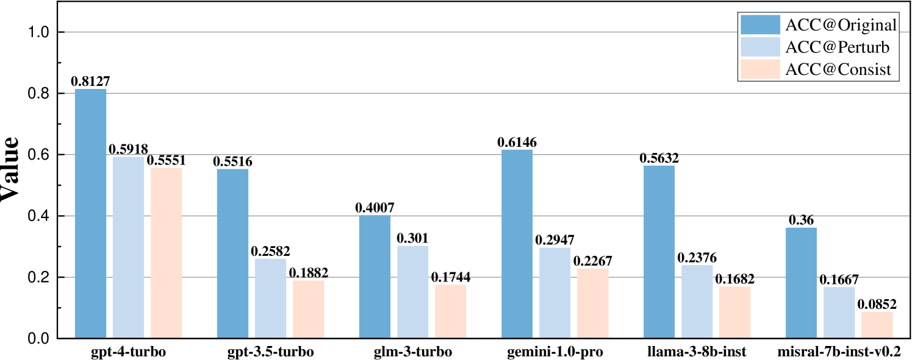
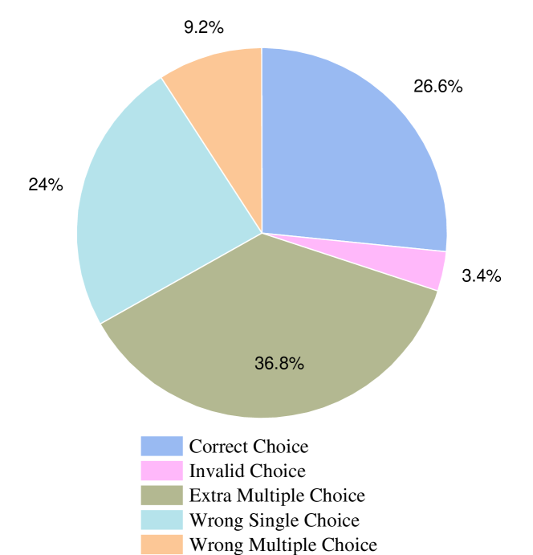

# PertEval：揭秘 LLMs 的真实知识储备——通过知识不变扰动探索其深层能力

发布时间：2024年05月30日

`LLM应用

理由：这篇论文介绍了一个名为PertEval的工具包，用于评估大型语言模型（LLMs）的知识能力。通过模拟人类改述的知识不变扰动，PertEval能够即时生成测试样本，并精确揭示LLMs的真实知识能力。这种方法不仅能够重新评估现有LLMs的性能，还能揭示它们对虚假知识的不确定性，并指导模型的改进。因此，这项工作属于LLM应用类别，因为它提供了一种新的方法来评估和改进LLMs的实际应用性能。` `人工智能评估` `语言模型`

> PertEval: Unveiling Real Knowledge Capacity of LLMs with Knowledge-Invariant Perturbations

# 摘要

> 专家设计的封闭式基准是评估大型语言模型知识能力的关键工具，但因测试场景有限和数据污染风险，其可靠性备受质疑。为此，我们开发了PertEval工具包，通过模拟人类改述的知识不变扰动，从静态基准即时生成测试样本，同时保留关键知识内容并调整无关细节。PertEval不仅包含转换分析，比较原始与扰动测试集的性能，精确揭示LLMs的真实知识能力，还重新评估了六款顶尖LLMs，发现它们在原始基准上的性能被显著高估，GPT-4甚至被高估了21%。通过细致的响应模式分析，我们发现PertEval能揭示LLMs对虚假知识的不确定性，这种不确定性可能通过死记硬背被掩盖，导致性能虚高。此外，PertEval的详细分析还能暴露现有LLMs在知识掌握上的弱点，并指导其改进。因此，我们认为PertEval是评估LLMs真实知识能力的重要工具，与任何封闭式基准结合使用时，能显著提升LLM评估的可信度。

> Expert-designed close-ended benchmarks serve as vital tools in assessing the knowledge capacity of large language models (LLMs). Despite their widespread use, concerns have mounted regarding their reliability due to limited test scenarios and an unavoidable risk of data contamination. To rectify this, we present PertEval, a toolkit devised for in-depth probing of LLMs' knowledge capacity through knowledge-invariant perturbations. These perturbations employ human-like restatement techniques to generate on-the-fly test samples from static benchmarks, meticulously retaining knowledge-critical content while altering irrelevant details. Our toolkit further includes a suite of transition analyses that compare performance on raw vs. perturbed test sets to precisely assess LLMs' genuine knowledge capacity. Six state-of-the-art LLMs are re-evaluated using PertEval. Results reveal significantly inflated performance of the LLMs on raw benchmarks, including an absolute 21% overestimation for GPT-4. Additionally, through a nuanced response pattern analysis, we discover that PertEval retains LLMs' uncertainty to specious knowledge, potentially being resolved through rote memorization and leading to inflated performance. We also find that the detailed transition analyses by PertEval could illuminate weaknesses in existing LLMs' knowledge mastery and guide the development of refinement. Given these insights, we posit that PertEval can act as an essential tool that, when applied alongside any close-ended benchmark, unveils the true knowledge capacity of LLMs, marking a significant step toward more trustworthy LLM evaluation.

[Arxiv](https://arxiv.org/abs/2405.19740)