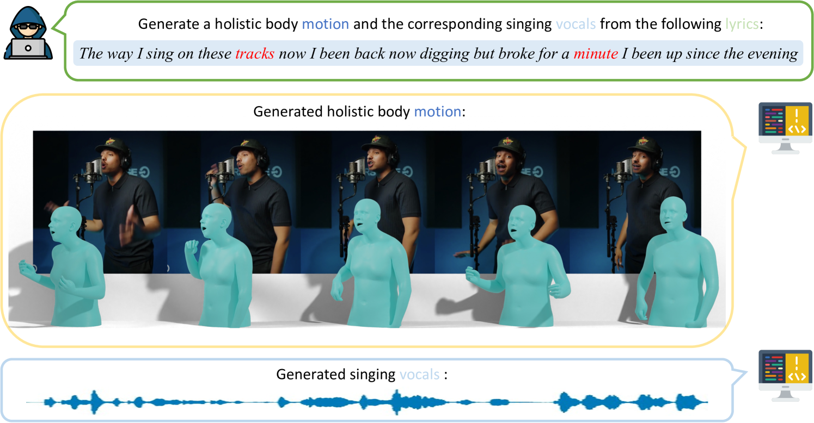
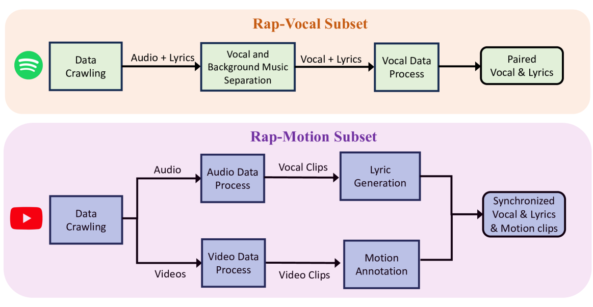
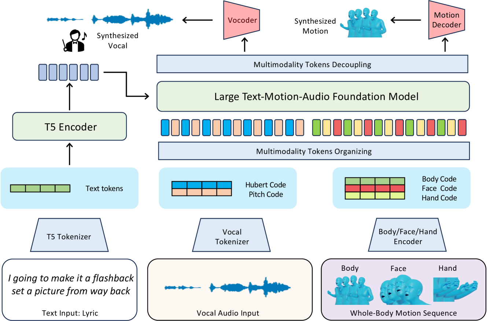
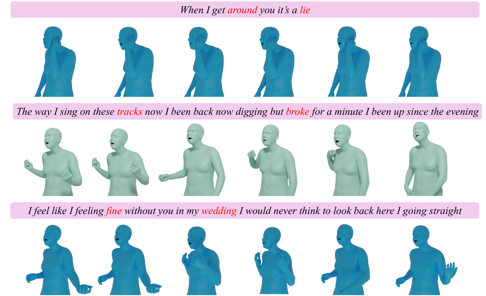

# RapVerse：文本驱动，创造连贯声乐与全身动作的完美融合

发布时间：2024年05月30日

`Agent

理由：这篇论文描述了一个系统，该系统能够从文本歌词直接生成3D全身动作与歌唱声音，这是一个复杂的任务，涉及到多模态数据的处理和生成。这个系统可以被视为一个Agent，因为它能够接收输入（文本歌词）并产生输出（3D全身动作和歌唱声音），展示了决策和执行动作的能力。此外，论文中提到的自回归多模态变压器和向量量化变分自编码器等技术，都是为了增强这个Agent的性能和真实感。因此，这篇论文更适合归类为Agent。` `虚拟现实`

> RapVerse: Coherent Vocals and Whole-Body Motions Generations from Text

# 摘要

> 本研究提出了一项挑战性任务，即从文本歌词直接生成3D全身动作与歌唱声音，超越了以往单独处理声音与动作的做法。我们收集了RapVerse数据集，包含同步的说唱声音、歌词及高质量的3D全身动作数据。通过扩展自回归多模态变压器，我们探索了如何提升声音与动作生成的一致性与真实感。采用向量量化变分自编码器和声音到单位模型，我们实现了动作与声音的模态统一。实验证明，我们的统一框架不仅能够从文本输入生成逼真的歌唱声音与动作，还与单模态生成系统媲美，为联合声音-动作生成设立了新标准。项目详情请访问：https://vis-www.cs.umass.edu/RapVerse。

> In this work, we introduce a challenging task for simultaneously generating 3D holistic body motions and singing vocals directly from textual lyrics inputs, advancing beyond existing works that typically address these two modalities in isolation. To facilitate this, we first collect the RapVerse dataset, a large dataset containing synchronous rapping vocals, lyrics, and high-quality 3D holistic body meshes. With the RapVerse dataset, we investigate the extent to which scaling autoregressive multimodal transformers across language, audio, and motion can enhance the coherent and realistic generation of vocals and whole-body human motions. For modality unification, a vector-quantized variational autoencoder is employed to encode whole-body motion sequences into discrete motion tokens, while a vocal-to-unit model is leveraged to obtain quantized audio tokens preserving content, prosodic information, and singer identity. By jointly performing transformer modeling on these three modalities in a unified way, our framework ensures a seamless and realistic blend of vocals and human motions. Extensive experiments demonstrate that our unified generation framework not only produces coherent and realistic singing vocals alongside human motions directly from textual inputs but also rivals the performance of specialized single-modality generation systems, establishing new benchmarks for joint vocal-motion generation. The project page is available for research purposes at https://vis-www.cs.umass.edu/RapVerse.

[Arxiv](https://arxiv.org/abs/2405.20336)