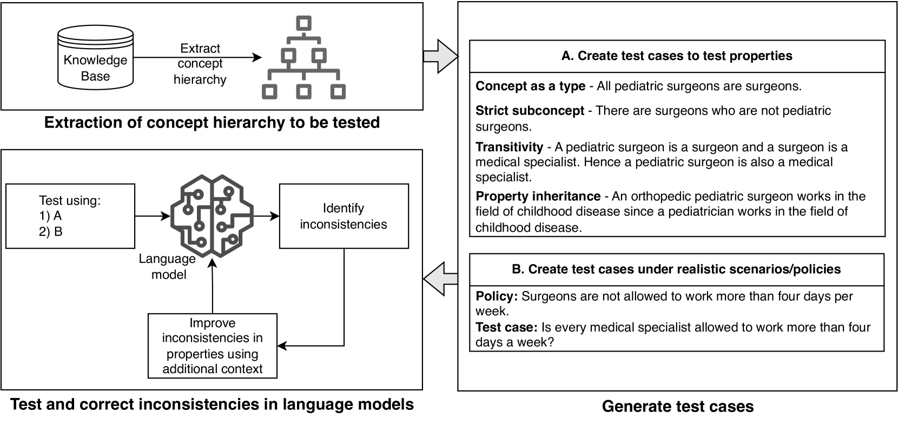
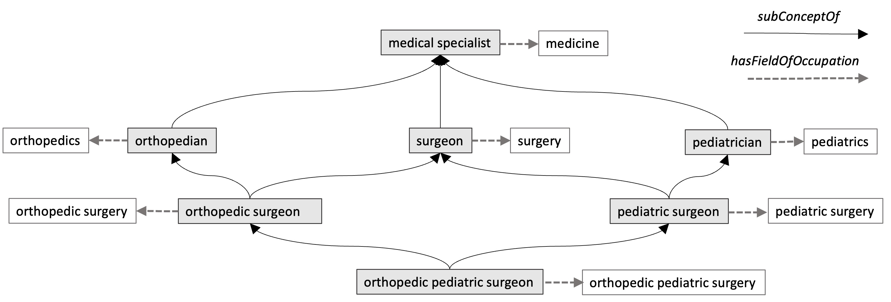
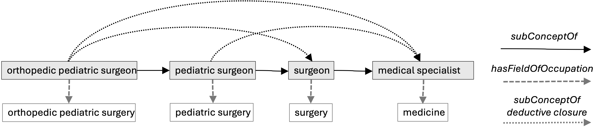
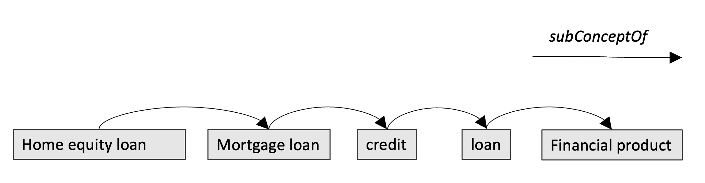
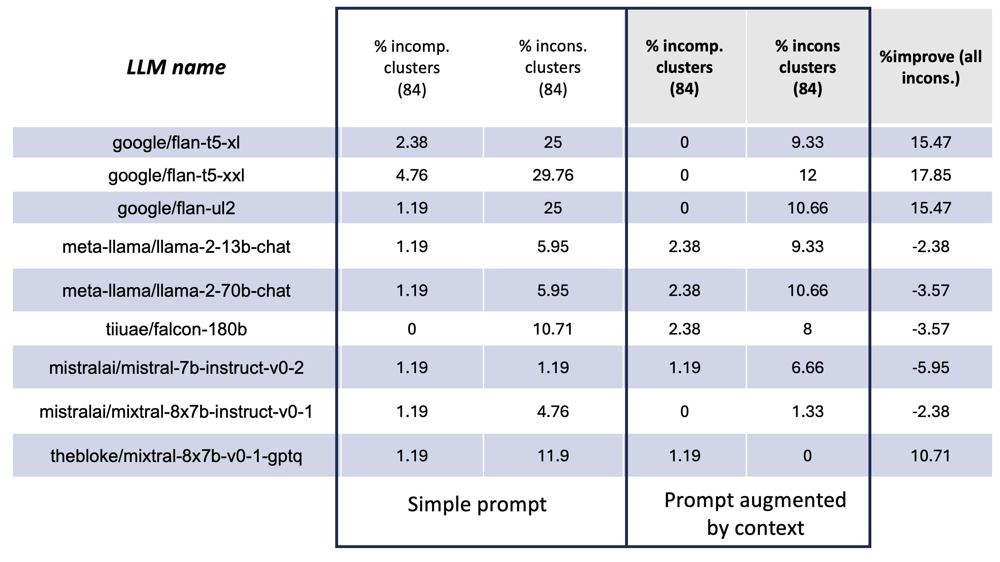

# 大型语言模型（LLMs）在概念推理中显露出的不一致性问题，值得我们深入探讨。

发布时间：2024年05月30日

`LLM理论

这篇论文主要关注大型语言模型（LLMs）在知识表达上的不一致性，并提出了一套策略来评估和增强这些模型中关键概念的完整性。这涉及到对LLMs理论层面的深入分析和改进，因此属于LLM理论分类。论文中提到的利用知识图谱资源来提升LLMs性能，虽然具有应用潜力，但核心内容更多地聚焦于理论分析和模型改进，而非具体的应用实例或Agent行为。` `知识图谱`

> Reasoning about concepts with LLMs: Inconsistencies abound

# 摘要

> 将知识抽象化是学习和推理的核心，工业应用尤其依赖于概念的统一和系统化。但当我们深入探究时，大型语言模型（LLMs）在知识表达上常显露出不一致性。通过知识图谱（KG）或本体中的Is-A层次结构，以及辅助推理的属性和公理，我们能揭示这些模型中的概念矛盾。为此，我们提出了一套策略，供领域专家评估并增强LLMs中关键概念的完整性。实践证明，利用公开的知识图谱资源，我们能有效提升不同规模LLMs的性能。

> The ability to summarize and organize knowledge into abstract concepts is key to learning and reasoning. Many industrial applications rely on the consistent and systematic use of concepts, especially when dealing with decision-critical knowledge. However, we demonstrate that, when methodically questioned, large language models (LLMs) often display and demonstrate significant inconsistencies in their knowledge. Computationally, the basic aspects of the conceptualization of a given domain can be represented as Is-A hierarchies in a knowledge graph (KG) or ontology, together with a few properties or axioms that enable straightforward reasoning. We show that even simple ontologies can be used to reveal conceptual inconsistencies across several LLMs. We also propose strategies that domain experts can use to evaluate and improve the coverage of key domain concepts in LLMs of various sizes. In particular, we have been able to significantly enhance the performance of LLMs of various sizes with openly available weights using simple knowledge-graph (KG) based prompting strategies.

[Arxiv](https://arxiv.org/abs/2405.20163)