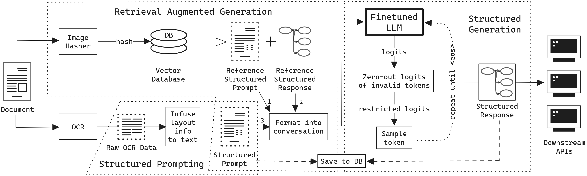

# 利用检索增强技术进行结构化生成：将商业文档信息提取视为工具运用

发布时间：2024年05月30日

`LLM应用

理由：这篇论文主要讨论了商业文档信息提取（BDIE）任务，并提出了检索增强结构化生成（RASG）框架，该框架结合大型语言模型（LLMs）在关键信息提取（KIE）和行项目识别（LIR）任务上取得了显著成果。论文的重点在于应用LLMs解决实际问题，即BDIE，并且通过实验和新型度量方法展示了LLMs结合RASG框架的优越性。因此，这篇论文更符合LLM应用分类，因为它关注的是LLMs在特定应用场景下的实际效果和改进。` `商业文档处理` `信息提取`

> Retrieval Augmented Structured Generation: Business Document Information Extraction As Tool Use

# 摘要

> 商业文档信息提取（BDIE）旨在将杂乱无章的信息（如原始文本、扫描文档）转化为下游系统可用的结构化数据。该领域主要涉及两大任务：关键信息提取（KIE）和行项目识别（LIR）。本文提出，BDIE应视为一个工具使用问题，其中工具即下游系统。我们创新性地提出了检索增强结构化生成（RASG）框架，该框架在BDIE的KIE和LIR任务上均取得了顶尖成果。本文的贡献可归纳为三点：(1) 通过对比测试，我们发现配备RASG的大型语言模型（LLMs）在BDIE任务上已超越或至少与未配备RASG的顶级多模态模型（LMMs）持平。(2) 我们提出了一种更贴合实际应用的新型行项目识别度量——通用行项目识别度量（GLIRM），相较于现有度量更为实用。(3) 我们开发了一种无需视觉编码器的启发式算法，用于精确计算行项目和表格的边界框。最终，我们认为，尽管LMMs在某些情况下可能略有优势，但在实际应用和BDIE的限制下，LLMs结合RASG通常表现更佳。

> Business Document Information Extraction (BDIE) is the problem of transforming a blob of unstructured information (raw text, scanned documents, etc.) into a structured format that downstream systems can parse and use. It has two main tasks: Key-Information Extraction (KIE) and Line Items Recognition (LIR). In this paper, we argue that BDIE is best modeled as a Tool Use problem, where the tools are these downstream systems. We then present Retrieval Augmented Structured Generation (RASG), a novel general framework for BDIE that achieves state of the art (SOTA) results on both KIE and LIR tasks on BDIE benchmarks.
  The contributions of this paper are threefold: (1) We show, with ablation benchmarks, that Large Language Models (LLMs) with RASG are already competitive with or surpasses current SOTA Large Multimodal Models (LMMs) without RASG on BDIE benchmarks. (2) We propose a new metric class for Line Items Recognition, General Line Items Recognition Metric (GLIRM), that is more aligned with practical BDIE use cases compared to existing metrics, such as ANLS*, DocILE, and GriTS. (3) We provide a heuristic algorithm for backcalculating bounding boxes of predicted line items and tables without the need for vision encoders. Finally, we claim that, while LMMs might sometimes offer marginal performance benefits, LLMs + RASG is oftentimes superior given real-world applications and constraints of BDIE.

[Arxiv](https://arxiv.org/abs/2405.20245)