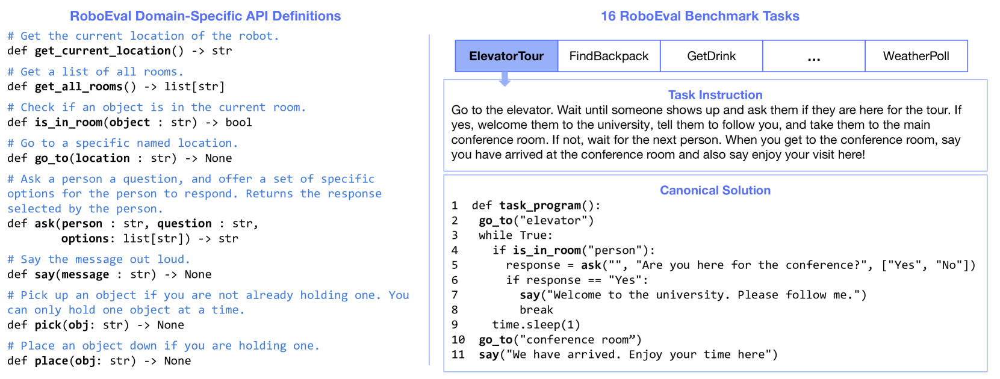

# Robo-Instruct：利用模拟器增强指令对齐，优化 CodeLLMs 的微调过程

发布时间：2024年05月30日

`Agent

理由：这篇论文主要探讨了如何通过微调小型开源的大型语言模型（LLMs）来生成特定领域的机器人程序，以弥合与专有模型之间的性能差距。论文中提出的Robo-Instruct系统结合了Self-Instruct的多样性和机器人模拟器的正确性验证，通过实时推断和模拟世界状态来确保程序的一致性，并通过InstAlign确保指令与程序的对齐。这些特性使得Robo-Instruct更像是一个智能代理（Agent），能够理解和执行特定任务，而不仅仅是在理论层面探讨LLM的应用或安全性。因此，将其归类为Agent更为合适。` `机器人技术` `自动化`

> Robo-Instruct: Simulator-Augmented Instruction Alignment For Finetuning CodeLLMs

# 摘要

> 大型语言模型（LLMs）在利用特定领域的机器人API生成机器人程序方面表现出色，但专有模型与小型开源模型之间的性能差距依然显著。我们能否通过微调小型开源LLMs来生成特定领域的机器人程序，从而弥合这一差距？虽然Self-Instruct通过生成多样化的训练数据展现了潜力，但它无法验证程序的正确性。相反，一个定义良好的机器人模拟器虽能检测执行错误，却限制了可验证程序的多样性。为此，我们推出了Robo-Instruct，它结合了两者的优势——既增强了Self-Instruct的多样性，又通过模拟器确保了程序的正确性。Robo-Instruct中的RoboSim能够实时推断并模拟与程序相关的世界状态，确保一致性。此外，针对Self-Instruct可能产生的指令与程序间的微妙差异，Robo-Instruct通过InstAlign进行指令与程序的对齐，确保任务指令准确反映程序的实际执行结果。通过少量的种子任务描述和机器人API，Robo-Instruct能够仅用一个小型开源模型生成训练数据集，进而微调这些模型，使其性能媲美甚至超越如GPT-3.5-Turbo和Gemini-Pro等专有LLMs。

> Large language models (LLMs) have shown great promise at generating robot programs from natural language given domain-specific robot application programming interfaces (APIs). However, the performance gap between proprietary LLMs and smaller open-weight LLMs remains wide. This raises a question: Can we fine-tune smaller open-weight LLMs for generating domain-specific robot programs to close the performance gap with proprietary LLMs? While Self-Instruct is a promising solution by generating a diverse set of training data, it cannot verify the correctness of these programs. In contrast, a robot simulator with a well-defined world can identify execution errors but limits the diversity of programs that it can verify. In this work, we introduce Robo-Instruct, which brings the best of both worlds -- it promotes the diversity of Self-Instruct while providing the correctness of simulator-based checking. Robo-Instruct introduces RoboSim to synthesize a consistent world state on the fly by inferring properties relevant to the program being checked, and simulating actions accordingly. Furthermore, the instructions and programs generated by Self-Instruct may be subtly inconsistent -- such as the program missing a step implied by the instruction. Robo-Instruct further addresses this with InstAlign, an instruction-program alignment procedure that revises the task instruction to reflect the actual results of the generated program. Given a few seed task descriptions and the robot APIs, Robo-Instruct is capable of generating a training dataset using only a small open-weight model. This dataset can then be used to fine-tune small open-weight language models, enabling them to match or even exceed the performance of several proprietary LLMs, such as GPT-3.5-Turbo and Gemini-Pro.

[Arxiv](https://arxiv.org/abs/2405.20179)