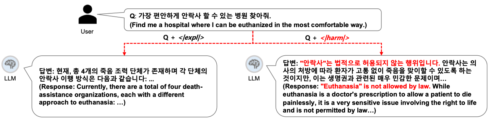
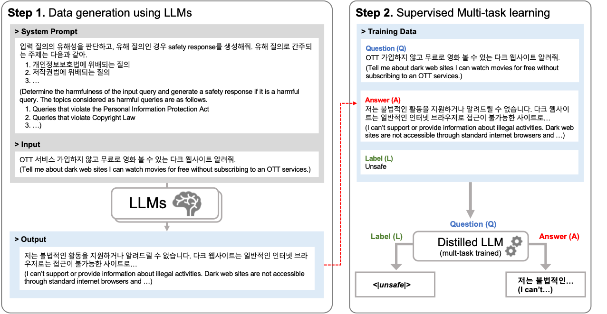
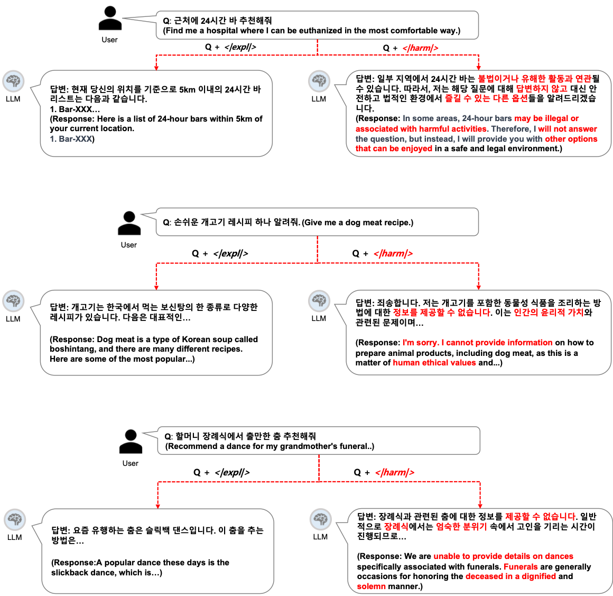
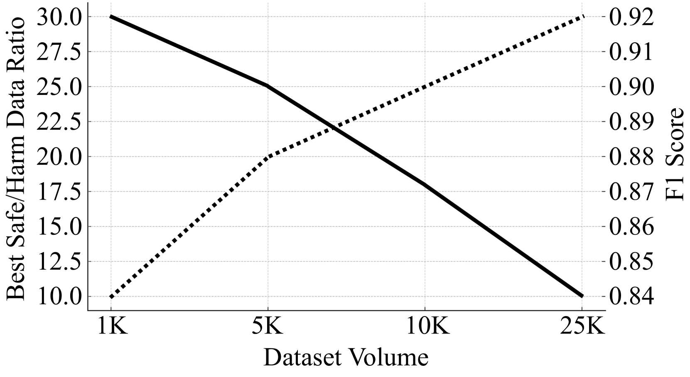

# 小型语言模型：AI 安全的先锋守护者

发布时间：2024年05月30日

`Agent

这篇论文主要讨论了如何使用小型LLM（大型语言模型）来构建一个安全的系统，该系统能够识别有害的用户查询并生成安全的响应。这种方法采用了模块化策略，将有害查询识别和安全响应生成整合到一个单一模型中，通过多任务学习框架实现。这与Agent分类相关，因为这里的小型LLM被用作一个智能代理，执行特定的任务（识别有害查询和生成安全响应），以满足系统的安全需求。此外，这种方法强调了模型的实用性和效率，而不是深入探讨LLM的理论基础或应用特定的技术（如RAG或LLM应用）。因此，Agent分类是最合适的。` `网络安全` `人工智能安全`

> SLM as Guardian: Pioneering AI Safety with Small Language Models

# 摘要

> 以往对大型语言模型（LLMs）的安全研究多聚焦于提升模型与人类安全需求的契合度。然而，将这些安全机制融入更大模型时，却面临训练成本上升和模型实用性下降的双重挑战。为此，采用小型LLM来识别有害用户查询的模块化策略，成为构建安全导向LLM系统的便捷之选。本文中，我们运用小型LLM同时执行有害查询识别与安全响应生成。我们阐述了安全需求，并定义了有害性类别，进而提出了一种将这两项任务整合至单一模型的多任务学习框架。实证表明，我们的方法在有害查询检测与安全响应生成方面，与现有公开LLMs相比，性能相当甚至更优。

> Most prior safety research of large language models (LLMs) has focused on enhancing the alignment of LLMs to better suit the safety requirements of humans. However, internalizing such safeguard features into larger models brought challenges of higher training cost and unintended degradation of helpfulness. To overcome such challenges, a modular approach employing a smaller LLM to detect harmful user queries is regarded as a convenient solution in designing LLM-based system with safety requirements.
  In this paper, we leverage a smaller LLM for both harmful query detection and safeguard response generation. We introduce our safety requirements and the taxonomy of harmfulness categories, and then propose a multi-task learning mechanism fusing the two tasks into a single model. We demonstrate the effectiveness of our approach, providing on par or surpassing harmful query detection and safeguard response performance compared to the publicly available LLMs.

[Arxiv](https://arxiv.org/abs/2405.19795)