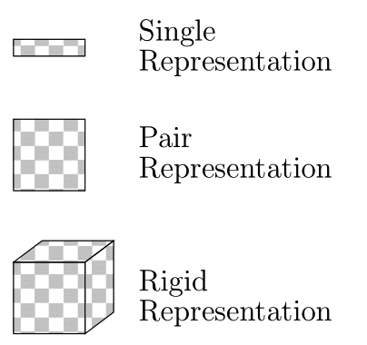
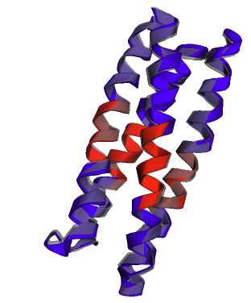

# 利用序列增强的SE(3)-流匹配技术，实现条件性蛋白质骨架的精准生成

发布时间：2024年05月30日

`LLM应用

这篇论文介绍了一种名为FoldFlow-2的模型，该模型结合了大型语言模型（LLM）、多模态融合主干和几何变换器解码器，用于蛋白质结构的生成。这种模型利用了LLM的能力来处理和生成复杂的蛋白质结构数据，并且通过在一个大规模的数据集上进行训练，提高了生成样本的多样性和新颖性。此外，通过强化微调（ReFT），模型能够针对特定的目标进行优化，如增加二级结构的多样性。这些特性表明，该论文主要关注的是LLM在特定应用领域（即蛋白质结构生成）的实际应用和效果，因此应归类为LLM应用。` `生物信息学` `蛋白质工程`

> Sequence-Augmented SE(3)-Flow Matching For Conditional Protein Backbone Generation

# 摘要

> 蛋白质的复杂3D结构由其氨基酸序列决定，赋予了它们在生物过程中的多样化功能。本文介绍了FoldFlow-2，一种创新的序列条件SE(3)-等变流匹配模型，用于蛋白质结构生成，它结合了蛋白质大型语言模型、多模态融合主干和几何变换器解码器。为了提升生成样本的多样性和新颖性，我们在一个比以往PDB数据集大一个数量级的新数据集上训练FoldFlow-2，该数据集涵盖了PDB中的已知蛋白质和高质量的合成结构。通过强化微调（ReFT），我们能够调整FoldFlow-2以追求特定的奖励目标，如增加二级结构的多样性。实证结果显示，FoldFlow-2在无条件生成方面超越了RFDiffusion，在设计性、多样性和新颖性以及平衡构象采样任务上均表现出色。此外，经过微调的FoldFlow-2在为VHH纳米体设计支架等复杂条件设计任务上取得了显著进展。

> Proteins are essential for almost all biological processes and derive their diverse functions from complex 3D structures, which are in turn determined by their amino acid sequences. In this paper, we exploit the rich biological inductive bias of amino acid sequences and introduce FoldFlow-2, a novel sequence-conditioned SE(3)-equivariant flow matching model for protein structure generation. FoldFlow-2 presents substantial new architectural features over the previous FoldFlow family of models including a protein large language model to encode sequence, a new multi-modal fusion trunk that combines structure and sequence representations, and a geometric transformer based decoder. To increase diversity and novelty of generated samples -- crucial for de-novo drug design -- we train FoldFlow-2 at scale on a new dataset that is an order of magnitude larger than PDB datasets of prior works, containing both known proteins in PDB and high-quality synthetic structures achieved through filtering. We further demonstrate the ability to align FoldFlow-2 to arbitrary rewards, e.g. increasing secondary structures diversity, by introducing a Reinforced Finetuning (ReFT) objective. We empirically observe that FoldFlow-2 outperforms previous state-of-the-art protein structure-based generative models, improving over RFDiffusion in terms of unconditional generation across all metrics including designability, diversity, and novelty across all protein lengths, as well as exhibiting generalization on the task of equilibrium conformation sampling. Finally, we demonstrate that a fine-tuned FoldFlow-2 makes progress on challenging conditional design tasks such as designing scaffolds for the VHH nanobody.

[Arxiv](https://arxiv.org/abs/2405.20313)