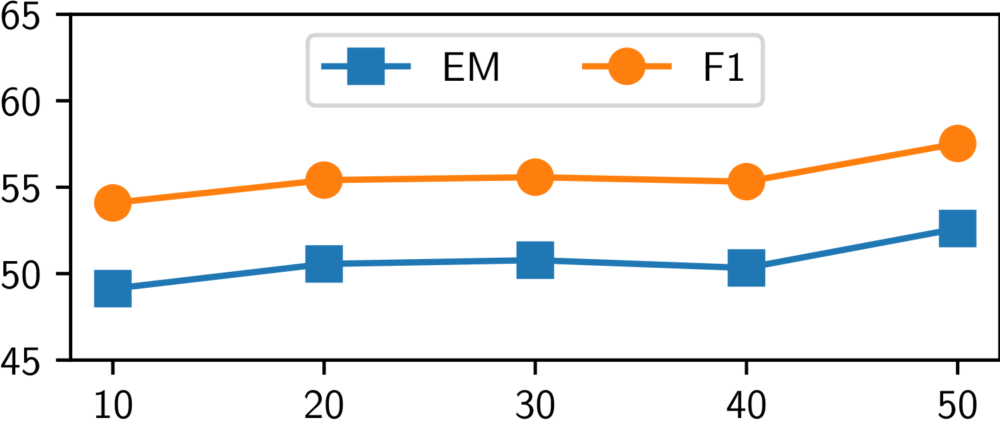

# 单一相似性不足为凭：为检索增强生成注入多层次思考

发布时间：2024年05月30日

`RAG

理由：这篇论文主要讨论了检索增强生成（RAG）技术在大型语言模型（LLMs）中的应用，特别是提出了一个新的框架MetRag，用于改进知识密集型任务中的性能。论文的核心贡献在于提出了一个结合相似性和实用性的新方法，并利用LLM作为任务自适应的摘要器来提升生成内容的紧凑性。这与RAG技术的目标和应用紧密相关，因此归类为RAG。` `知识密集型任务`

> Similarity is Not All You Need: Endowing Retrieval Augmented Generation with Multi Layered Thoughts

# 摘要

> 大型语言模型（LLMs）近年来在多个领域大放异彩，但知识更新的滞后和成本，以及模型自身的幻觉问题，限制了其在知识密集型任务中的应用。检索增强生成（RAG）技术为此提供了解决方案，但现有模型过于依赖相似性匹配，有时反而影响性能。为此，我们创新性地提出了MetRag框架，它不仅融合了相似性和实用性的多层思维，还利用LLM作为任务自适应的摘要器，提升了生成的紧凑性。实验证明，MetRag在知识密集型任务中表现卓越。

> In recent years, large language models (LLMs) have made remarkable achievements in various domains. However, the untimeliness and cost of knowledge updates coupled with hallucination issues of LLMs have curtailed their applications in knowledge intensive tasks, where retrieval augmented generation (RAG) can be of help. Nevertheless, existing retrieval augmented models typically use similarity as a bridge between queries and documents and follow a retrieve then read procedure. In this work, we argue that similarity is not always the panacea and totally relying on similarity would sometimes degrade the performance of retrieval augmented generation. To this end, we propose MetRag, a Multi layEred Thoughts enhanced Retrieval Augmented Generation framework. To begin with, beyond existing similarity oriented thought, we embrace a small scale utility model that draws supervision from an LLM for utility oriented thought and further come up with a smarter model by comprehensively combining the similarity and utility oriented thoughts. Furthermore, given the fact that the retrieved document set tends to be huge and using them in isolation makes it difficult to capture the commonalities and characteristics among them, we propose to make an LLM as a task adaptive summarizer to endow retrieval augmented generation with compactness-oriented thought. Finally, with multi layered thoughts from the precedent stages, an LLM is called for knowledge augmented generation. Extensive experiments on knowledge-intensive tasks have demonstrated the superiority of MetRag.

[Arxiv](https://arxiv.org/abs/2405.19893)