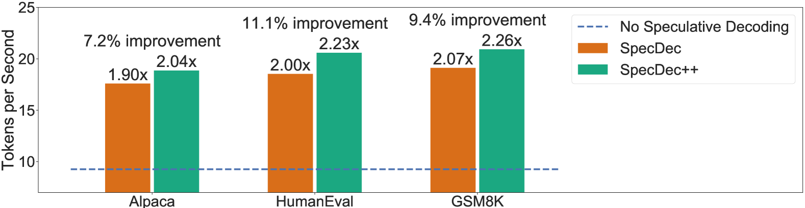
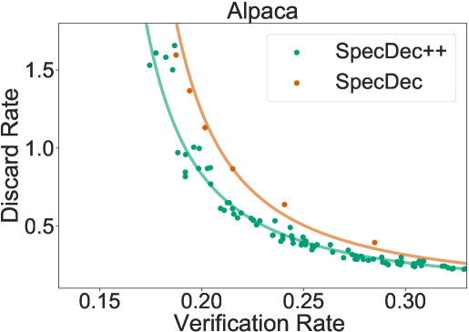

# SpecDec++：利用自适应候选长度增强推测解码性能

发布时间：2024年05月30日

`LLM应用

这篇论文主要讨论了大型语言模型（LLM）的推理延迟问题，并提出了一种名为SpecDec++的新方法来优化推理过程。通过动态调整候选令牌的长度和使用训练过的接受预测模块，SpecDec++能够有效降低推理延迟，提高模型性能。这种方法直接应用于LLM的实际使用中，以改善其效率和性能，因此属于LLM应用类别。` `模型优化`

> SpecDec++: Boosting Speculative Decoding via Adaptive Candidate Lengths

# 摘要

> 推测解码通过使用一个小巧快速的草稿模型，有效降低了大型语言模型的推理延迟。其性能关键在于超参数K，即每轮验证的候选令牌数量。以往方法常采用简单启发式选择K，效果未必最佳。我们深入研究了K的选择，将其视为马尔可夫决策过程，并证明最优策略是阈值策略：当拒绝概率超过特定阈值时，应停止推测并验证。基于此，我们开发了SpecDec++，一种能动态调整候选长度的增强版推测解码。我们为草稿模型添加了训练过的接受预测模块，实时预测令牌接受概率。一旦预测到至少一个令牌被拒绝的概率超过阈值，SpecDec++即停止推测。在Alpaca数据集上，SpecDec++实现了2.04倍加速，比基线方法提升了7.2%；在GSM8K和HumanEval数据集上，分别实现了2.26倍（提升9.4%）和2.23倍（提升11.1%）的加速。

> Speculative decoding reduces the inference latency of a target large language model via utilizing a smaller and faster draft model. Its performance depends on a hyperparameter K -- the candidate length, i.e., the number of candidate tokens for the target model to verify in each round. However, previous methods often use simple heuristics to choose K, which may result in sub-optimal performance. We study the choice of the candidate length K and formulate it as a Markov Decision Process. We theoretically show that the optimal policy of this Markov decision process takes the form of a threshold policy, i.e., the current speculation should stop and be verified when the probability of getting a rejection exceeds a threshold value. Motivated by this theory, we propose SpecDec++, an enhanced version of speculative decoding that adaptively determines the candidate length on the fly. We augment the draft model with a trained acceptance prediction head to predict the conditional acceptance probability of the candidate tokens. SpecDec++ will stop the current speculation when the predicted probability that at least one token gets rejected exceeds a threshold. We implement SpecDec++ and apply it to the llama-2-chat 7B & 70B model pair. Our adaptive method achieves a 2.04x speedup on the Alpaca dataset (an additional 7.2% improvement over the baseline speculative decoding). On the GSM8K and HumanEval datasets, our method achieves a 2.26x speedup (9.4% improvement) and 2.23x speedup (11.1% improvement), respectively.

[Arxiv](https://arxiv.org/abs/2405.19715)