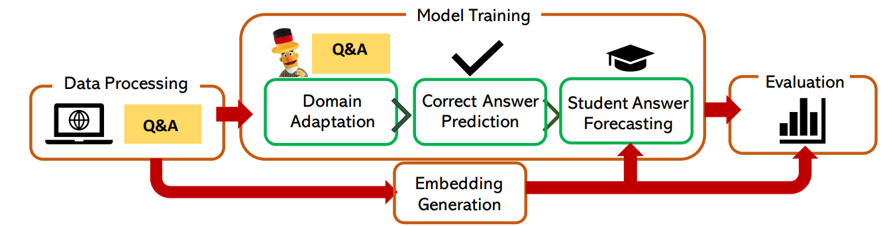
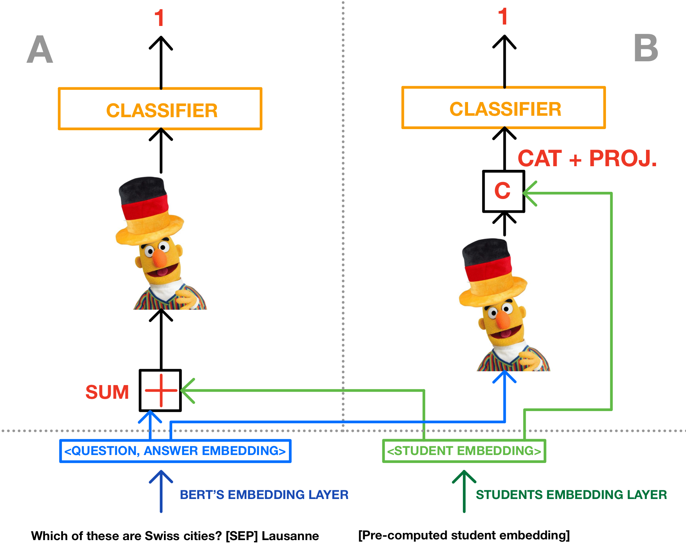
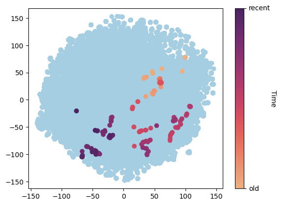
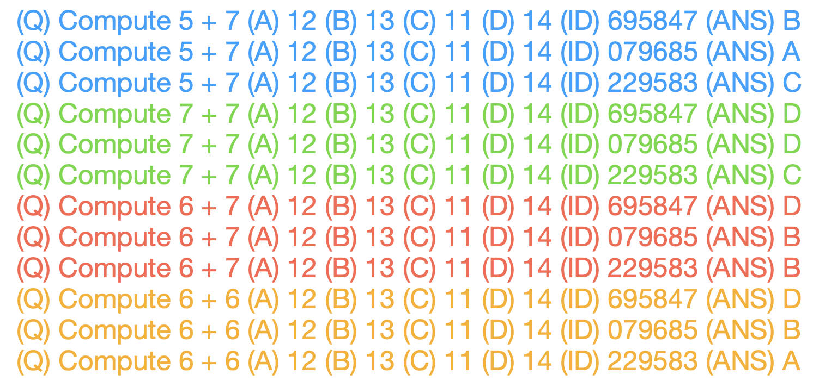
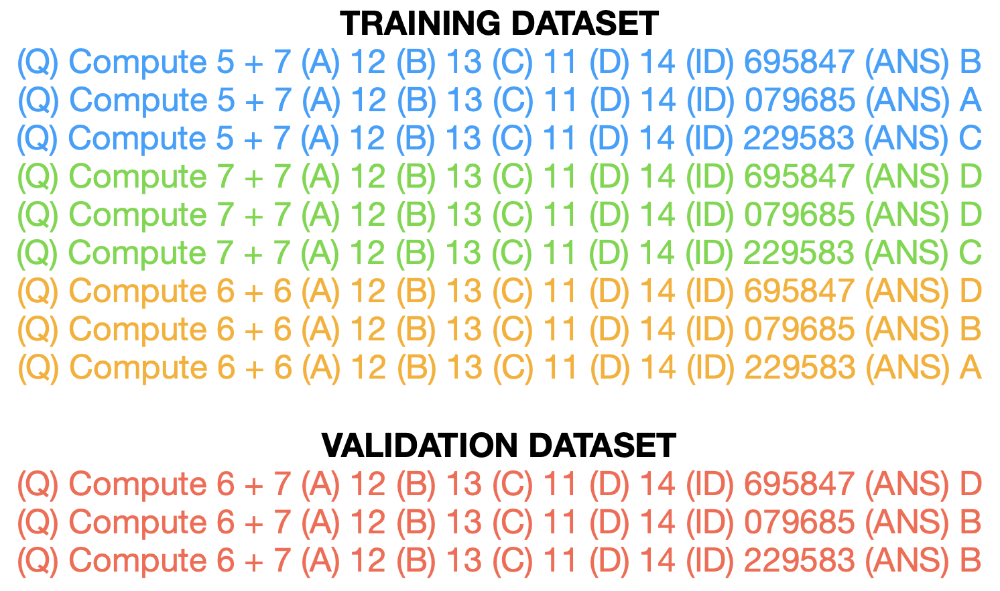
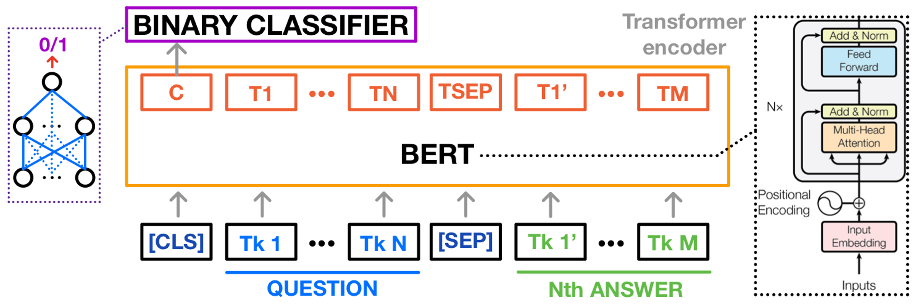
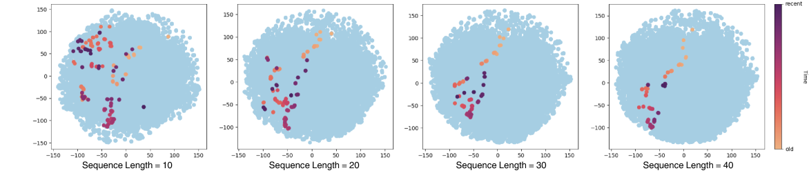

# 语言学习中的学生答案预测：利用Transformer模型精准预测答案选项

发布时间：2024年05月30日

`Agent

理由：这篇论文主要关注的是智能辅导系统（ITS），并开发了一个模型（MCQStudentBert）来预测学生的答案选择，以提供个性化的学习指导。这个模型利用了大型语言模型（LLMs）的功能，并且能够根据学生的答题历史和问题文本来理解学生的选择上下文。这个系统可以被视为一个智能代理（Agent），因为它能够根据学生的行为和历史来做出决策和提供指导。因此，这篇论文更适合归类到Agent分类中。` `个性化学习`

> Student Answer Forecasting: Transformer-Driven Answer Choice Prediction for Language Learning

# 摘要

> 智能辅导系统（ITS）通过预测学生答案，提供即时定制指导，促进个性化学习。但现有研究多关注答案正确性，忽视了学生在特定选项上的表现，限制了对学生思考过程和潜在误解的理解。为此，我们开发了MCQStudentBert模型，该模型利用大型语言模型（LLMs）的强大功能，结合学生答题历史和问题文本，深入理解学生选择答案的上下文。此模型能预测学生可能的答案选择，使教育者无需重新训练即可轻松调整答案选项。我们比较了MLP、LSTM、BERT和Mistral 7B等架构，从学生过往互动中提取特征，整合进微调的BERT模型中，用于预测答案。我们应用此模型于一个包含10,000多名学生的语言学习多选题数据集，验证其在结合学生互动模式下的预测准确性，并与传统方法进行比较。这项研究为教育内容的个性化、模块化及细粒度支持提供了新思路。

> Intelligent Tutoring Systems (ITS) enhance personalized learning by predicting student answers to provide immediate and customized instruction. However, recent research has primarily focused on the correctness of the answer rather than the student's performance on specific answer choices, limiting insights into students' thought processes and potential misconceptions. To address this gap, we present MCQStudentBert, an answer forecasting model that leverages the capabilities of Large Language Models (LLMs) to integrate contextual understanding of students' answering history along with the text of the questions and answers. By predicting the specific answer choices students are likely to make, practitioners can easily extend the model to new answer choices or remove answer choices for the same multiple-choice question (MCQ) without retraining the model. In particular, we compare MLP, LSTM, BERT, and Mistral 7B architectures to generate embeddings from students' past interactions, which are then incorporated into a finetuned BERT's answer-forecasting mechanism. We apply our pipeline to a dataset of language learning MCQ, gathered from an ITS with over 10,000 students to explore the predictive accuracy of MCQStudentBert, which incorporates student interaction patterns, in comparison to correct answer prediction and traditional mastery-learning feature-based approaches. This work opens the door to more personalized content, modularization, and granular support.

[Arxiv](https://arxiv.org/abs/2405.20079)