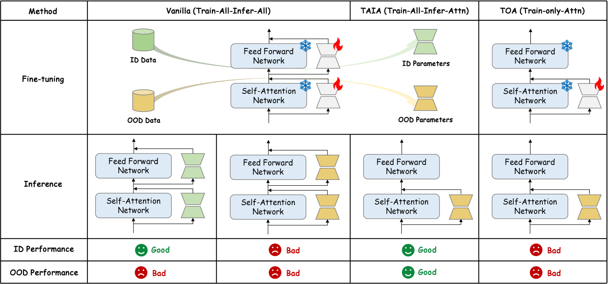

# TAIA：大型语言模型擅长学习分布外数据

发布时间：2024年05月30日

`LLM应用

这篇论文主要探讨了在特定任务中，如何通过微调大型语言模型（LLMs）来提升其在下游任务的性能，特别是在数据分布不一致的情况下。论文提出了一种新的策略，即在训练时使用所有参数，但在推理时仅激活注意力参数。这种方法在多个下游任务中显示出了优越性，并有效应对了数据不匹配的问题。因此，这篇论文的内容更偏向于LLM的应用层面，即如何优化和调整LLM以适应特定的任务需求。` `医疗健康`

> TAIA: Large Language Models are Out-of-Distribution Data Learners

# 摘要

> 针对特定任务的问答对进行微调是提升大型语言模型（LLMs）在下游任务性能的主流方法。但在医疗健康或无害内容生成等专业领域，获取与下游任务匹配的高质量数据极为困难。为了解决这一问题，我们重新审视了Transformer架构，并发现并非所有微调参数都对下游性能有益。具体而言，当训练与测试数据分布不一致时，只有注意力参数的微调显示出显著优势。据此，我们提出了一种新颖的推理时策略：训练所有参数，但推理时仅激活注意力参数（\trainallInfAttn）。通过在两个通用数据集上的验证，以及在涉及数学、推理和知识理解的七个下游任务上的评估，我们证实了\trainallInfAttn在多种LLMs和微调技术中的优越性。该方法不仅显著提升了性能，还因其对数据不匹配的高容忍性，有效抵御了越狱调优，增强了在通用数据上执行专业任务的能力。

> Fine-tuning on task-specific question-answer pairs is a predominant method for enhancing the performance of instruction-tuned large language models (LLMs) on downstream tasks. However, in certain specialized domains, such as healthcare or harmless content generation, it is nearly impossible to obtain a large volume of high-quality data that matches the downstream distribution. To improve the performance of LLMs in data-scarce domains with domain-mismatched data, we re-evaluated the Transformer architecture and discovered that not all parameter updates during fine-tuning contribute positively to downstream performance. Our analysis reveals that within the self-attention and feed-forward networks, only the fine-tuned attention parameters are particularly beneficial when the training set's distribution does not fully align with the test set. Based on this insight, we propose an effective inference-time intervention method: \uline{T}raining \uline{A}ll parameters but \uline{I}nferring with only \uline{A}ttention (\trainallInfAttn). We empirically validate \trainallInfAttn using two general instruction-tuning datasets and evaluate it on seven downstream tasks involving math, reasoning, and knowledge understanding across LLMs of different parameter sizes and fine-tuning techniques. Our comprehensive experiments demonstrate that \trainallInfAttn achieves superior improvements compared to both the fully fine-tuned model and the base model in most scenarios, with significant performance gains. The high tolerance of \trainallInfAttn to data mismatches makes it resistant to jailbreaking tuning and enhances specialized tasks using general data.

[Arxiv](https://arxiv.org/abs/2405.20192)