# TS-Align：一种教师-学生协作框架，专为大型语言模型的可扩展迭代微调设计

发布时间：2024年05月30日

`Agent

理由：这篇论文介绍了一个名为“TS-Align”的框架，该框架通过自动从输出中提取的成对反馈数据来微调策略模型，以实现大型语言模型（LLMs）的对齐。这个框架涉及教师模型和学生模型的协同工作，用于迭代地进行策略微调。这种方法可以被视为一种智能代理（Agent），因为它通过自动化的方式处理和优化模型，以更好地符合人类的偏好。因此，这篇论文更符合Agent分类，因为它描述了一个系统或代理如何通过自动化过程来改进和优化语言模型。` `对话系统` `模型训练`

> TS-Align: A Teacher-Student Collaborative Framework for Scalable Iterative Finetuning of Large Language Models

# 摘要

> 在大型语言模型（LLMs）的对齐过程中，人类偏好数据扮演着关键角色，尤其是在模型更新时。然而，收集这些反馈既昂贵又难以规模化。为此，我们提出了“TS-Align”框架，它通过自动从输出中提取的成对反馈数据来微调策略模型。这一过程得益于大规模教师模型与小规模学生模型的协同工作，实现了高效运作。在我们的教师-学生协作框架中，策略微调可以不断迭代进行。实验结果显示，经过对齐的策略模型在七个对话或指令遵循数据集上的平均胜率达到了69.7%，显著优于原始模型。此外，我们的方法成功地将教师的排序能力传递给了学生，形成了一个小巧但高效的奖励模型，用于策略模型的对齐。

> Mainstream approaches to aligning large language models (LLMs) heavily rely on human preference data, particularly when models require periodic updates. The standard process for iterative alignment of LLMs involves collecting new human feedback for each update. However, the data collection process is costly and challenging to scale. To address this issue, we introduce the "TS-Align" framework, which fine-tunes a policy model using pairwise feedback data automatically mined from its outputs. This automatic mining process is efficiently accomplished through the collaboration between a large-scale teacher model and a small-scale student model. The policy fine-tuning process can be iteratively repeated using on-policy generations within our proposed teacher-student collaborative framework. Through extensive experiments, we demonstrate that our final aligned policy outperforms the base policy model with an average win rate of 69.7% across seven conversational or instruction-following datasets. Furthermore, we show that the ranking capability of the teacher is effectively distilled into the student through our pipeline, resulting in a small-scale yet effective reward model for policy model alignment.

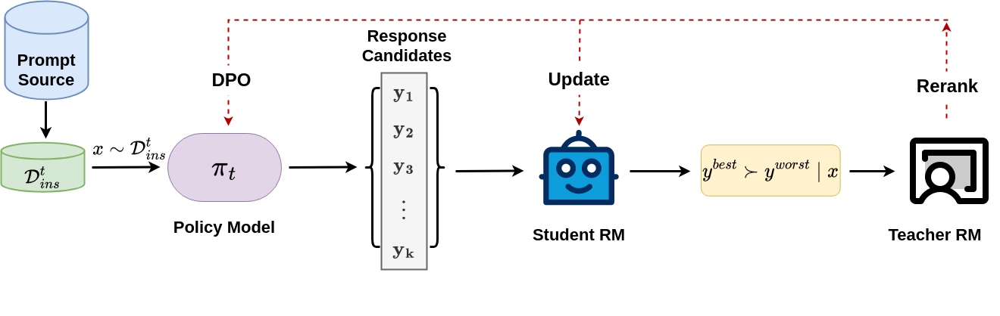

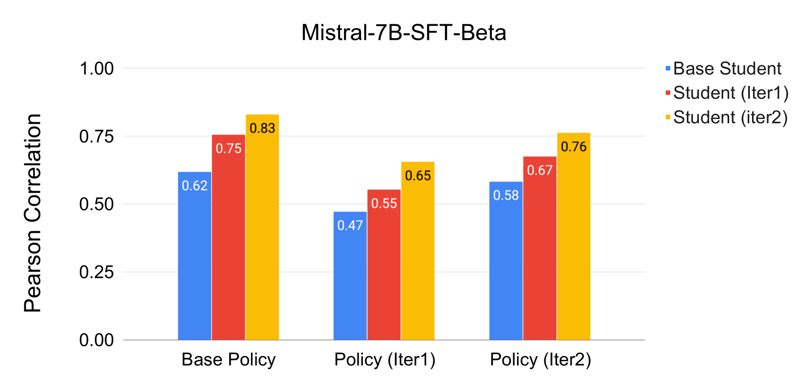

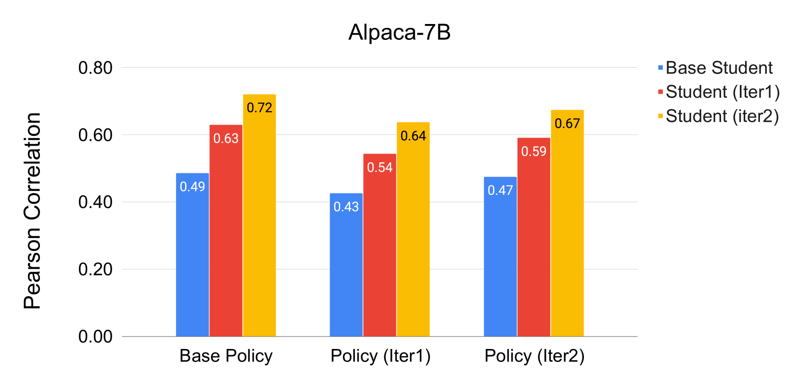

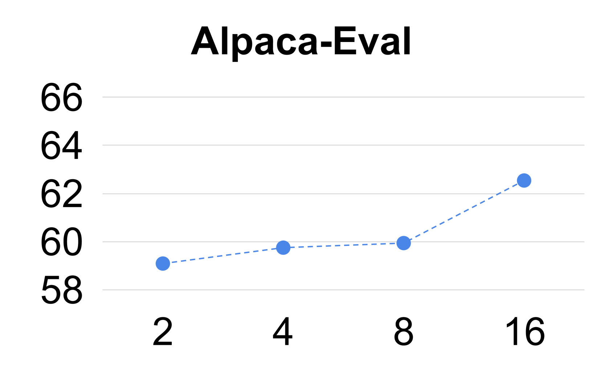

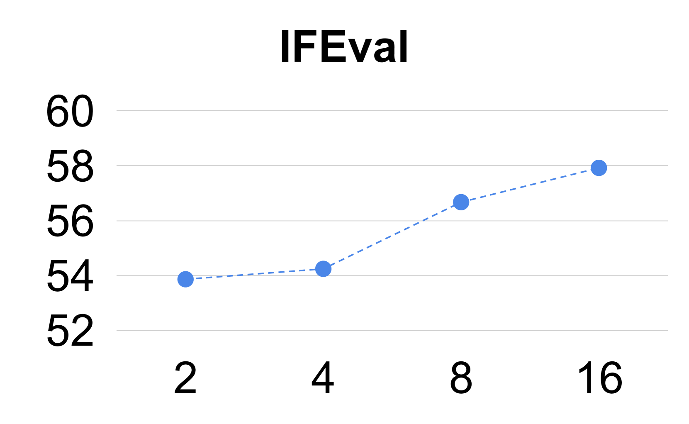

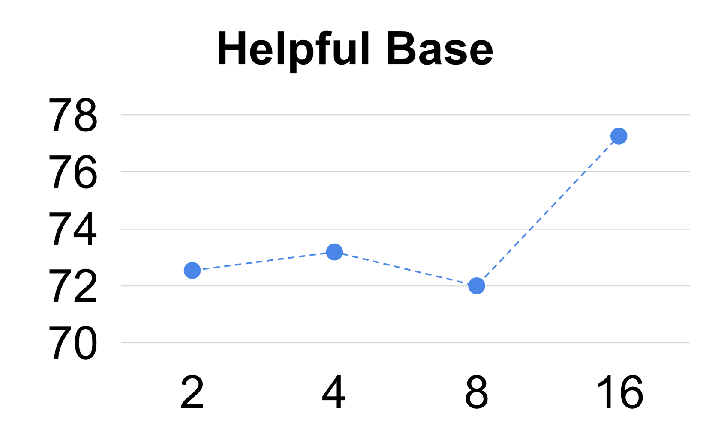

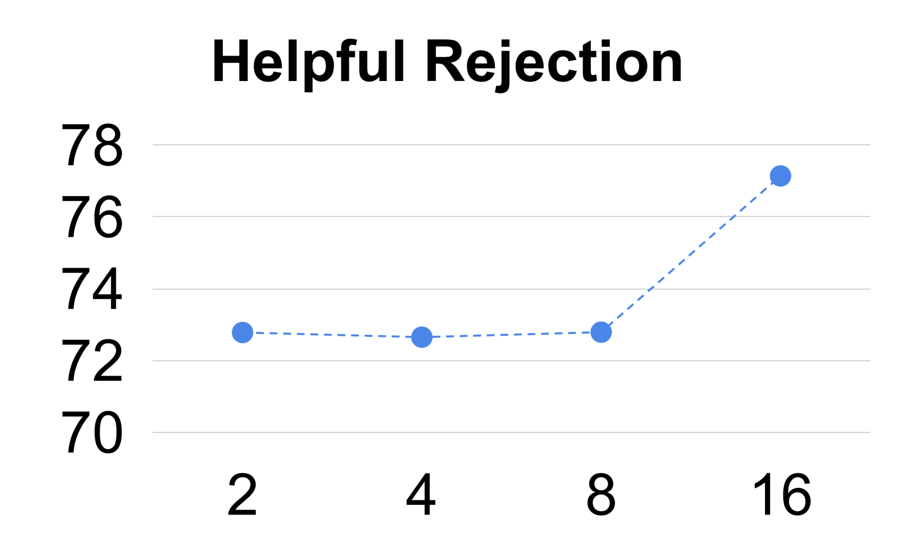

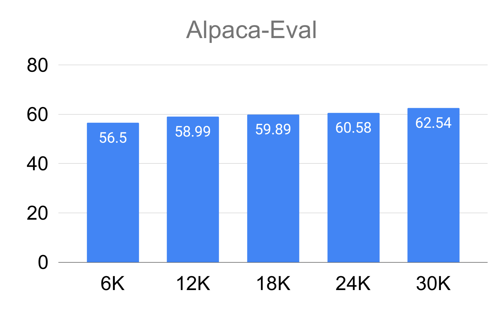

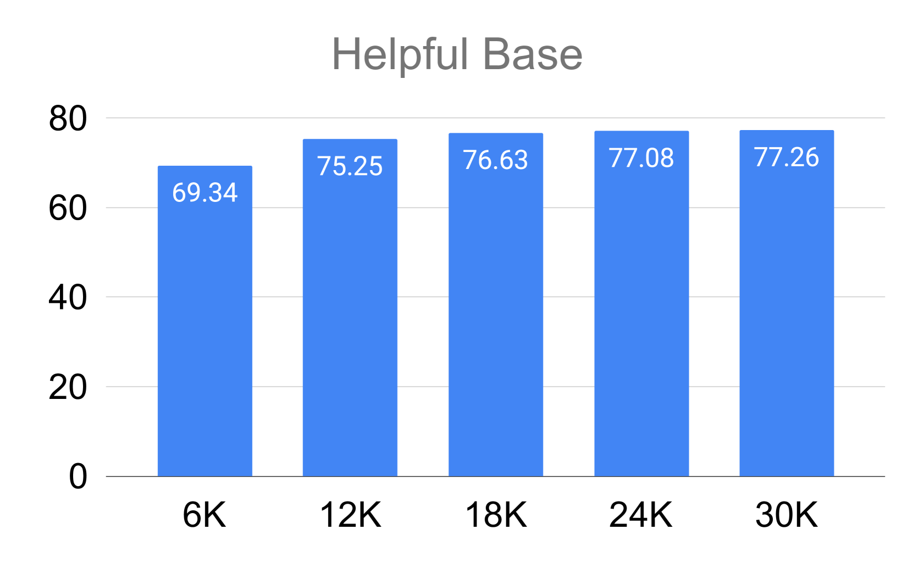

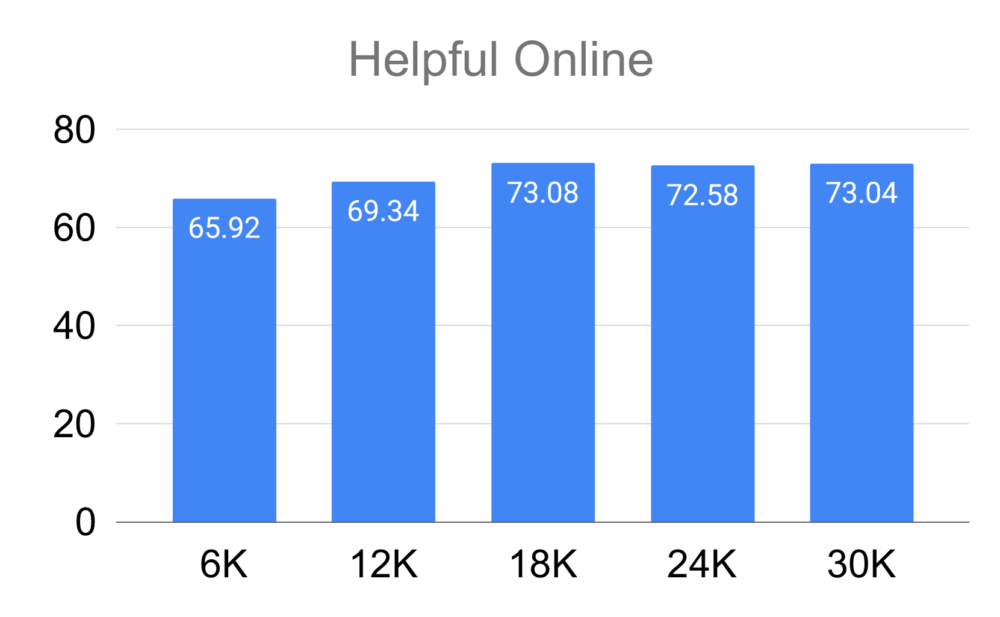

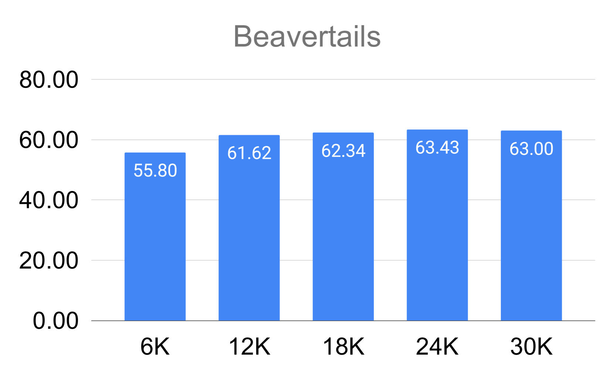

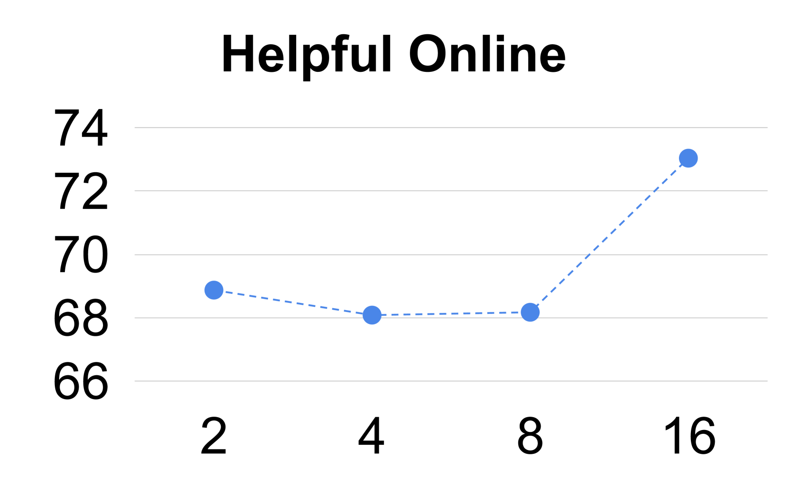

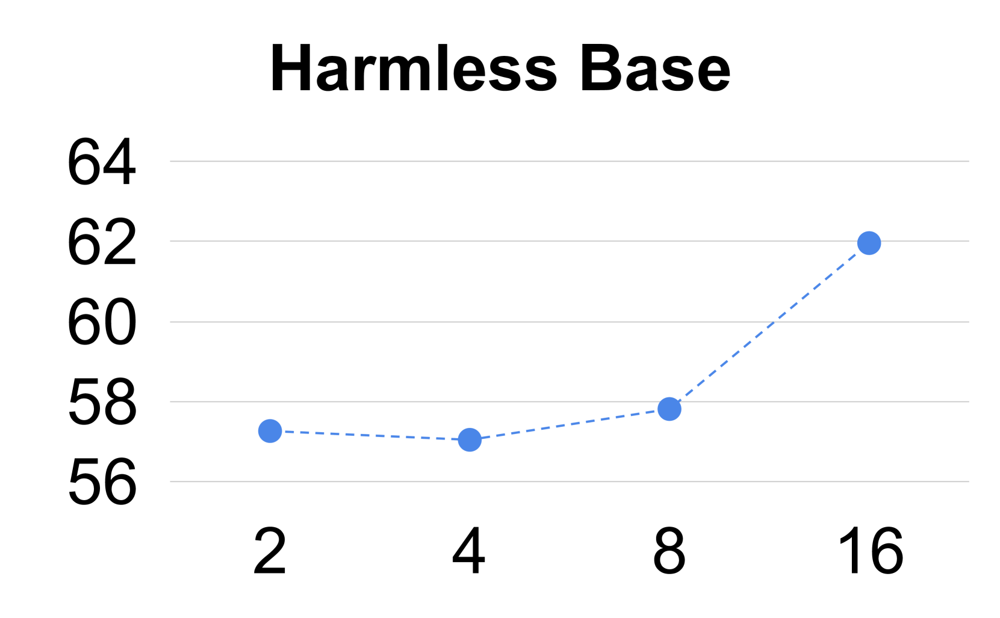

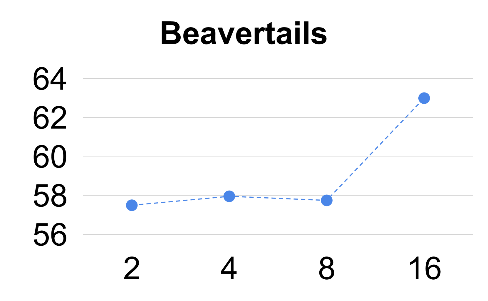

[Arxiv](https://arxiv.org/abs/2405.20215)