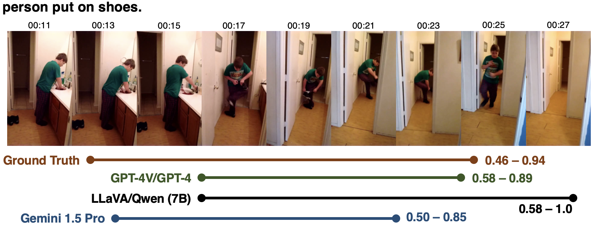
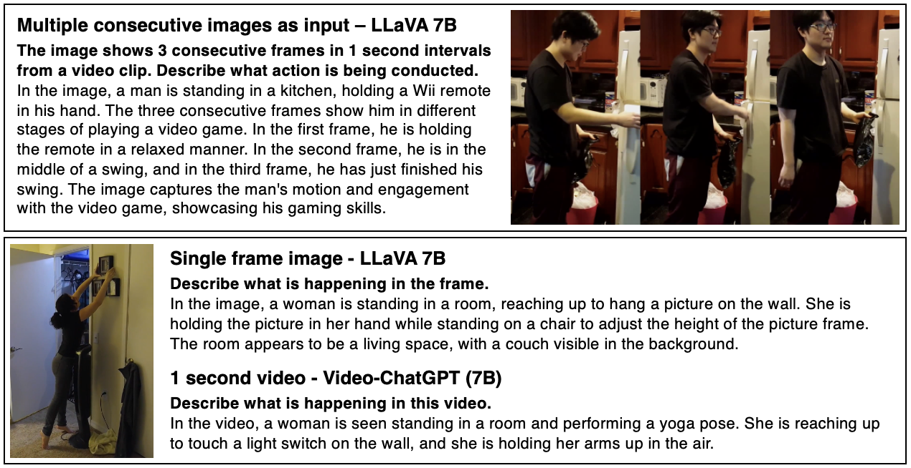

# 借助多模态大型语言模型实现活动的时间锚定

发布时间：2024年05月30日

`LLM应用` `视频理解` `人工智能`

> Temporal Grounding of Activities using Multimodal Large Language Models

# 摘要

> 时间定位活动是视频理解的核心任务，涉及在复杂事件中精准识别动作时间点。随着多模态大型语言模型的进步，我们探索了图像与文本LLM结合的两阶段方法，显著提升了时间活动定位的准确性。实验表明，通过指令调优优化小规模多模态LLM处理动作查询的能力，能产出更丰富、更具信息量的结果，有效增强时间间隔识别性能。Charades-STA数据集的实验结果进一步证实了此方法在推动时间活动定位及视频理解领域的应用潜力。

> Temporal grounding of activities, the identification of specific time intervals of actions within a larger event context, is a critical task in video understanding. Recent advancements in multimodal large language models (LLMs) offer new opportunities for enhancing temporal reasoning capabilities. In this paper, we evaluate the effectiveness of combining image-based and text-based large language models (LLMs) in a two-stage approach for temporal activity localization. We demonstrate that our method outperforms existing video-based LLMs. Furthermore, we explore the impact of instruction-tuning on a smaller multimodal LLM, showing that refining its ability to process action queries leads to more expressive and informative outputs, thereby enhancing its performance in identifying specific time intervals of activities. Our experimental results on the Charades-STA dataset highlight the potential of this approach in advancing the field of temporal activity localization and video understanding.

[Arxiv](https://arxiv.org/abs/2407.06157)