# 微调之谜：如何在不削弱 LLM 能力的前提下，提升翻译品质

发布时间：2024年05月30日

`LLM应用

这篇论文主要探讨了微调大型语言模型（LLMs）在机器翻译中的应用及其对模型特有优势的影响。研究通过评估不同规模的LLaMA和Falcon系列模型，分析了微调对翻译质量及模型特定能力的影响。论文强调了在机器翻译中微调策略的重要性，以保持和提升LLMs的优势。因此，这篇论文属于LLM应用分类。` `机器翻译` `语言模型`

> The Fine-Tuning Paradox: Boosting Translation Quality Without Sacrificing LLM Abilities

# 摘要

> 微调大型语言模型（LLMs）已提升机器翻译的整体质量，但其对LLMs特有优势（如可操控性、文档级翻译能力及非字面翻译）的影响仍不明朗。我们对参数从70亿至650亿的LLaMA和Falcon系列模型进行了深入评估。结果显示，微调虽提升了一般翻译质量，却削弱了某些关键能力，如正式性调整、少量示例下的技术翻译及文档级翻译。然而，微调后的模型在并行数据上训练，其翻译更趋非字面。我们发现，将单语数据纳入微调过程，既能保持原有能力，又能进一步提升翻译质量。这强调了在机器翻译中保留LLMs优势的微调策略的重要性。

> Fine-tuning large language models (LLMs) for machine translation has shown improvements in overall translation quality. However, it is unclear what is the impact of fine-tuning on desirable LLM behaviors that are not present in neural machine translation models, such as steerability, inherent document-level translation abilities, and the ability to produce less literal translations. We perform an extensive translation evaluation on the LLaMA and Falcon family of models with model size ranging from 7 billion up to 65 billion parameters. Our results show that while fine-tuning improves the general translation quality of LLMs, several abilities degrade. In particular, we observe a decline in the ability to perform formality steering, to produce technical translations through few-shot examples, and to perform document-level translation. On the other hand, we observe that the model produces less literal translations after fine-tuning on parallel data. We show that by including monolingual data as part of the fine-tuning data we can maintain the abilities while simultaneously enhancing overall translation quality. Our findings emphasize the need for fine-tuning strategies that preserve the benefits of LLMs for machine translation.

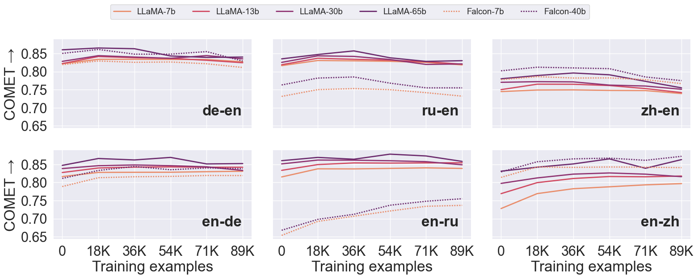

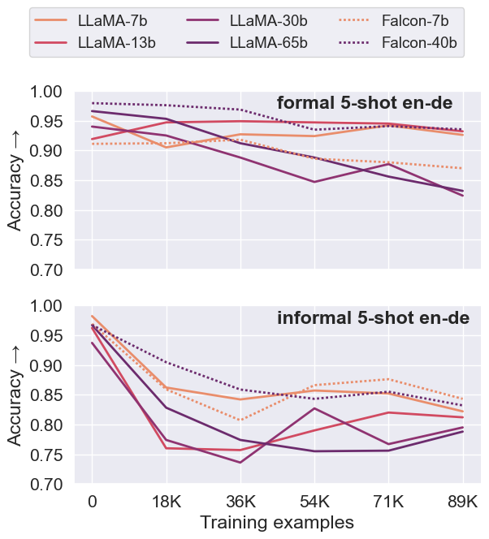

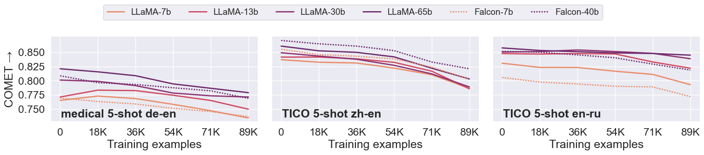

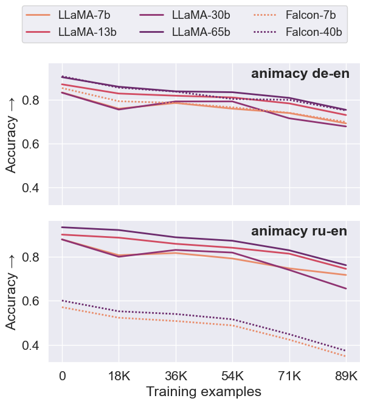

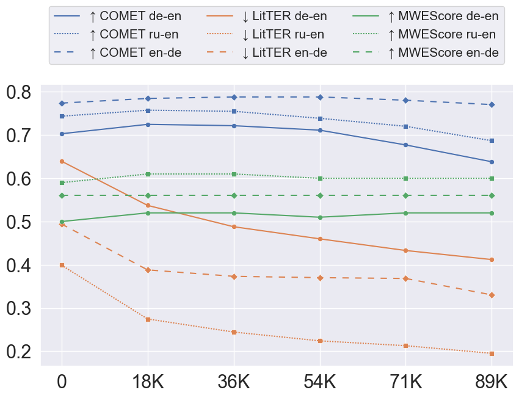

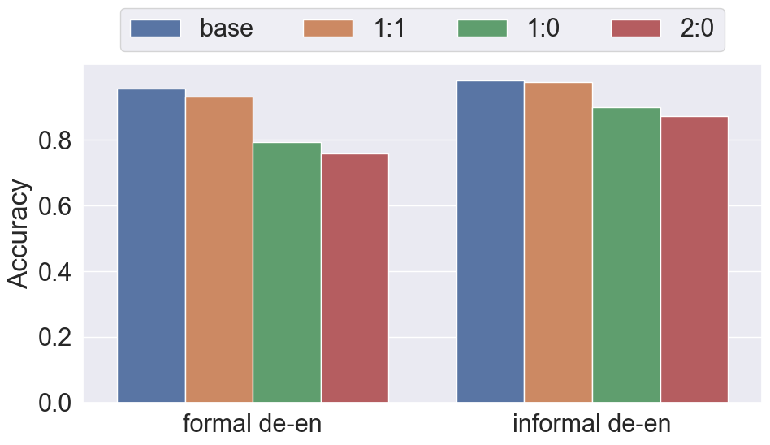

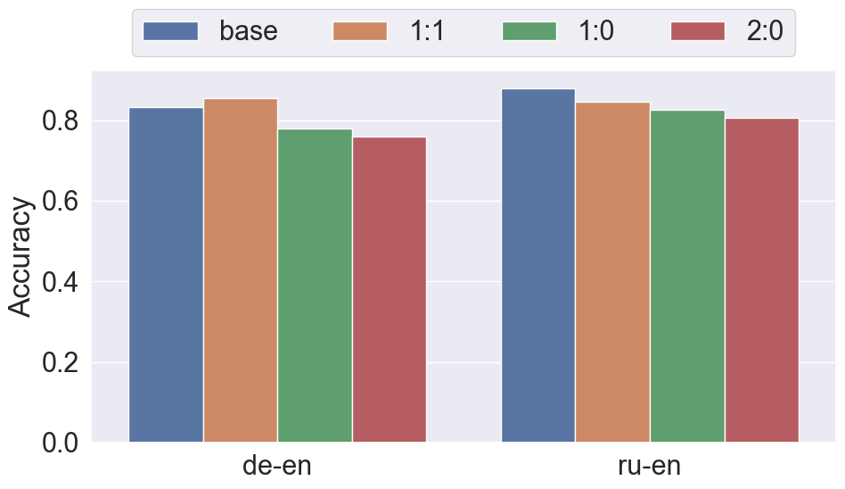

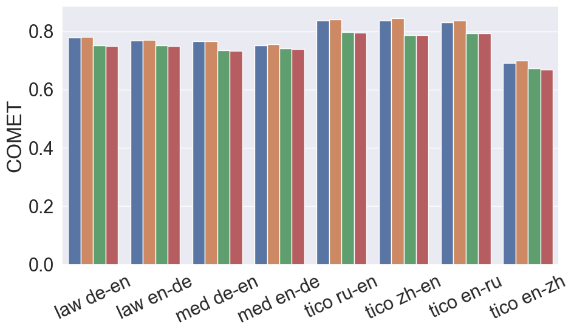

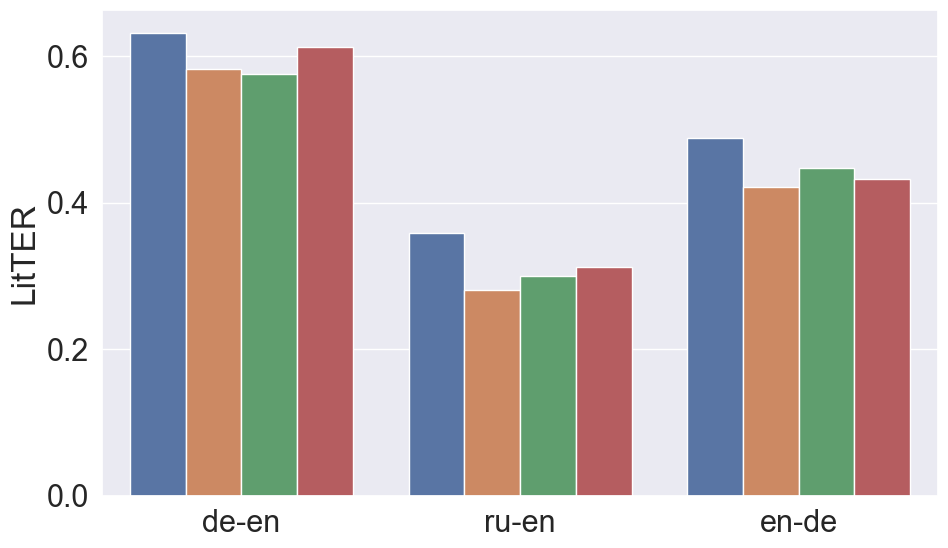

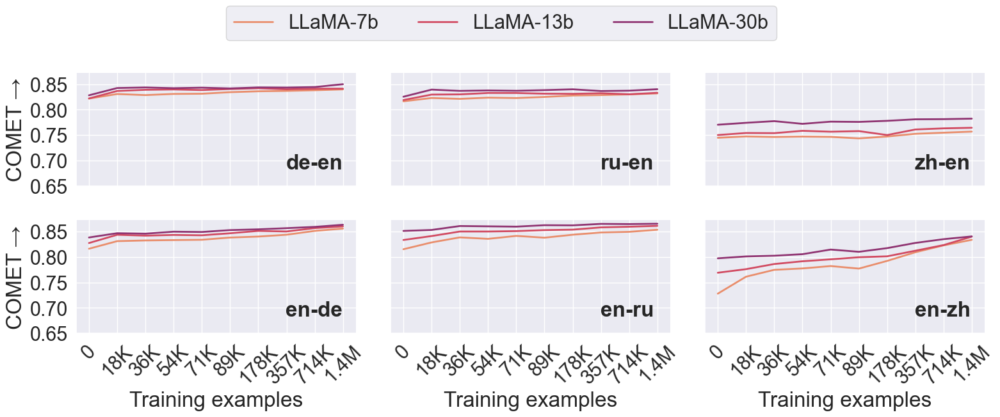

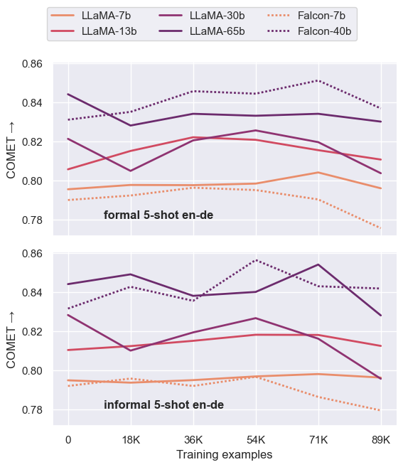

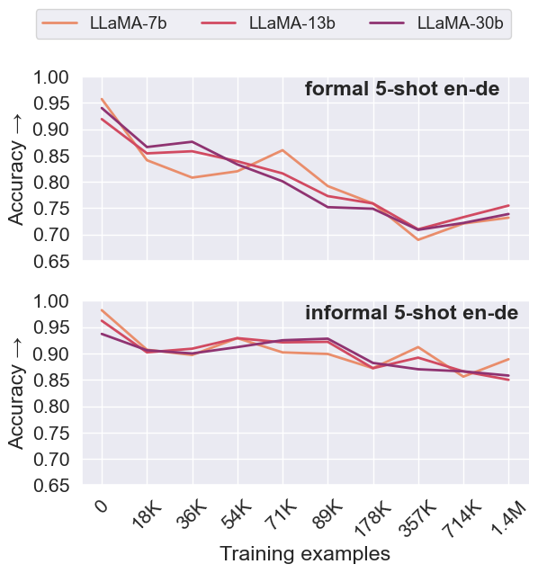

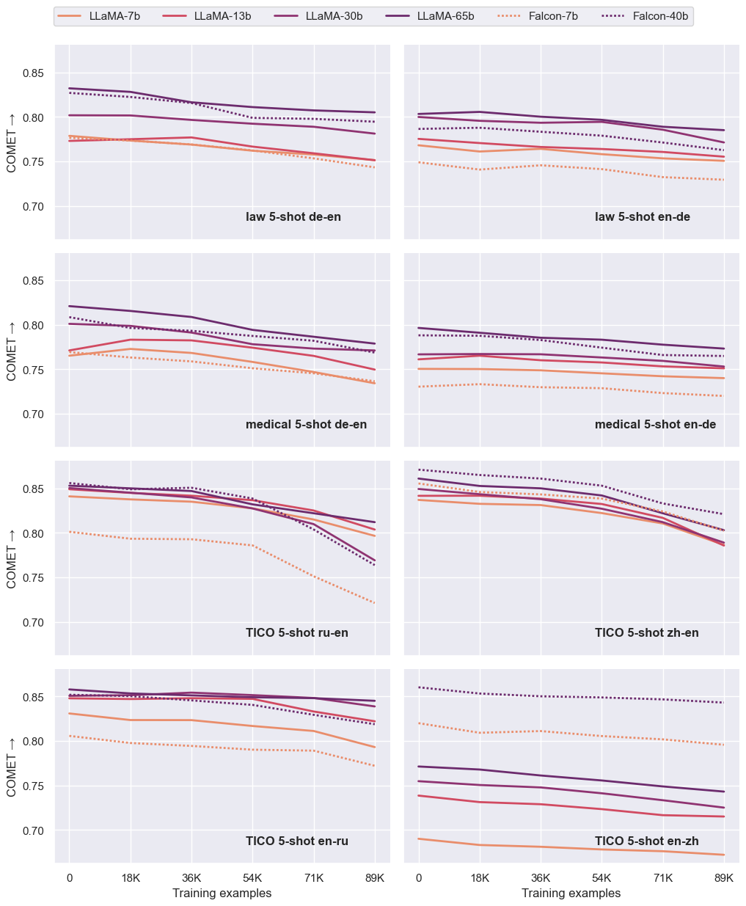

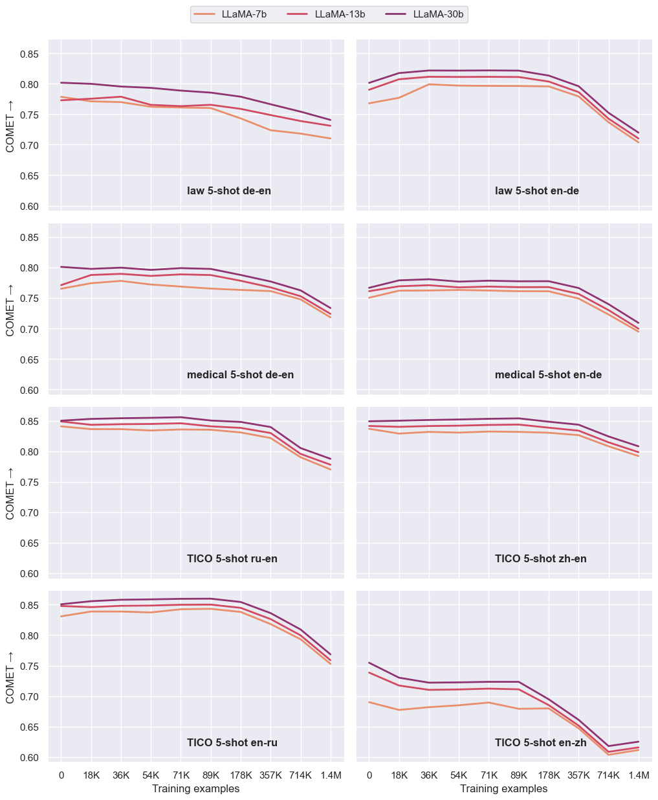

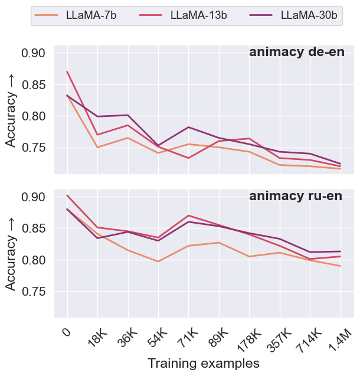

[Arxiv](https://arxiv.org/abs/2405.20089)