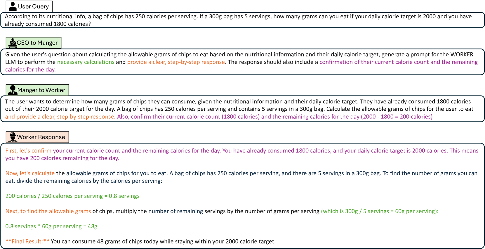

# 探索分层多代理工作流程以优化零-shot提示

发布时间：2024年05月30日

`Agent

这篇论文主要介绍了一种新的方法，即层次化多代理工作流（HMAW），用于自主设计最优提示以提升大型语言模型（LLMs）的性能。这种方法通过构建一个层次分明、指令精确、措辞准确的提示，然后生成用户查询的最终答案，无需人类干预，无需训练，且与任务无关，能够灵活适应任务细节。因此，它更符合Agent分类，因为它涉及到了自主代理系统的设计和应用。` `人工智能`

> Towards Hierarchical Multi-Agent Workflows for Zero-Shot Prompt Optimization

# 摘要

> 大型语言模型（LLMs）在应对用户提问方面取得了巨大进步，支持了众多应用。然而，LLM的输出质量很大程度上依赖于提示设计，一个精心设计的提示能让LLM准确解答难题。为此，研究者们提出了多种提升提示效果的策略，包括人工精雕细琢和领域内优化。但在无限制场景下，这些策略的有效性仍存疑，前者受限于特定问题的人工设计，后者则难以适应新场景。为此，我们让LLMs自主设计最优提示。具体而言，我们引入了层次化LLMs，首先构建一个层次分明、指令精确、措辞准确的提示，再以此生成用户查询的最终答案。我们称这一流程为层次化多代理工作流（HMAW）。与以往研究不同，HMAW无需人类干预，无需训练，且与任务无关，能灵活适应任务细节。通过跨多个基准的定量与定性实验，我们证实了这一简洁方法能生成详尽且恰当的提示，显著提升了LLMs的性能。

> Large language models (LLMs) have shown great progress in responding to user questions, allowing for a multitude of diverse applications. Yet, the quality of LLM outputs heavily depends on the prompt design, where a good prompt might enable the LLM to answer a very challenging question correctly. Therefore, recent works have developed many strategies for improving the prompt, including both manual crafting and in-domain optimization. However, their efficacy in unrestricted scenarios remains questionable, as the former depends on human design for specific questions and the latter usually generalizes poorly to unseen scenarios. To address these problems, we give LLMs the freedom to design the best prompts according to themselves. Specifically, we include a hierarchy of LLMs, first constructing a prompt with precise instructions and accurate wording in a hierarchical manner, and then using this prompt to generate the final answer to the user query. We term this pipeline Hierarchical Multi-Agent Workflow, or HMAW. In contrast with prior works, HMAW imposes no human restriction and requires no training, and is completely task-agnostic while capable of adjusting to the nuances of the underlying task. Through both quantitative and qualitative experiments across multiple benchmarks, we verify that despite its simplicity, the proposed approach can create detailed and suitable prompts, further boosting the performance of current LLMs.

[Arxiv](https://arxiv.org/abs/2405.20252)