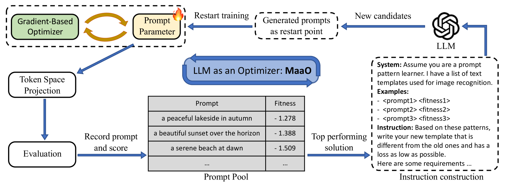
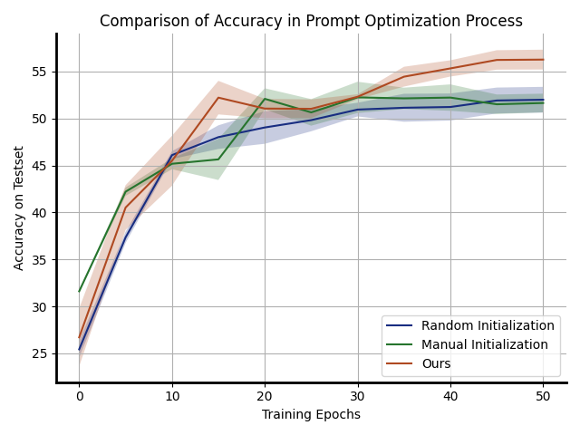
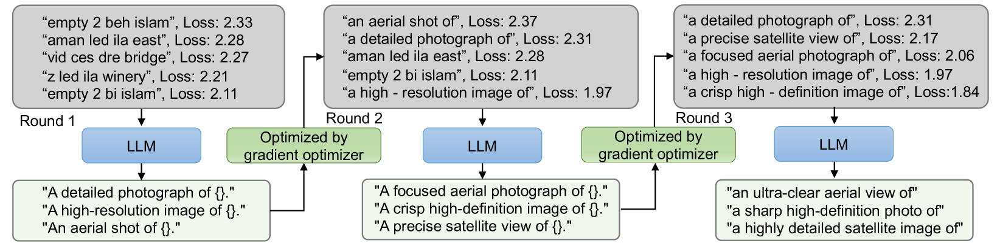

# 双优化器胜于单一：LLM 催化剂助力梯度优化提升

发布时间：2024年05月30日

`LLM应用

这篇论文探讨了将基于梯度的优化方法与基于大型语言模型（LLMs）的优化方法相结合的策略，以解决复杂的非凸优化问题。这种结合方法利用了LLMs的高层次推理能力，通过自然语言指令推导解决方案，并将这些推断结果作为下一轮梯度优化的起点。这种方法展示了传统优化技术与LLMs推理能力的协同效应，并且超越了现有的基准提示调整技术。因此，这篇论文属于LLM应用类别，因为它展示了LLMs在实际优化问题中的应用和效果。` `优化算法` `机器学习`

> Two Optimizers Are Better Than One: LLM Catalyst for Enhancing Gradient-Based Optimization

# 摘要

> 学习技能往往需要实践者的亲身经历和指导者的深刻指导。那么，这种策略能否有效解决复杂的非凸优化问题呢？基于梯度的优化器如同一位严谨的实践者，每步追求局部最优。而利用大型语言模型（LLMs）的新方法，则如同高层次的指导者，通过自然语言指令推导解决方案。本文揭示了这两种优化器的互补性，提出了一种协作优化策略：将基于梯度的优化与基于LLM的优化交替结合。我们通过任务描述和梯度优化中的实时轨迹来指导LLMs，其推断结果作为下一轮梯度优化的起点。这种结合方法不仅严谨且具有高层次的推理能力，持续超越了现有的基准提示调整技术。我们的研究展示了传统优化与LLMs推理能力的强大协同效应，相关代码已公开于https://github.com/guozix/LLM-catalyst。

> Learning a skill generally relies on both practical experience by doer and insightful high-level guidance by instructor. Will this strategy also work well for solving complex non-convex optimization problems? Here, a common gradient-based optimizer acts like a disciplined doer, making locally optimal update at each step. Recent methods utilize large language models (LLMs) to optimize solutions for concrete problems by inferring from natural language instructions, akin to a high-level instructor. In this paper, we show that these two optimizers are complementary to each other, suggesting a collaborative optimization approach. The gradient-based optimizer and LLM-based optimizer are combined in an interleaved manner. We instruct LLMs using task descriptions and timely optimization trajectories recorded during gradient-based optimization. Inferred results from LLMs are used as restarting points for the next stage of gradient optimization. By leveraging both the locally rigorous gradient-based optimizer and the high-level deductive LLM-based optimizer, our combined optimization method consistently yields improvements over competitive baseline prompt tuning methods. Our results demonstrate the synergistic effect of conventional gradient-based optimization and the inference ability of LLMs. The code is released at https://github.com/guozix/LLM-catalyst.

[Arxiv](https://arxiv.org/abs/2405.19732)