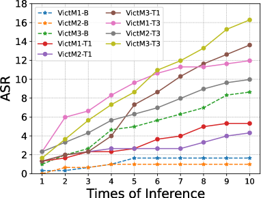
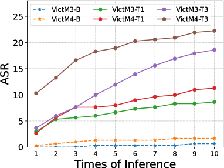

# 排版艺术激发语义多样性，提升多模态大型语言模型间的对抗迁移能力。

发布时间：2024年05月30日

`LLM应用

这篇论文主要关注多元大型语言模型（MLLMs）在对抗样本可迁移性方面的挑战，并提出了一种新的攻击方法——基于排版的语义转移攻击（TSTA）。这种方法利用了MLLMs处理语义信息的能力和排版攻击对视觉信息的干扰能力，以提升对抗攻击的跨模型效果。因此，这篇论文的内容更偏向于LLM的应用层面，特别是在安全性和对抗性攻击方面的应用。` `人工智能` `网络安全`

> Typography Leads Semantic Diversifying: Amplifying Adversarial Transferability across Multimodal Large Language Models

# 摘要

> 随着大型模型引领的人工智能时代的到来，能够理解视觉与文本间跨模态交互的多元大型语言模型（MLLMs）已成为研究热点。这些模型面临的挑战之一是对抗样本的可迁移性，即一个模型产生的微小扰动也能影响其他模型。增加数据多样性是提升这种可迁移性的关键策略，已被证实能在黑盒攻击中显著增强威胁。尽管MLLMs在白盒环境下能生成对抗样本，但其可迁移性仍有限，难以实现跨模型的黑盒攻击。为此，本文创新性地提出了基于排版的语义转移攻击（TSTA），利用MLLMs处理语义信息的特点和排版攻击对视觉信息的干扰能力。在有害词汇插入和重要信息保护等场景中，TSTA表现出色，有效提升了对抗攻击的跨模型效果。

> Following the advent of the Artificial Intelligence (AI) era of large models, Multimodal Large Language Models (MLLMs) with the ability to understand cross-modal interactions between vision and text have attracted wide attention. Adversarial examples with human-imperceptible perturbation are shown to possess a characteristic known as transferability, which means that a perturbation generated by one model could also mislead another different model. Augmenting the diversity in input data is one of the most significant methods for enhancing adversarial transferability. This method has been certified as a way to significantly enlarge the threat impact under black-box conditions. Research works also demonstrate that MLLMs can be exploited to generate adversarial examples in the white-box scenario. However, the adversarial transferability of such perturbations is quite limited, failing to achieve effective black-box attacks across different models. In this paper, we propose the Typographic-based Semantic Transfer Attack (TSTA), which is inspired by: (1) MLLMs tend to process semantic-level information; (2) Typographic Attack could effectively distract the visual information captured by MLLMs. In the scenarios of Harmful Word Insertion and Important Information Protection, our TSTA demonstrates superior performance.

[Arxiv](https://arxiv.org/abs/2405.20090)