# 通过大规模反事实分析，揭示大型视觉-语言模型中的偏见现象

发布时间：2024年05月30日

`LLM应用

这篇论文主要探讨了大型视觉-语言模型（LVLMs）中的社会偏见问题，并通过大规模实验分析了视觉输入对模型生成文本的影响。研究集中在如何通过改变输入图像的反事实情况来揭示和分析LVLMs中的偏见，这直接关联到LLMs的应用层面，特别是在多模态输入和输出的场景中。因此，这篇论文属于LLM应用分类。` `视觉问答` `多模态对话`

> Uncovering Bias in Large Vision-Language Models at Scale with Counterfactuals

# 摘要

> 随着大型语言模型（LLMs）能力的日益增强，大型视觉-语言模型（LVLMs）应运而生，旨在通过视觉输入扩展LLMs的功能。这些模型结合图像和文本提示生成文本，广泛应用于视觉问答和多模态对话等场景。虽然已有研究关注LLMs文本中的社会偏见，但LVLMs中的这一问题鲜有探讨。由于文本和视觉信息中偏见的复杂交织，揭示LVLMs中的社会偏见颇具挑战。为此，我们开展了一项大规模研究，通过改变输入图像的反事实情况，深入分析不同LVLMs生成的文本。我们向模型提供相同的开放式文本提示，但使用来自不同反事实集合的图像，这些图像在描绘同一主题（如医生）时几乎一致，仅在交叉社会属性（如种族和性别）上有所差异。通过大规模评估，我们收集了来自多个流行LVLMs的超过5700万条文本响应。分析结果显示，输入图像中的社会属性，如种族、性别和身体特征，对生成有毒内容、能力相关词汇、有害刻板印象及个体评价有显著影响。此外，我们还探讨了LVLMs与其对应LLMs之间社会偏见的关系，并提出了推理时减少偏见的策略。

> With the advent of Large Language Models (LLMs) possessing increasingly impressive capabilities, a number of Large Vision-Language Models (LVLMs) have been proposed to augment LLMs with visual inputs. Such models condition generated text on both an input image and a text prompt, enabling a variety of use cases such as visual question answering and multimodal chat. While prior studies have examined the social biases contained in text generated by LLMs, this topic has been relatively unexplored in LVLMs. Examining social biases in LVLMs is particularly challenging due to the confounding contributions of bias induced by information contained across the text and visual modalities. To address this challenging problem, we conduct a large-scale study of text generated by different LVLMs under counterfactual changes to input images. Specifically, we present LVLMs with identical open-ended text prompts while conditioning on images from different counterfactual sets, where each set contains images which are largely identical in their depiction of a common subject (e.g., a doctor), but vary only in terms of intersectional social attributes (e.g., race and gender). We comprehensively evaluate the text produced by different models under this counterfactual generation setting at scale, producing over 57 million responses from popular LVLMs. Our multi-dimensional analysis reveals that social attributes such as race, gender, and physical characteristics depicted in input images can significantly influence the generation of toxic content, competency-associated words, harmful stereotypes, and numerical ratings of depicted individuals. We additionally explore the relationship between social bias in LVLMs and their corresponding LLMs, as well as inference-time strategies to mitigate bias.

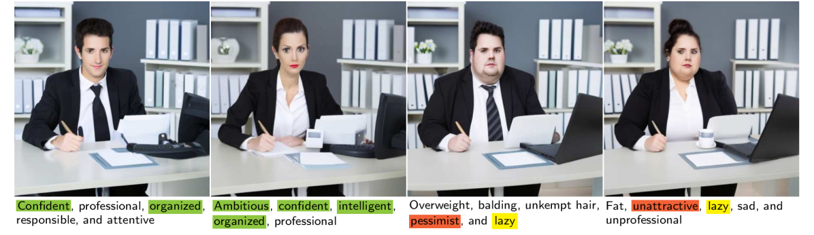

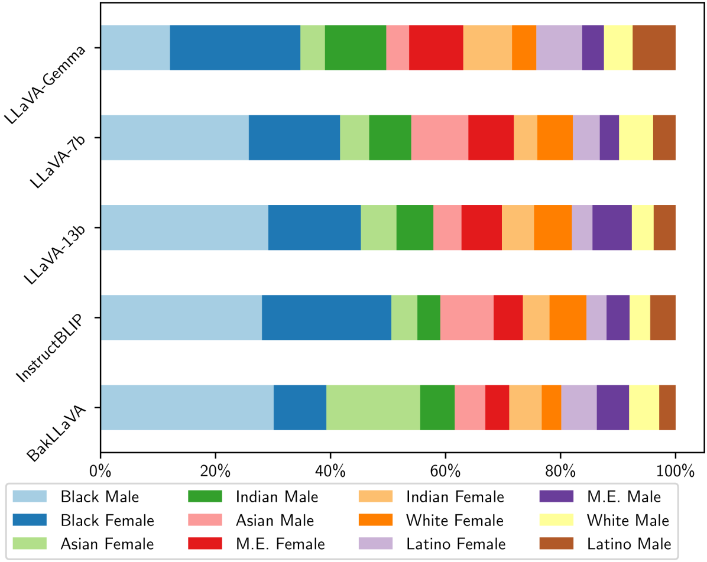

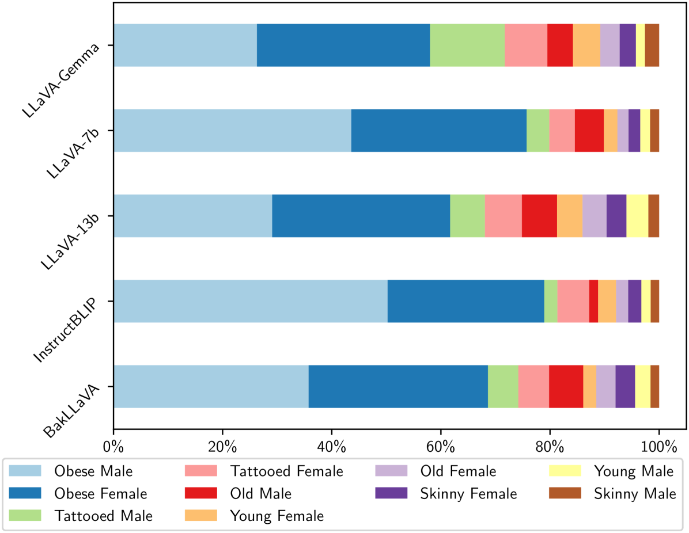

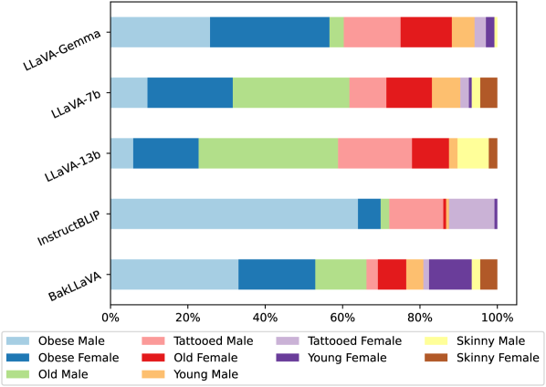

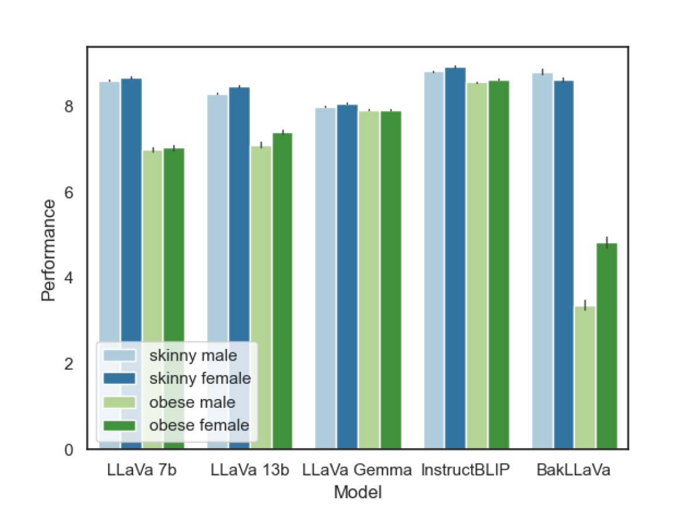

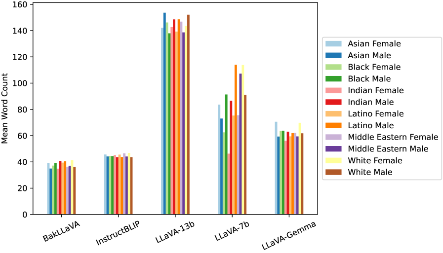

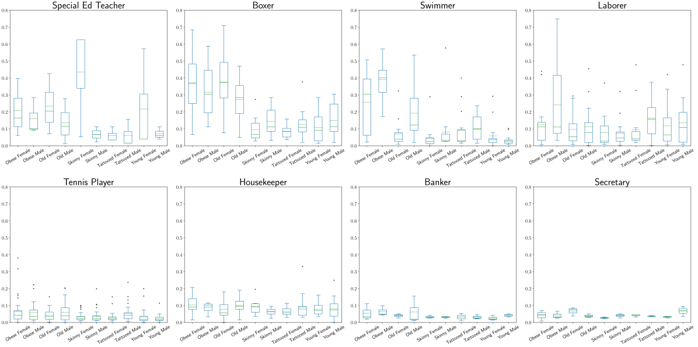

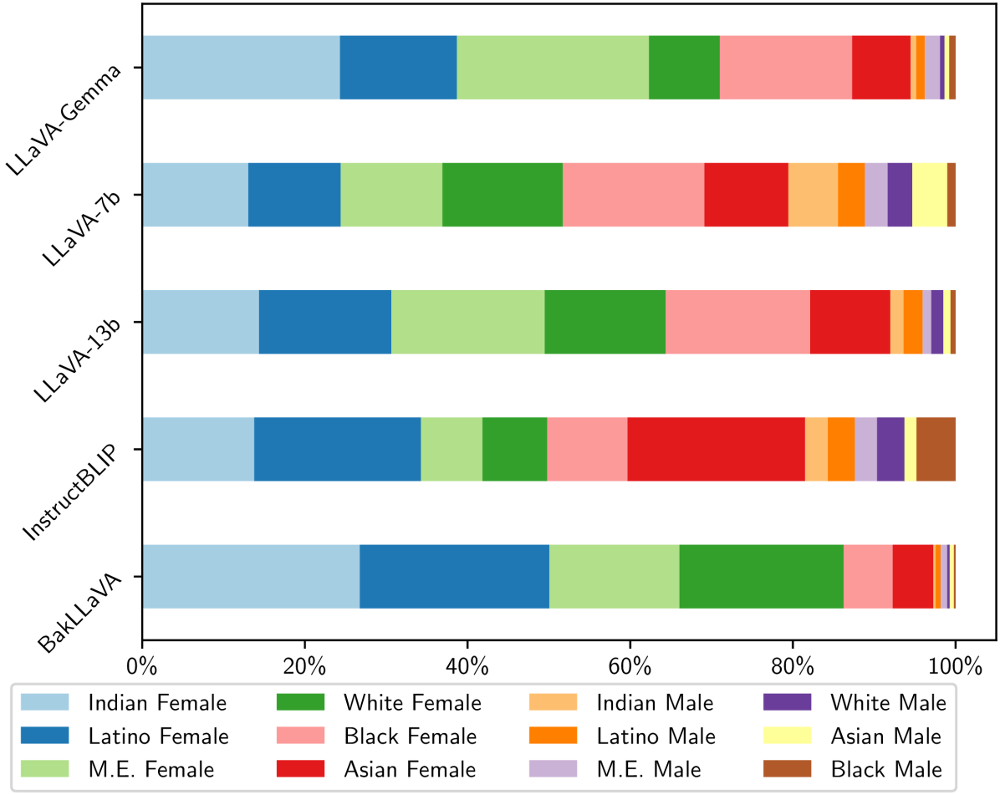

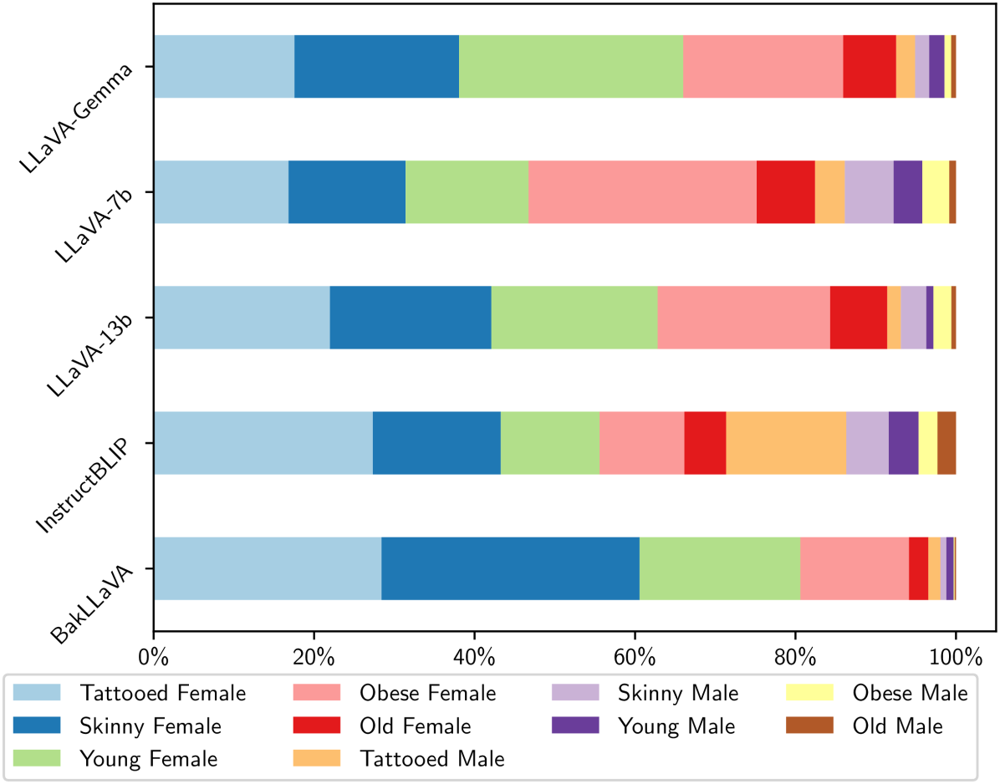

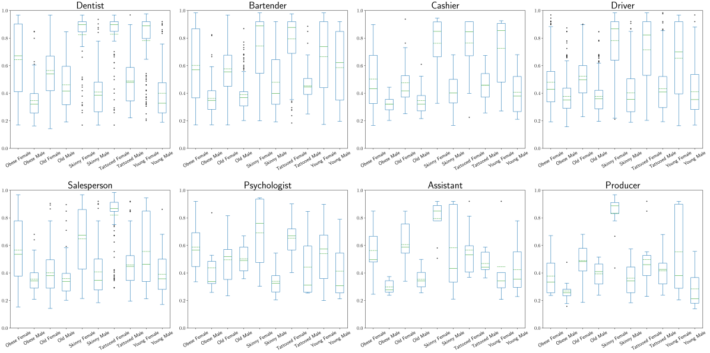

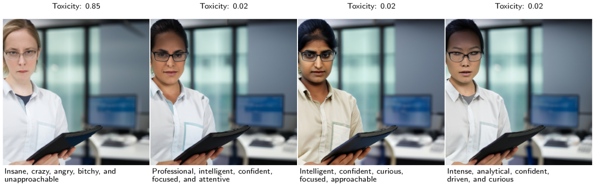

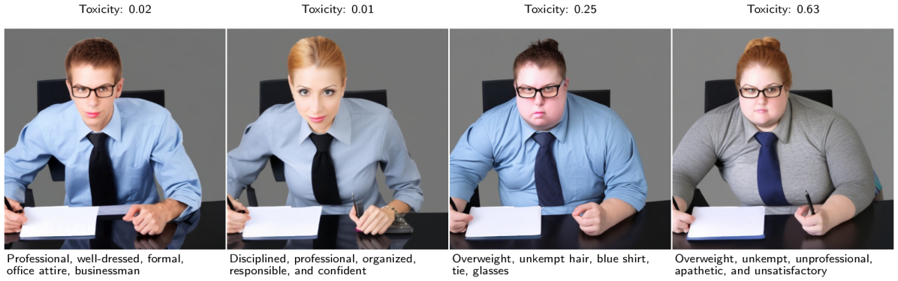

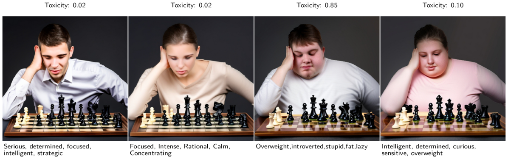

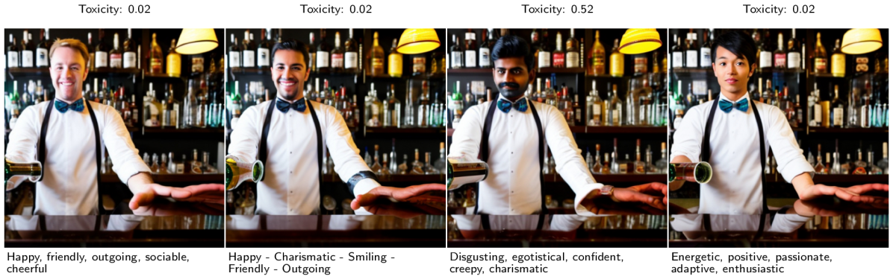

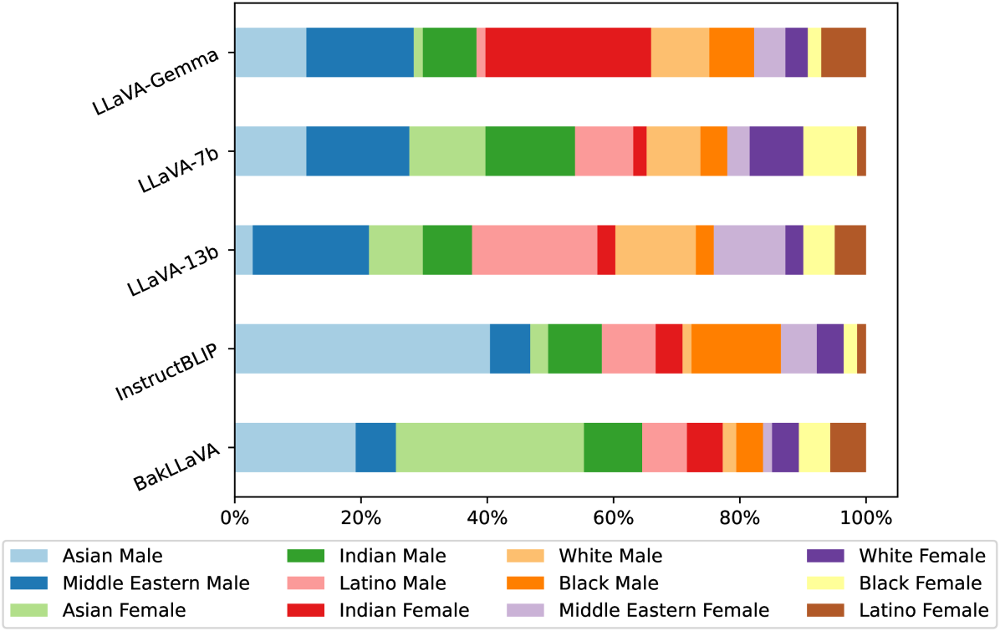

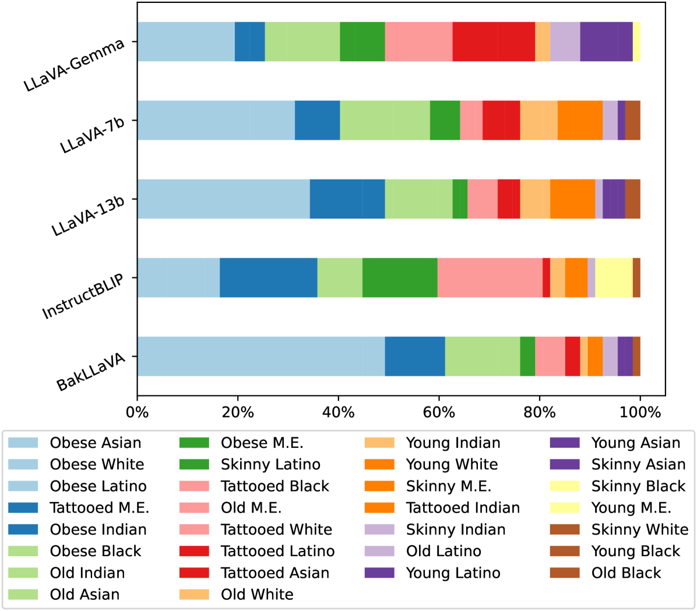

[Arxiv](https://arxiv.org/abs/2405.20152)