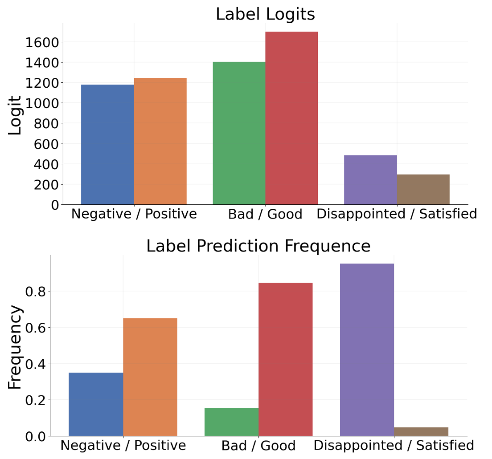

# UniBias：揭示与缓解大型语言模型偏差的新途径——内部注意力与FFN操控

发布时间：2024年05月30日

`LLM理论

这篇论文主要探讨了大型语言模型（LLMs）在情境学习（ICL）范式下的偏差问题，并深入分析了导致这些偏差的内在机制，特别是前馈神经网络（FFNs）和注意力头的作用。研究通过识别和消除这些偏差组件，提出了一种名为UniBias的方法，该方法在推理阶段使用，旨在提升模型的性能并减少提示的脆弱性。这一研究属于对LLMs理论层面的深入分析和改进，因此归类为LLM理论。` `机器学习`

> UniBias: Unveiling and Mitigating LLM Bias through Internal Attention and FFN Manipulation

# 摘要

> 大型语言模型（LLMs）在情境学习（ICL）范式下，于多任务中展现了卓越能力，但常因固有偏差而影响效能，表现为对示例选择、顺序及提示格式等设计细节的高度敏感。尽管以往研究尝试通过外部调整模型输出来纠正LLM偏差，但导致偏差的内在机制仍未明朗。本研究深入探讨了这些机制，特别关注前馈神经网络（FFNs）与注意力头如何引发LLMs的偏差。通过分析单个FFN向量及注意力头的贡献，我们揭示了导致LLMs预测偏向特定标签的偏差组件。为此，我们提出了UniBias，一种仅在推理阶段使用的方法，能有效识别并消除这些偏差组件。在12个NLP数据集上的广泛测试显示，UniBias不仅显著提升了ICL性能，还有效缓解了LLMs的提示脆弱性。

> Large language models (LLMs) have demonstrated impressive capabilities in various tasks using the in-context learning (ICL) paradigm. However, their effectiveness is often compromised by inherent bias, leading to prompt brittleness, i.e., sensitivity to design settings such as example selection, order, and prompt formatting. Previous studies have addressed LLM bias through external adjustment of model outputs, but the internal mechanisms that lead to such bias remain unexplored. Our work delves into these mechanisms, particularly investigating how feedforward neural networks (FFNs) and attention heads result in the bias of LLMs. By Interpreting the contribution of individual FFN vectors and attention heads, we identify the biased LLM components that skew LLMs' prediction toward specific labels. To mitigate these biases, we introduce UniBias, an inference-only method that effectively identifies and eliminates biased FFN vectors and attention heads. Extensive experiments across 12 NLP datasets demonstrate that UniBias significantly enhances ICL performance and alleviates prompt brittleness of LLMs.

[Arxiv](https://arxiv.org/abs/2405.20612)