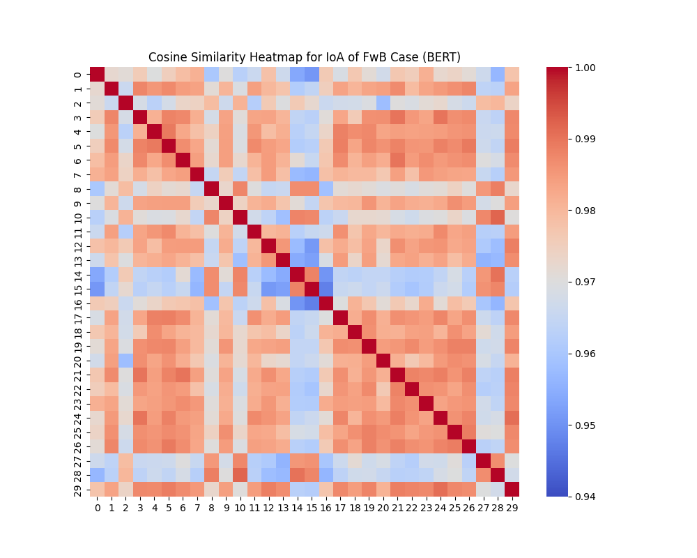

# 大型语言模型在人道前线谈判中的应用：机遇与审慎考量

发布时间：2024年05月30日

`Agent

理由：这篇论文探讨了大型语言模型（LLMs）在人道主义谈判中的应用，特别是在冲突地区的前线谈判中。它涉及了AI辅助决策、案例分析和创意支持，这些都是Agent（代理）在特定任务中执行的功能。虽然论文中提到了LLMs的应用，但其核心关注点是AI在特定环境（前线谈判）中的实际应用和效果，而不是LLMs的理论研究或RAG（检索增强生成）的机制。因此，将其归类为Agent更为合适。` `人道主义` `冲突解决`

> Using Large Language Models for Humanitarian Frontline Negotiation: Opportunities and Considerations

# 摘要

> 在冲突地区进行的人道主义谈判，即“前线谈判”，往往充满对抗、复杂且风险高。多年来，一些最佳实践帮助谈判者从大数据中汲取智慧，应对瞬息万变的复杂局面。大型语言模型（LLMs）的最新进展激发了人们对AI辅助前线谈判决策的兴趣。通过与13位资深前线谈判者的深入交流，我们了解到他们对AI辅助案例分析和创意支持的需求，以及对保密性和模型偏差的顾虑。我们还探讨了AI如何增强前线谈判规划中的三种常用工具。在两个真实案例中，我们评估了基于ChatGPT的谈判工具的质量和稳定性。研究结果表明，LLMs有潜力提升人道主义谈判的效果，并强调了在伦理和实践层面需谨慎考量的必要性。

> Humanitarian negotiations in conflict zones, called \emph{frontline negotiation}, are often highly adversarial, complex, and high-risk. Several best-practices have emerged over the years that help negotiators extract insights from large datasets to navigate nuanced and rapidly evolving scenarios. Recent advances in large language models (LLMs) have sparked interest in the potential for AI to aid decision making in frontline negotiation. Through in-depth interviews with 13 experienced frontline negotiators, we identified their needs for AI-assisted case analysis and creativity support, as well as concerns surrounding confidentiality and model bias. We further explored the potential for AI augmentation of three standard tools used in frontline negotiation planning. We evaluated the quality and stability of our ChatGPT-based negotiation tools in the context of two real cases. Our findings highlight the potential for LLMs to enhance humanitarian negotiations and underscore the need for careful ethical and practical considerations.

[Arxiv](https://arxiv.org/abs/2405.20195)