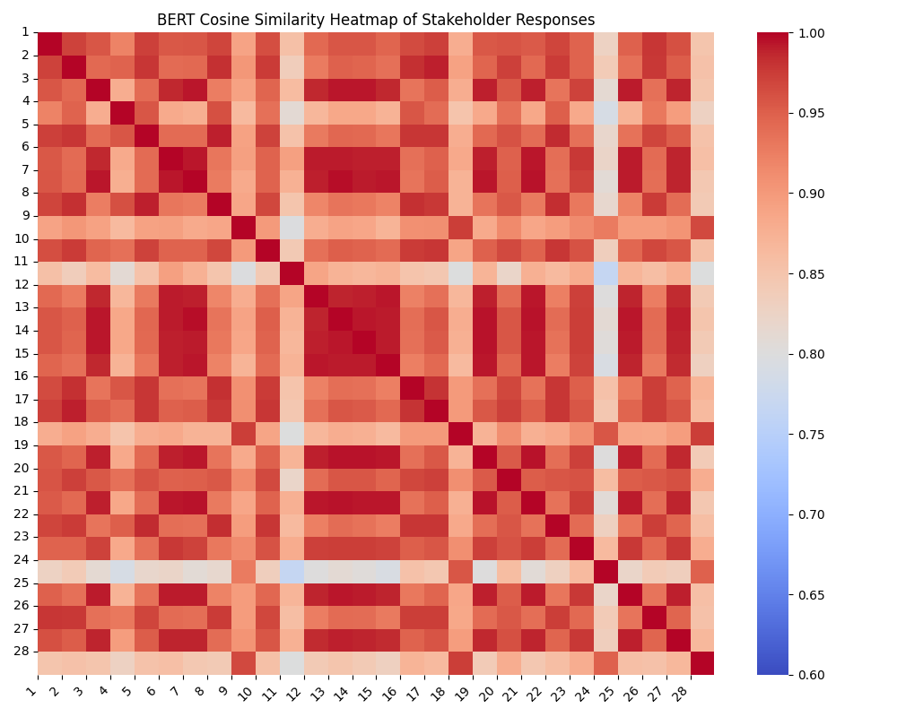

# 大型语言模型在人道主义前线谈判中的应用：机遇与深思

发布时间：2024年05月30日

`Agent

这篇论文主要探讨了大型语言模型（LLMs）在人道主义谈判中的应用，特别是在冲突地区的前线谈判中。论文通过与资深谈判者的交流，明确了AI辅助的需求，并评估了基于ChatGPT的谈判工具在实际案例中的表现。这表明论文关注的是如何利用AI（特别是LLMs）作为辅助决策的Agent，在特定情境下提升谈判效果。因此，将其归类为Agent是合适的。` `人道主义` `冲突解决`

> Using Large Language Models for Humanitarian Frontline Negotiation: Opportunities and Considerations

# 摘要

> 在冲突地区进行的人道主义谈判，即“前线谈判”，往往充满对抗、复杂且风险高。随着时间的推移，一些最佳实践应运而生，帮助谈判者从海量数据中洞察秋毫，应对瞬息万变的局势。大型语言模型（LLMs）的最新进展，引发了人们对AI辅助前线谈判决策潜力的关注。通过与13位资深前线谈判者的深入交流，我们明确了他们对AI辅助案例分析和创意支持的需求，同时也关注到了保密性和模型偏差的问题。我们还探讨了AI如何增强前线谈判规划中的三种常用工具。我们评估了基于ChatGPT的谈判工具在两个实际案例中的表现，发现LLMs在提升人道主义谈判方面潜力巨大，同时也提醒我们必须审慎考虑伦理和实际操作问题。

> Humanitarian negotiations in conflict zones, called \emph{frontline negotiation}, are often highly adversarial, complex, and high-risk. Several best-practices have emerged over the years that help negotiators extract insights from large datasets to navigate nuanced and rapidly evolving scenarios. Recent advances in large language models (LLMs) have sparked interest in the potential for AI to aid decision making in frontline negotiation. Through in-depth interviews with 13 experienced frontline negotiators, we identified their needs for AI-assisted case analysis and creativity support, as well as concerns surrounding confidentiality and model bias. We further explored the potential for AI augmentation of three standard tools used in frontline negotiation planning. We evaluated the quality and stability of our ChatGPT-based negotiation tools in the context of two real cases. Our findings highlight the potential for LLMs to enhance humanitarian negotiations and underscore the need for careful ethical and practical considerations.

[Arxiv](https://arxiv.org/abs/2405.20195)