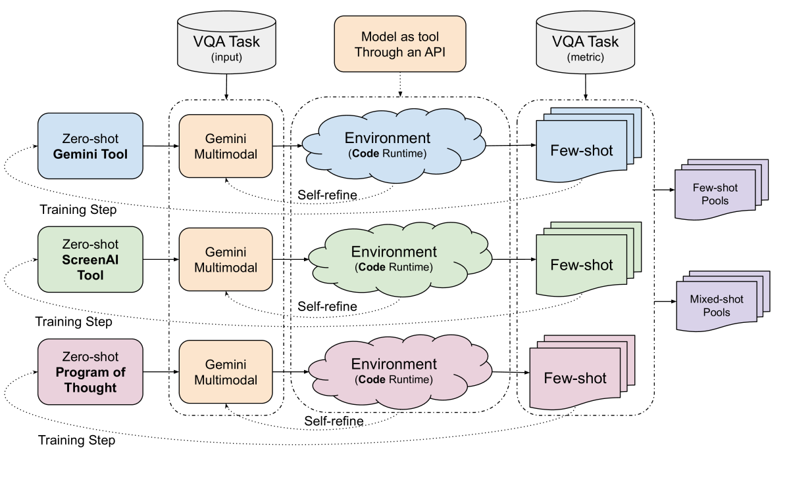
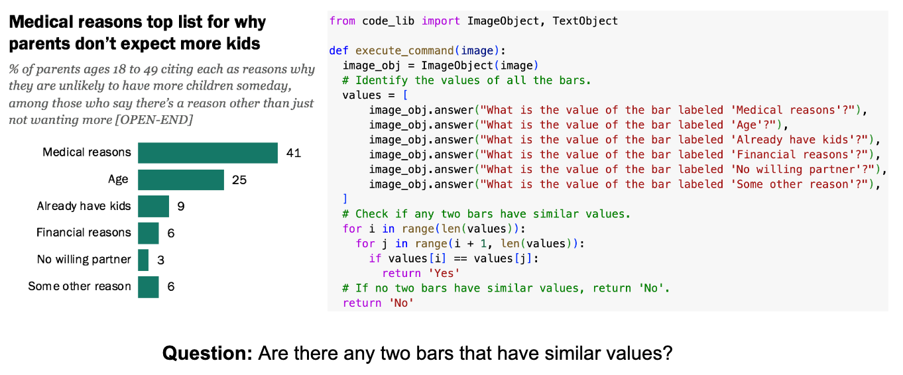
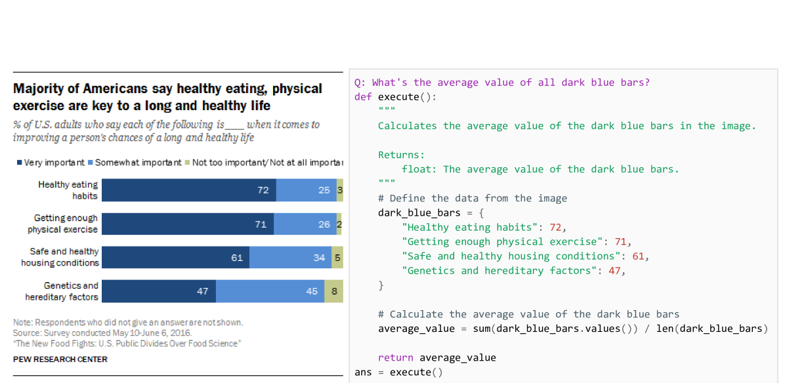

# VQA训练集如同自对弈的舞台，孕育着少量样本池的生成。

发布时间：2024年05月30日

`Agent

这篇论文介绍了一种新方法，该方法允许大型语言模型在计算环境中自我学习如何利用自身或其他模型作为工具，以提高在视觉问答等组合推理任务上的性能。这种方法通过整合外部信号，增强了训练集的有效性，并通过迭代选择样本示例来优化模型。这种方法的核心在于模型能够自主地选择和使用工具来解决问题，这符合Agent的定义，即一个能够感知环境并采取行动以达到目标的系统。因此，这篇论文应归类于Agent。` `视觉问答` `机器学习`

> VQA Training Sets are Self-play Environments for Generating Few-shot Pools

# 摘要

> 大型语言模型与视觉模型在组合推理任务上的表现日益卓越，尤其在视觉问答基准测试中屡创佳绩。然而，这些顶尖解决方案往往依赖于精心设计的大规模预训练与微调数据集，成本不菲。借助外部工具，如其他机器学习模型、搜索引擎或API，能有效将复杂推理问题拆解为易于解答的子问题，从而大幅提升性能，但这也意味着需要额外的数据集构建成本来训练模型如何利用这些工具。我们提出了一种新方法，允许直接利用现有训练集构建计算环境，以任务指标作为激励，使模型能够自我学习如何将自身或其他模型作为工具使用。这一方法通过整合外部信号，增强了训练集的有效性。我们从零样本提示出发，通过迭代选择能够最大化训练集上任务指标的少量样本示例，不断优化模型。实验证明，Gemini能够学会利用自身或如ScreenAI这类小型专业模型，在训练集上持续提升性能，我们的方法在图表、信息图及文档视觉问答数据集上显著超越了零样本性能。

> Large-language models and large-vision models are increasingly capable of solving compositional reasoning tasks, as measured by breakthroughs in visual-question answering benchmarks. However, state-of-the-art solutions often involve careful construction of large pre-training and fine-tuning datasets, which can be expensive. The use of external tools, whether other ML models, search engines, or APIs, can significantly improve performance by breaking down high-level reasoning questions into sub-questions that are answerable by individual tools, but this approach has similar dataset construction costs to teach fine-tuned models how to use the available tools. We propose a technique in which existing training sets can be directly used for constructing computational environments with task metrics as rewards. This enables a model to autonomously teach itself to use itself or another model as a tool. By doing so, we augment training sets by integrating external signals. The proposed method starts with zero-shot prompts and iteratively refines them by selecting few-shot examples that maximize the task metric on the training set. Our experiments showcase how Gemini learns how to use itself, or another smaller and specialized model such as ScreenAI, to iteratively improve performance on training sets. Our approach successfully generalizes and improves upon zeroshot performance on charts, infographics, and document visual question-answering datasets

[Arxiv](https://arxiv.org/abs/2405.19773)