# 视觉与语言融合骨架：借助跨模态知识的渐进蒸馏，深化三维动作表示学习之旅

发布时间：2024年05月30日

`RAG

理由：这篇论文介绍了一种新的框架C$^2$VL，它通过跨模态对比学习和渐进式蒸馏从视觉-语言知识提示中提取骨骼动作表示。这种方法涉及多模态数据的处理和融合，特别是视觉和语言模态的结合，这与RAG（Retrieval-Augmented Generation）模型的概念相似，后者也是通过结合检索（retrieval）和生成（generation）来增强模型的性能。因此，这篇论文更符合RAG的分类，因为它处理的是多模态数据融合和应用的问题，而不是Agent的行为或LLM的理论研究。` `动作识别` `多模态学习`

> Vision-Language Meets the Skeleton: Progressively Distillation with Cross-Modal Knowledge for 3D Action Representation Learning

# 摘要

> 监督学习与自监督学习是骨骼动作识别的两大支柱，但前者依赖于繁琐的类别标注，后者则可能在预设任务中破坏骨骼结构。为此，我们创新性地提出了C$^2$VL框架，它利用跨模态对比学习和渐进式蒸馏，从视觉-语言知识提示中提炼出不受任务限制的骨骼动作表示。我们通过大型多模态模型生成的视觉-语言提示，构建了一个精细的动作概念空间，弥补了骨骼动作空间的不足。在跨模态对比学习中，我们引入了模内自相似性和模间交叉一致性，以温和的方式引导视觉-语言提示与骨骼数据的融合。这些策略有助于从杂乱的骨骼-视觉-语言数据中提炼出更优质的动作表示。在推理时，我们的方法仅需骨骼数据即可进行动作识别，无需额外的视觉-语言提示。实验结果显示，我们的方法在多个数据集上均取得了领先的成绩，相关代码将在未来公开。

> Supervised and self-supervised learning are two main training paradigms for skeleton-based human action recognition. However, the former one-hot classification requires labor-intensive predefined action categories annotations, while the latter involves skeleton transformations (e.g., cropping) in the pretext tasks that may impair the skeleton structure. To address these challenges, we introduce a novel skeleton-based training framework (C$^2$VL) based on Cross-modal Contrastive learning that uses the progressive distillation to learn task-agnostic human skeleton action representation from the Vision-Language knowledge prompts. Specifically, we establish the vision-language action concept space through vision-language knowledge prompts generated by pre-trained large multimodal models (LMMs), which enrich the fine-grained details that the skeleton action space lacks. Moreover, we propose the intra-modal self-similarity and inter-modal cross-consistency softened targets in the cross-modal contrastive process to progressively control and guide the degree of pulling vision-language knowledge prompts and corresponding skeletons closer. These soft instance discrimination and self-knowledge distillation strategies contribute to the learning of better skeleton-based action representations from the noisy skeleton-vision-language pairs. During the inference phase, our method requires only the skeleton data as the input for action recognition and no longer for vision-language prompts. Extensive experiments show that our method achieves state-of-the-art results on NTU RGB+D 60, NTU RGB+D 120, and PKU-MMD datasets. The code will be available in the future.

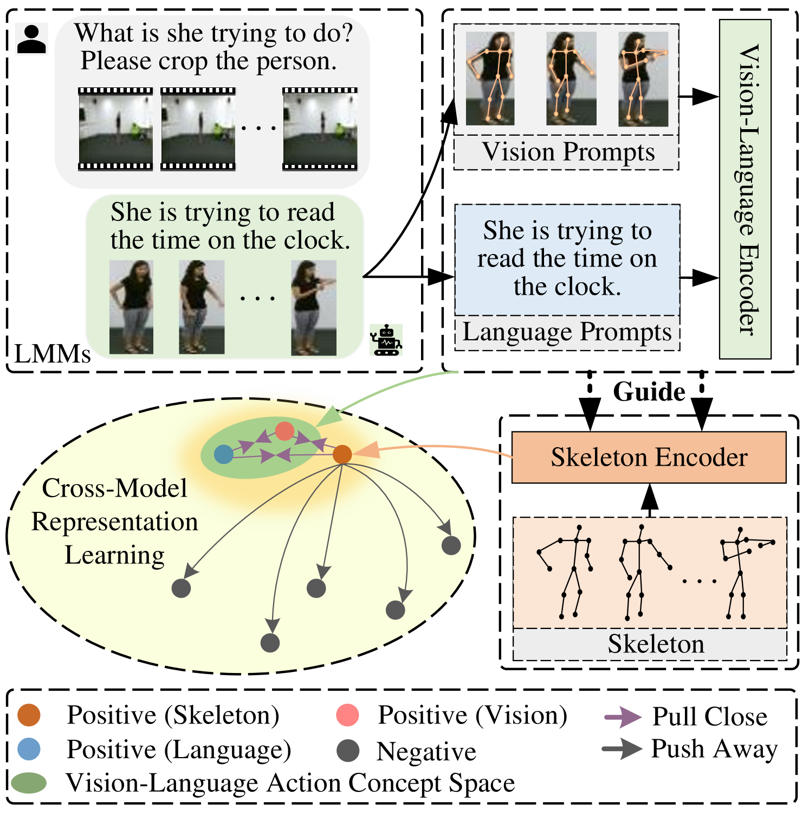

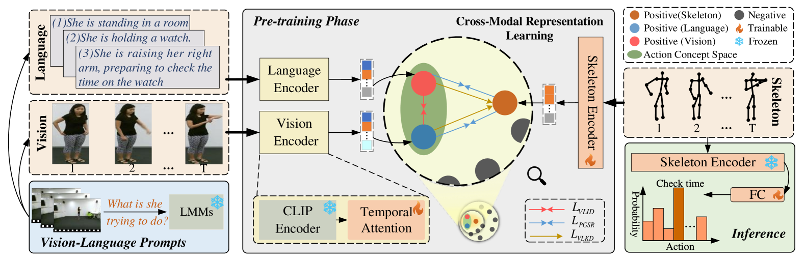

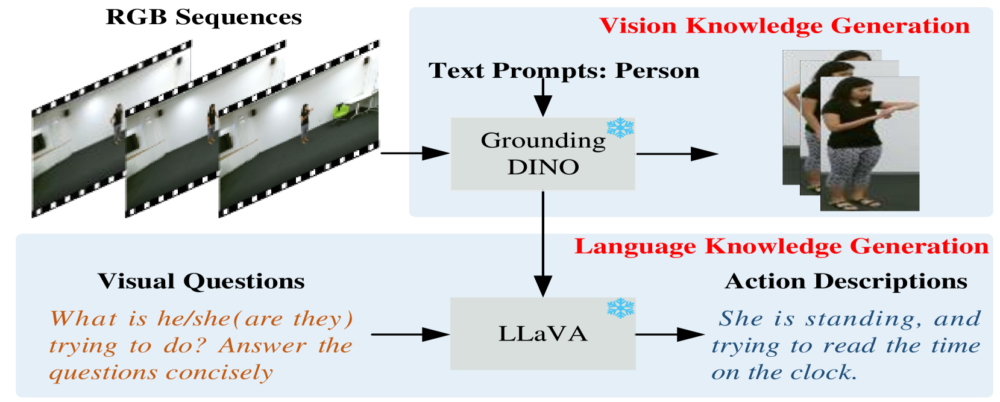

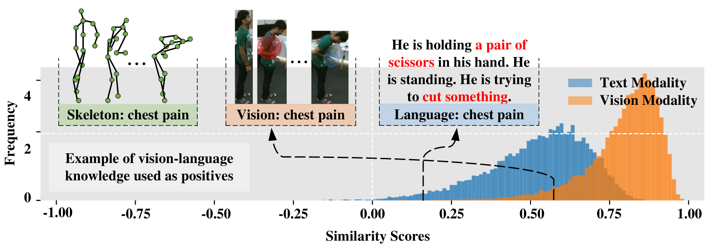

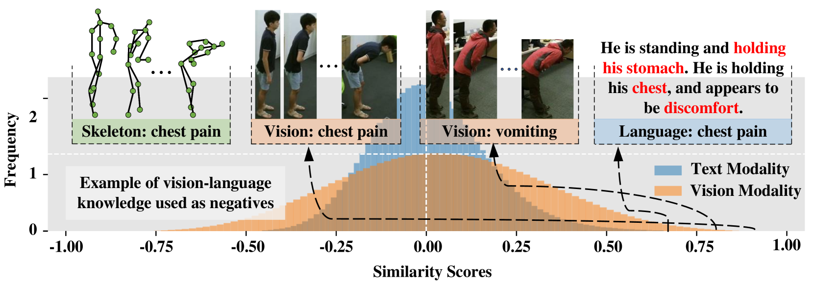

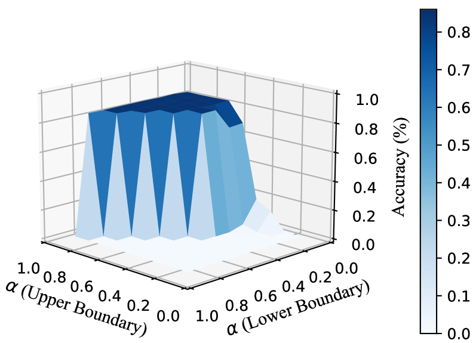

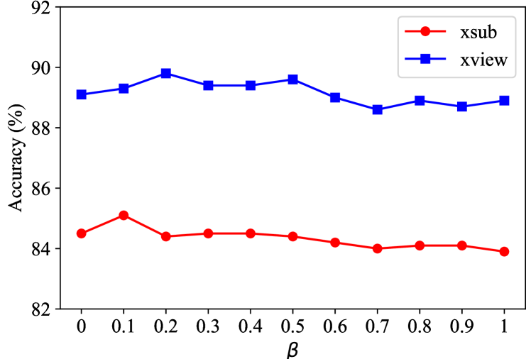

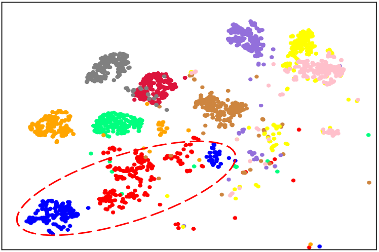

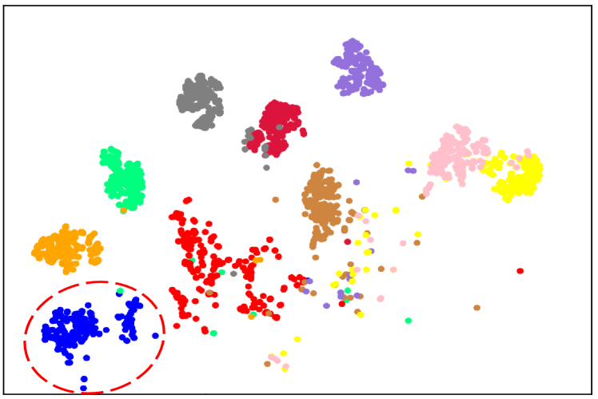

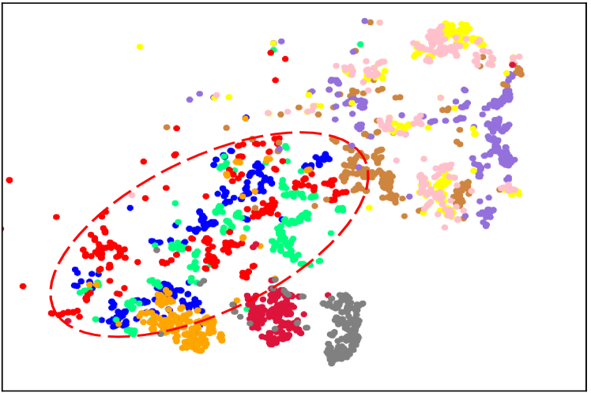

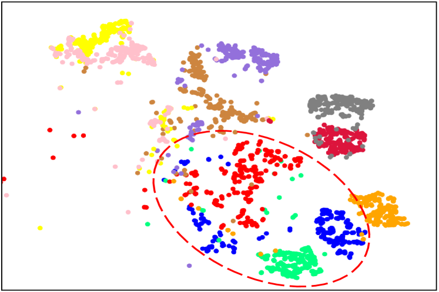

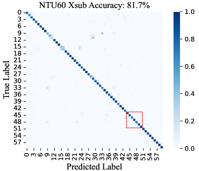

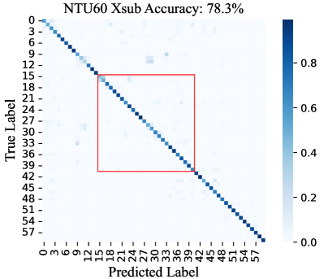

[Arxiv](https://arxiv.org/abs/2405.20606)