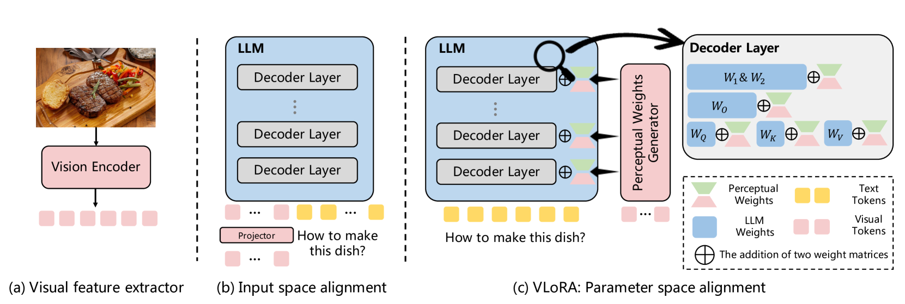
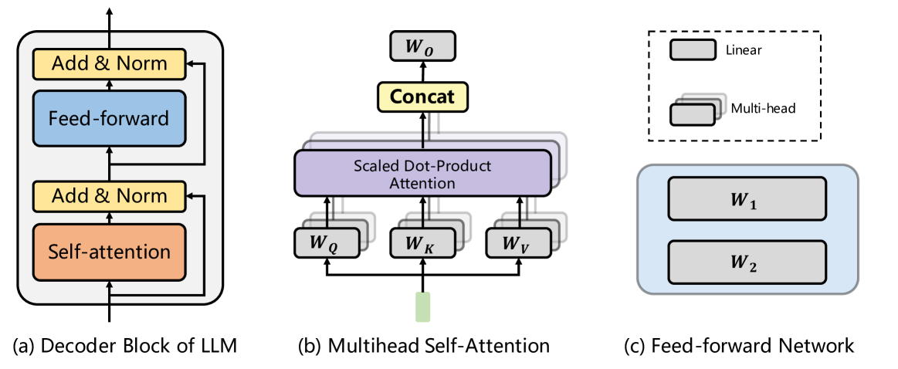
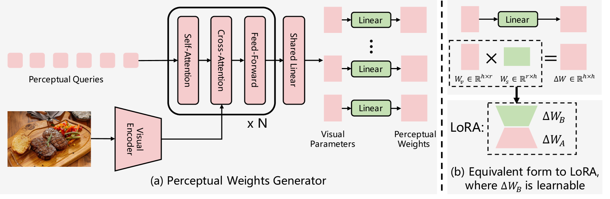
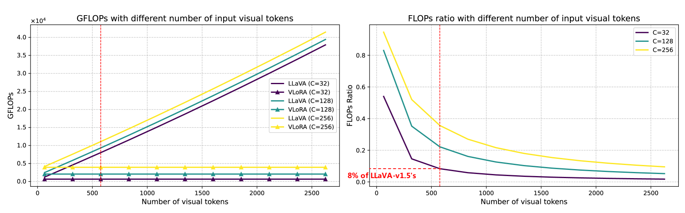
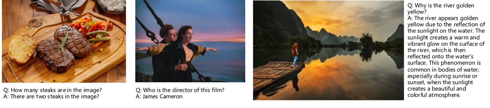

# 大型语言模型权重下的视觉感知探索

发布时间：2024年05月30日

`LLM应用

这篇论文探讨了多模态大型语言模型（MLLMs）的效率问题，并提出了一种新的方法来整合视觉信息到模型权重中，从而减少计算成本并提高效率。这种方法涉及到将视觉特征转化为模型权重，而不是通过延长输入序列来整合视觉信息。因此，这项工作属于LLM应用类别，因为它关注的是如何改进现有的LLM技术以更好地处理多模态数据，并提高其效率和性能。` `计算机视觉`

> Visual Perception by Large Language Model's Weights

# 摘要

> 现有的多模态大型语言模型（MLLMs）通过将视觉特征与大型语言模型（LLMs）的输入空间对齐，并将视觉令牌与文本令牌结合，形成统一输入序列，已在多种视觉-语言任务上取得显著成果。然而，这种方法因视觉令牌导致的输入序列延长而面临高计算成本的挑战。本文提出了一种创新的参数空间对齐方法，将视觉信息转化为模型权重，而非传统的输入空间对齐。我们使用视觉编码器提取图像特征，将其转换为感知权重，并融入LLM的权重中，从而使LLM无需视觉令牌，大幅提升了效率。基于此，我们开发了VLoRA，并配备了能够生成低秩感知权重的生成器，其结构类似LoRA。实验证明，VLoRA在多个MLLMs基准上表现出色，同时大幅降低了计算成本。相关代码和模型将公开共享。

> Existing Multimodal Large Language Models (MLLMs) follow the paradigm that perceives visual information by aligning visual features with the input space of Large Language Models (LLMs), and concatenating visual tokens with text tokens to form a unified sequence input for LLMs. These methods demonstrate promising results on various vision-language tasks but are limited by the high computational effort due to the extended input sequence resulting from the involvement of visual tokens. In this paper, instead of input space alignment, we propose a novel parameter space alignment paradigm that represents visual information as model weights. For each input image, we use a vision encoder to extract visual features, convert features into perceptual weights, and merge the perceptual weights with LLM's weights. In this way, the input of LLM does not require visual tokens, which reduces the length of the input sequence and greatly improves efficiency. Following this paradigm, we propose VLoRA with the perceptual weights generator. The perceptual weights generator is designed to convert visual features to perceptual weights with low-rank property, exhibiting a form similar to LoRA. The experimental results show that our VLoRA achieves comparable performance on various benchmarks for MLLMs, while significantly reducing the computational costs for both training and inference. The code and models will be made open-source.

[Arxiv](https://arxiv.org/abs/2405.20339)