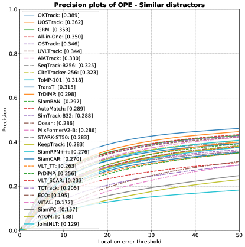
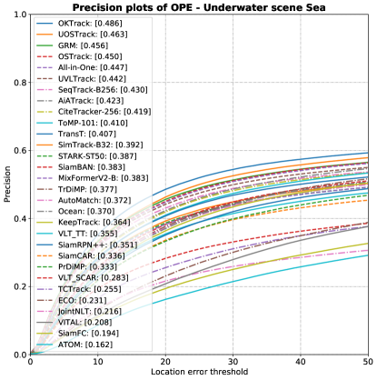
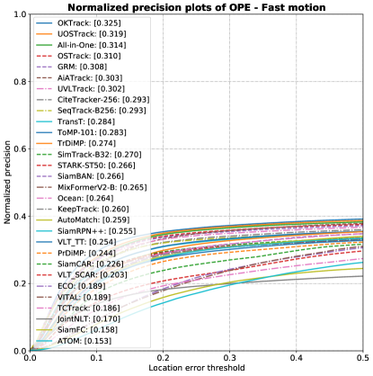
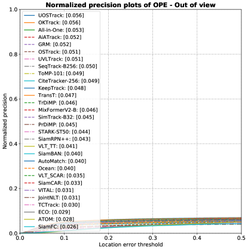
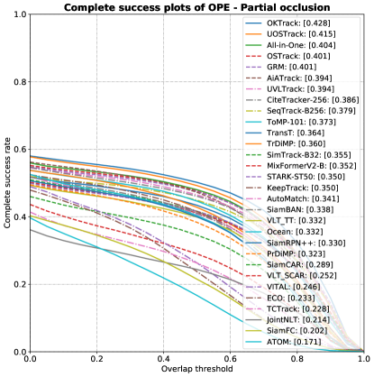

# WebUOT-1M：借助百万级基准，深度推进深海物体跟踪技术

发布时间：2024年05月30日

`Agent

理由：这篇论文主要关注的是水下目标跟踪（UOT）任务，并提出了一个新的数据集WebUOT-1M以及一个全知识蒸馏框架来提升跟踪器的性能。这个工作更侧重于开发和优化特定环境下的跟踪算法，即水下环境，这通常是Agent领域的工作，因为Agent系统需要在这样的环境中进行自主决策和行动。虽然论文中提到了语言提示和视觉-语言跟踪，但这并不是论文的核心内容，而是作为提升跟踪器性能的一个方面。因此，这篇论文更适合归类为Agent。` `水下目标跟踪` `计算机视觉`

> WebUOT-1M: Advancing Deep Underwater Object Tracking with A Million-Scale Benchmark

# 摘要

> 水下目标跟踪（UOT）是识别水下视频中潜藏实体的关键任务，但现有数据集因规模和多样性不足而限制了算法的发展。为此，我们推出了WebUOT-1M，一个包含110万帧、覆盖408个目标类别的庞大基准，远超以往。通过精细的手动标注，我们确保了数据的高质量，并引入了语言提示，拓宽了应用如水下视觉-语言跟踪。然而，大多数跟踪器因露天环境设计而在水下表现不佳，且因数据限制难以优化。为此，我们创新性地提出了全知识蒸馏框架，有效转移露天知识至UOT，显著提升了性能。通过30个深度跟踪器的全面测试，WebUOT-1M不仅验证了其作为研究基准的价值，也为未来研究开辟了新天地。所有资源将公开，以促进UOT领域的进一步发展。

> Underwater object tracking (UOT) is a foundational task for identifying and tracing submerged entities in underwater video sequences. However, current UOT datasets suffer from limitations in scale, diversity of target categories and scenarios covered, hindering the training and evaluation of modern tracking algorithms. To bridge this gap, we take the first step and introduce WebUOT-1M, \ie, the largest public UOT benchmark to date, sourced from complex and realistic underwater environments. It comprises 1.1 million frames across 1,500 video clips filtered from 408 target categories, largely surpassing previous UOT datasets, \eg, UVOT400. Through meticulous manual annotation and verification, we provide high-quality bounding boxes for underwater targets. Additionally, WebUOT-1M includes language prompts for video sequences, expanding its application areas, \eg, underwater vision-language tracking. Most existing trackers are tailored for open-air environments, leading to performance degradation when applied to UOT due to domain gaps. Retraining and fine-tuning these trackers are challenging due to sample imbalances and limited real-world underwater datasets. To tackle these challenges, we propose a novel omni-knowledge distillation framework based on WebUOT-1M, incorporating various strategies to guide the learning of the student Transformer. To the best of our knowledge, this framework is the first to effectively transfer open-air domain knowledge to the UOT model through knowledge distillation, as demonstrated by results on both existing UOT datasets and the newly proposed WebUOT-1M. Furthermore, we comprehensively evaluate WebUOT-1M using 30 deep trackers, showcasing its value as a benchmark for UOT research by presenting new challenges and opportunities for future studies. The complete dataset, codes and tracking results, will be made publicly available.

[Arxiv](https://arxiv.org/abs/2405.19818)