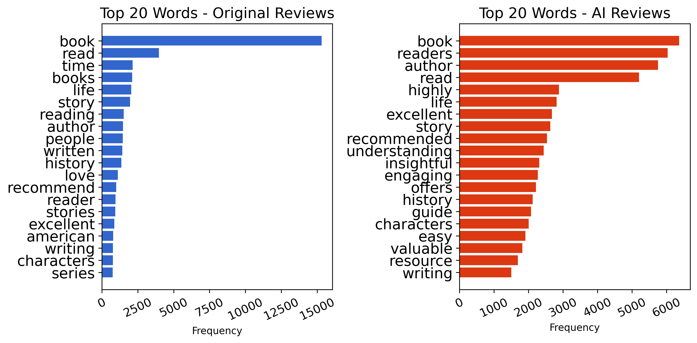
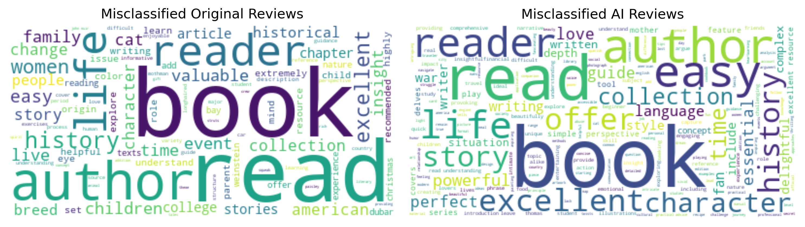

# 评论出自谁手，人类还是AI？

发布时间：2024年05月30日

`LLM应用

这篇论文主要探讨了如何使用大型语言模型（LLM）来区分AI生成的文本和人类撰写的文本，特别是在书评领域。研究中采用了迁移学习技术，并构建了一个包含真实与AI生成书评的数据集，利用Vicuna语言模型进行验证。这种方法的目的是提高识别AI生成文本的准确率，并探讨LLM在文本识别上的潜力和局限。因此，这篇论文属于LLM应用类别，因为它关注的是LLM在实际应用中的使用，即检测和区分AI生成的文本。` `文本识别`

> Who Writes the Review, Human or AI?

# 摘要

> 随着AI在自然语言处理领域的广泛应用，如何检测AI生成的文本成为了一个备受关注的问题。本研究提出了一种新方法，旨在精准区分AI与人类撰写的书评。我们采用迁移学习技术，不仅使模型能够跨主题识别AI文本，还增强了其捕捉写作风格和词汇差异的能力。通过构建包含真实与AI生成书评的数据集，并利用Vicuna语言模型，我们验证了该方法的有效性，实现了高达96.86%的准确率。本研究致力于揭示大型语言模型在文本识别上的潜力与局限，以期为未来类似模型的应用和维护人类内容的真实性提供指导。

> With the increasing use of Artificial Intelligence in Natural Language Processing, concerns have been raised regarding the detection of AI-generated text in various domains. This study aims to investigate this issue by proposing a methodology to accurately distinguish AI-generated and human-written book reviews. Our approach utilizes transfer learning, enabling the model to identify generated text across different topics while improving its ability to detect variations in writing style and vocabulary. To evaluate the effectiveness of the proposed methodology, we developed a dataset consisting of real book reviews and AI-generated reviews using the recently proposed Vicuna open-source language model. The experimental results demonstrate that it is feasible to detect the original source of text, achieving an accuracy rate of 96.86%. Our efforts are oriented toward the exploration of the capabilities and limitations of Large Language Models in the context of text identification. Expanding our knowledge in these aspects will be valuable for effectively navigating similar models in the future and ensuring the integrity and authenticity of human-generated content.

[Arxiv](https://arxiv.org/abs/2405.20285)