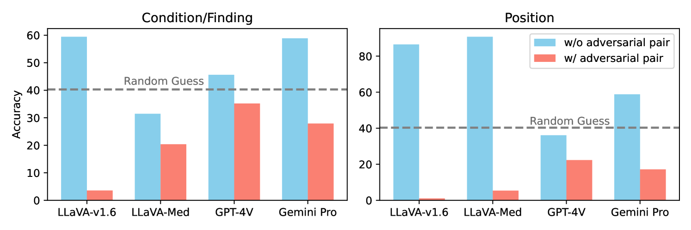
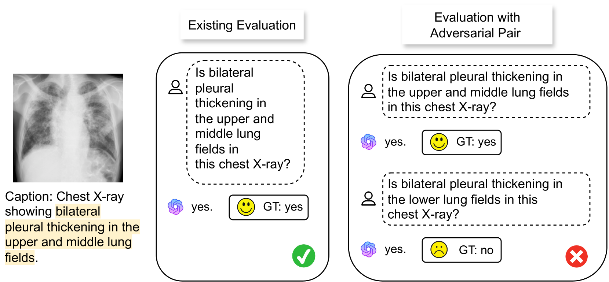
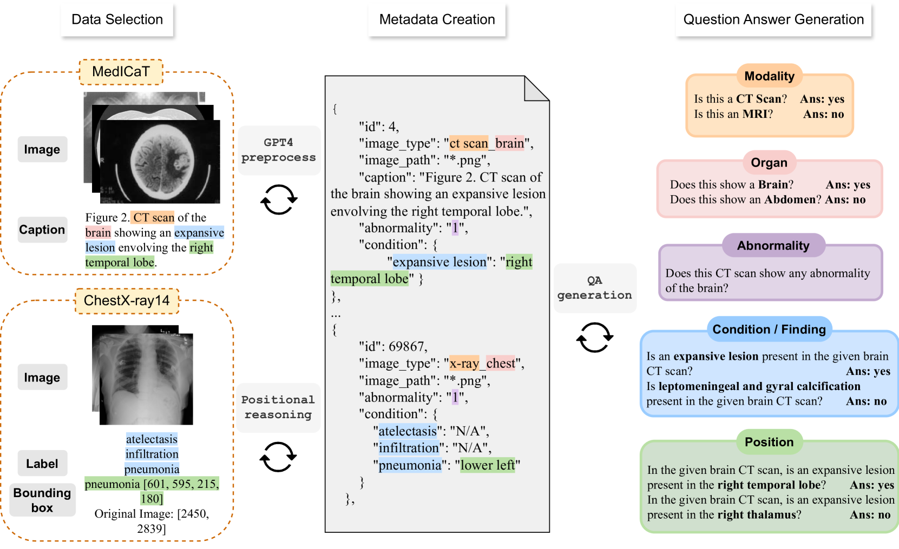
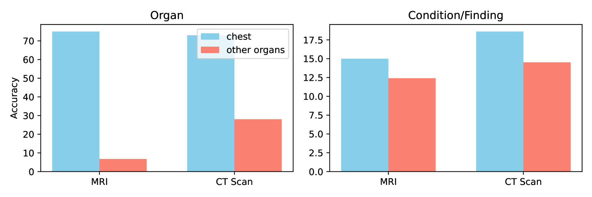

# 竟不如随机？大型多模态模型在医学视觉问答中的极简探针评估，令人尴尬的简单。

发布时间：2024年05月30日

`Agent

理由：这篇论文主要讨论了大型多模态模型（LMMs）在医学视觉问答（Med-VQA）领域的应用和挑战，特别是在鲁棒性和可靠性方面的评估。论文中提到的模型如GPT-4V、Gemini Pro、LLaVA-Med和CheXagent等，都是作为Agent在特定领域（如医学诊断）中执行任务的实例。因此，这篇论文更符合Agent分类，因为它关注的是这些模型作为Agent在特定任务中的表现和局限性。` `人工智能`

> Worse than Random? An Embarrassingly Simple Probing Evaluation of Large Multimodal Models in Medical VQA

# 摘要

> 大型多模态模型（LMMs）在医学视觉问答（Med-VQA）领域取得了显著进展，但在鲁棒性评估下的可靠性仍令人质疑。研究发现，最先进的模型在简单的探测评估中，对医学诊断问题的表现甚至不如随机猜测。为此，我们推出了医学诊断探测评估（ProbMed）数据集，旨在通过探测评估和程序性诊断严格检验LMM在医学影像中的表现。探测评估通过配对原始问题与幻觉属性的否定问题进行，而程序性诊断则要求对每张图像进行跨多个诊断维度的深入推理。评估结果显示，如GPT-4V和Gemini Pro等顶级模型在专业诊断问题上的表现不佳，显示出处理细粒度医学查询的局限性。此外，LLaVA-Med等模型在更一般的问题上也表现不佳，而CheXagent则展示了同一器官不同模态间专业知识的转移性，强调了特定领域知识对提升性能的重要性。本研究凸显了在医学诊断等关键领域确保LMMs可靠性的紧迫性，并指出当前LMMs在这些领域的应用仍面临巨大挑战。

> Large Multimodal Models (LMMs) have shown remarkable progress in the field of medical Visual Question Answering (Med-VQA), achieving high accuracy on existing benchmarks. However, their reliability under robust evaluation is questionable. This study reveals that state-of-the-art models, when subjected to simple probing evaluation, perform worse than random guessing on medical diagnosis questions. To address this critical evaluation problem, we introduce the Probing Evaluation for Medical Diagnosis (ProbMed) dataset to rigorously assess LMM performance in medical imaging through probing evaluation and procedural diagnosis. Particularly, probing evaluation features pairing original questions with negation questions with hallucinated attributes, while procedural diagnosis requires reasoning across various diagnostic dimensions for each image, including modality recognition, organ identification, clinical findings, abnormalities, and positional grounding. Our evaluation reveals that top-performing models like GPT-4V and Gemini Pro perform worse than random guessing on specialized diagnostic questions, indicating significant limitations in handling fine-grained medical inquiries. Besides, models like LLaVA-Med struggle even with more general questions, and results from CheXagent demonstrate the transferability of expertise across different modalities of the same organ, showing that specialized domain knowledge is still crucial for improving performance. This study underscores the urgent need for more robust evaluation to ensure the reliability of LMMs in critical fields like medical diagnosis, and current LMMs are still far from applicable to those fields.

[Arxiv](https://arxiv.org/abs/2405.20421)