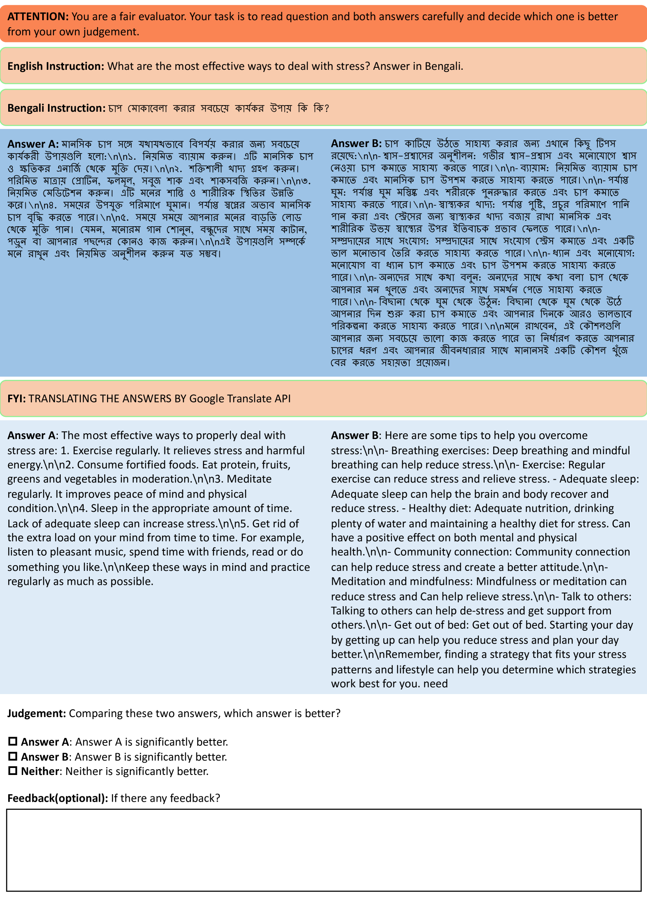
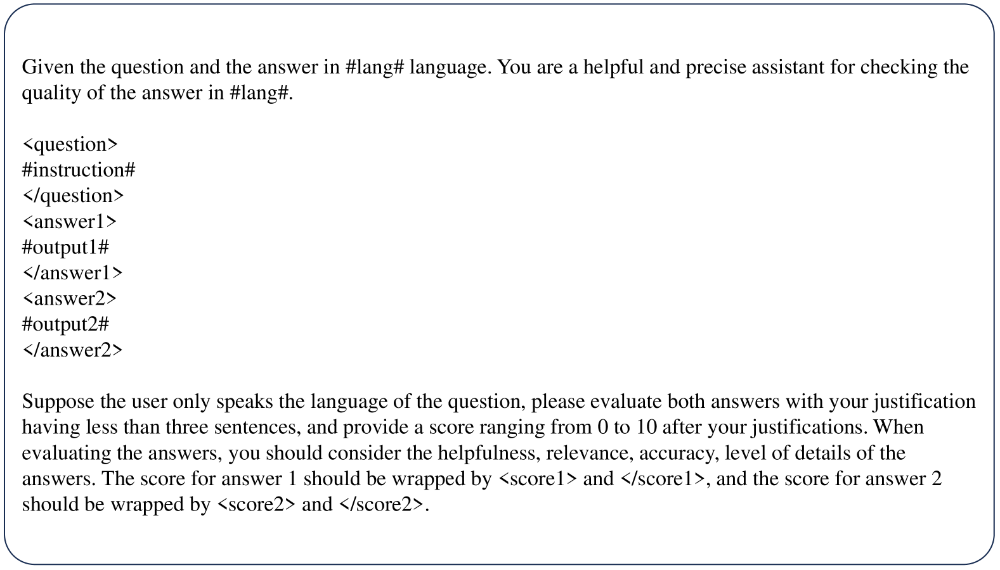

# X-Instruction：借助自选跨语言指令，优化低资源语言模型的对齐

发布时间：2024年05月30日

`LLM应用

这篇论文探讨了大型语言模型（LLM）在资源匮乏语言中的应用问题，并提出了一种创新的跨语言指令遵循样本生成方法。这种方法旨在通过使用英语指令和低资源语言响应来改善模型在这些语言中的表现。论文中提到的构建大规模跨语言指令调整数据集（X-Instruction）以及实验结果表明，这种方法能够显著提高模型在特定语言中的性能，使其能够准确遵循指令并产生高质量的响应。因此，这篇论文属于LLM应用类别，因为它专注于实际应用中的问题解决和方法创新。` `跨语言学习`

> X-Instruction: Aligning Language Model in Low-resource Languages with Self-curated Cross-lingual Instructions

# 摘要

> 大型语言模型在英语等资源丰富的语言中表现出色，但在资源匮乏的语言中则显得捉襟见肘。这可能是因为这些语言缺乏高质量的指令数据。虽然直接翻译英语样本到这些语言看似一种解决办法，但往往因翻译错误和缺乏特定语言或文化知识而不可靠。为此，我们提出了一种创新方法，创建跨语言指令遵循样本，其中指令使用英语，响应则采用低资源语言。我们的方法首先让语言模型学会根据其他语言的网络文本生成恰当的英语指令，然后对候选样本进行精炼和多样化处理。我们已利用此方法构建了一个涵盖10种语言的大规模跨语言指令调整数据集，名为X-Instruction。与简单翻译相比，我们的方法所构建的指令数据融入了更多特定语言的知识。实验结果显示，经过X-Instruction调优的模型在响应质量上远超从强大教师模型中提炼出的模型，甚至能与ChatGPT媲美。更有趣的是，这些模型在无需额外调优的情况下，便能在输出语言中准确遵循指令。

> Large language models respond well in high-resource languages like English but struggle in low-resource languages. It may arise from the lack of high-quality instruction following data in these languages. Directly translating English samples into these languages can be a solution but unreliable, leading to responses with translation errors and lacking language-specific or cultural knowledge. To address this issue, we propose a novel method to construct cross-lingual instruction following samples with instruction in English and response in low-resource languages. Specifically, the language model first learns to generate appropriate English instructions according to the natural web texts in other languages as responses. The candidate cross-lingual instruction tuning samples are further refined and diversified. We have employed this method to build a large-scale cross-lingual instruction tuning dataset on 10 languages, namely X-Instruction. The instruction data built using our method incorporate more language-specific knowledge compared with the naive translation method. Experimental results have shown that the response quality of the model tuned on X-Instruction greatly exceeds the model distilled from a powerful teacher model, reaching or even surpassing the ones of ChatGPT. In addition, we find that models tuned on cross-lingual instruction following samples can follow the instruction in the output language without further tuning.

[Arxiv](https://arxiv.org/abs/2405.19744)