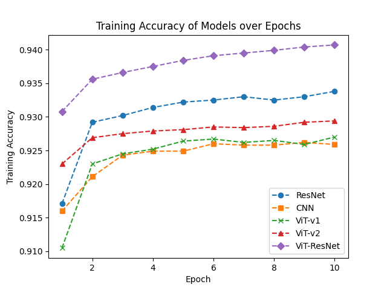

# 胸部疾病多分类：CNN、ResNet与视觉变换器的比较研究

发布时间：2024年05月31日

`LLM应用

理由：这篇论文探讨了大型语言模型（特别是基于Transformer架构的Vision Transformers）在医学图像处理领域的应用，具体是在胸部X光图像的多标签分类任务中。论文通过实验比较了不同模型的性能，并展示了预训练的ViT模型在诊断肺部疾病方面的潜力。这属于LLM在特定应用领域的实际应用研究，因此归类为LLM应用。` `图像处理`

> A Comparative Study of CNN, ResNet, and Vision Transformers for Multi-Classification of Chest Diseases

# 摘要

> 大型语言模型，尤其是基于Transformer架构的，因其强大的数据处理能力和可扩展性而成为重要工具。Dosovitskiy等人的Vision Transformers（ViT）进一步扩展了这一架构，使其适用于图像处理。基于此，我们利用NIH胸部X光数据集（包含100,000多张X光图像）对两种ViT模型进行了微调：一种基于ImageNet预训练，另一种全新训练。研究中，我们将这些模型与CNNs和ResNet在14种疾病的多标签分类任务中进行比较，并通过精确的准确性评估发现，预训练的ViT模型表现更佳，显示出其在胸部X光图像中准确诊断多种肺部疾病的潜力。

> Large language models, notably utilizing Transformer architectures, have emerged as powerful tools due to their scalability and ability to process large amounts of data. Dosovitskiy et al. expanded this architecture to introduce Vision Transformers (ViT), extending its applicability to image processing tasks. Motivated by this advancement, we fine-tuned two variants of ViT models, one pre-trained on ImageNet and another trained from scratch, using the NIH Chest X-ray dataset containing over 100,000 frontal-view X-ray images. Our study evaluates the performance of these models in the multi-label classification of 14 distinct diseases, while using Convolutional Neural Networks (CNNs) and ResNet architectures as baseline models for comparison. Through rigorous assessment based on accuracy metrics, we identify that the pre-trained ViT model surpasses CNNs and ResNet in this multilabel classification task, highlighting its potential for accurate diagnosis of various lung conditions from chest X-ray images.

[Arxiv](https://arxiv.org/abs/2406.00237)