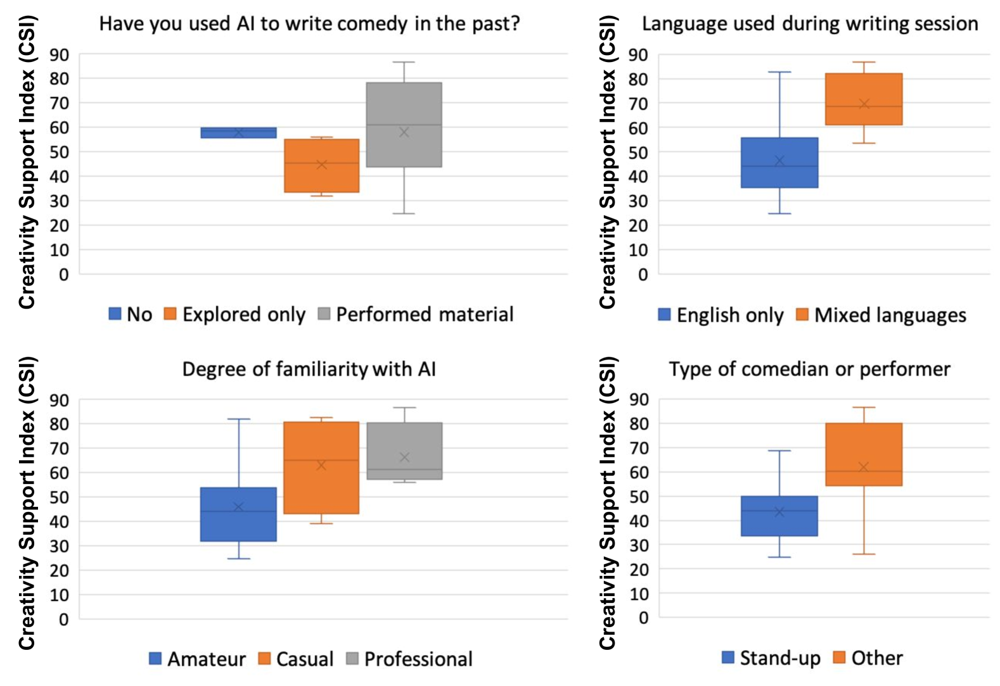

# 机器人酒吧奇遇记：探究语言模型是否能成为喜剧创作的得力助手，评估其幽默感与喜剧演员的契合度。

发布时间：2024年05月31日

`Agent

这篇论文主要探讨了人工智能（特别是大型语言模型）在喜剧表演中的应用，以及喜剧演员对AI作为创作工具的看法和担忧。它涉及了AI在特定领域（喜剧）的实际应用，以及对AI审查策略、创造力和社区价值的讨论。虽然它涉及到大型语言模型（LLM），但重点在于AI作为代理（Agent）在特定艺术场景中的应用和影响，而不是LLM的理论研究或应用开发。因此，将其归类为Agent更为合适。` `艺术节` `人工智能`

> A Robot Walks into a Bar: Can Language Models Serve asCreativity Support Tools for Comedy? An Evaluation of LLMs' Humour Alignment with Comedians

# 摘要

> 我们在爱丁堡边缘艺术节上采访了二十位喜剧演员，他们利用人工智能在观众面前进行现场表演。通过“AI x 喜剧”工作坊，我们探讨了他们如何与大型语言模型合作创作喜剧，以及他们对AI作为创作工具的看法。参与者担忧现有的AI审查策略可能强化了主流观点，忽视了少数群体的声音。同时，他们认为AI生成的喜剧内容平淡且带有偏见，未能有效支持创造力。我们的研究深入分析了有害言论与抵抗性“冒犯语言”的区别，并强调了构建符合艺术家需求的AI工具时，社区价值对齐和数据所有权的重要性。

> We interviewed twenty professional comedians who perform live shows in front of audiences and who use artificial intelligence in their artistic process as part of 3-hour workshops on ``AI x Comedy'' conducted at the Edinburgh Festival Fringe in August 2023 and online. The workshop consisted of a comedy writing session with large language models (LLMs), a human-computer interaction questionnaire to assess the Creativity Support Index of AI as a writing tool, and a focus group interrogating the comedians' motivations for and processes of using AI, as well as their ethical concerns about bias, censorship and copyright. Participants noted that existing moderation strategies used in safety filtering and instruction-tuned LLMs reinforced hegemonic viewpoints by erasing minority groups and their perspectives, and qualified this as a form of censorship. At the same time, most participants felt the LLMs did not succeed as a creativity support tool, by producing bland and biased comedy tropes, akin to ``cruise ship comedy material from the 1950s, but a bit less racist''. Our work extends scholarship about the subtle difference between, one the one hand, harmful speech, and on the other hand, ``offensive'' language as a practice of resistance, satire and ``punching up''. We also interrogate the global value alignment behind such language models, and discuss the importance of community-based value alignment and data ownership to build AI tools that better suit artists' needs.

[Arxiv](https://arxiv.org/abs/2405.20956)